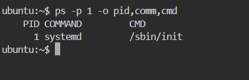
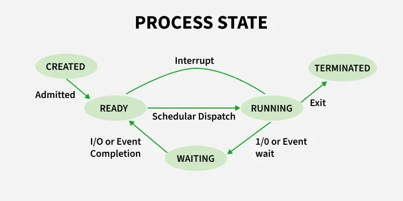
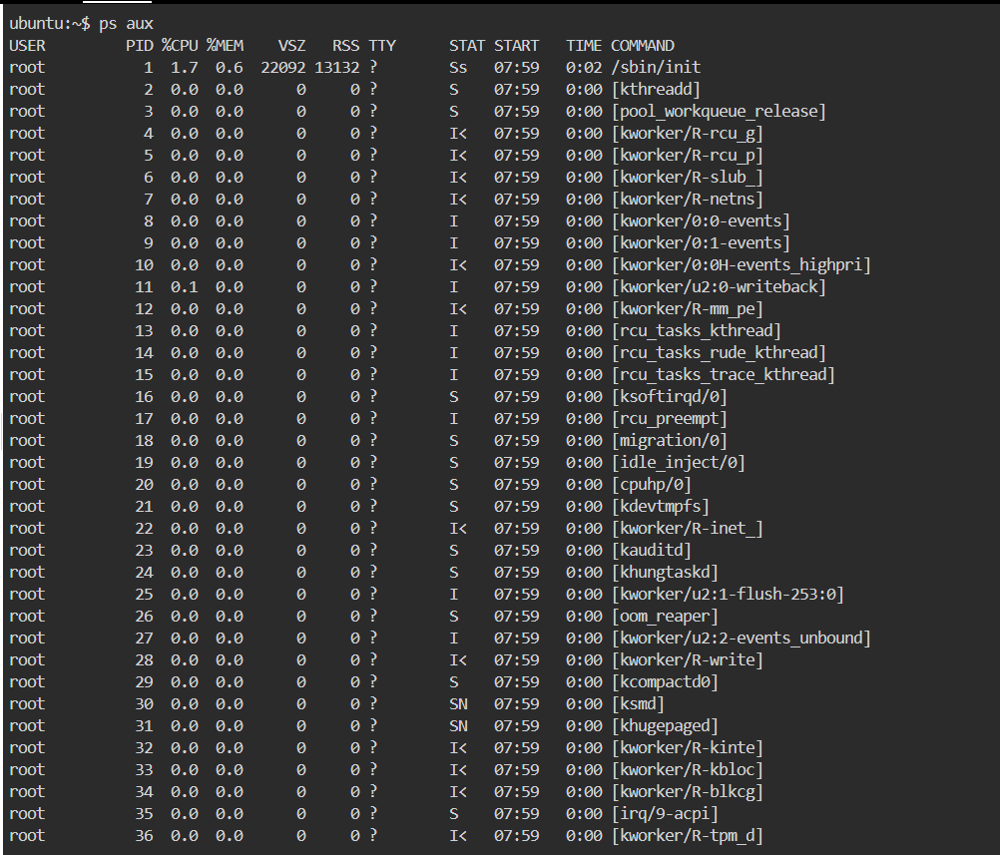
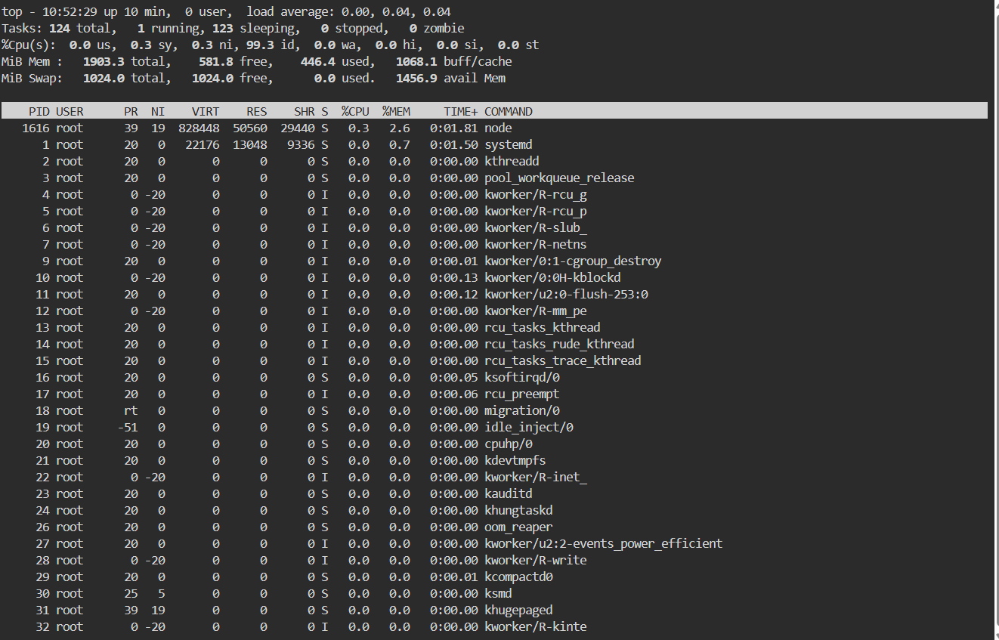
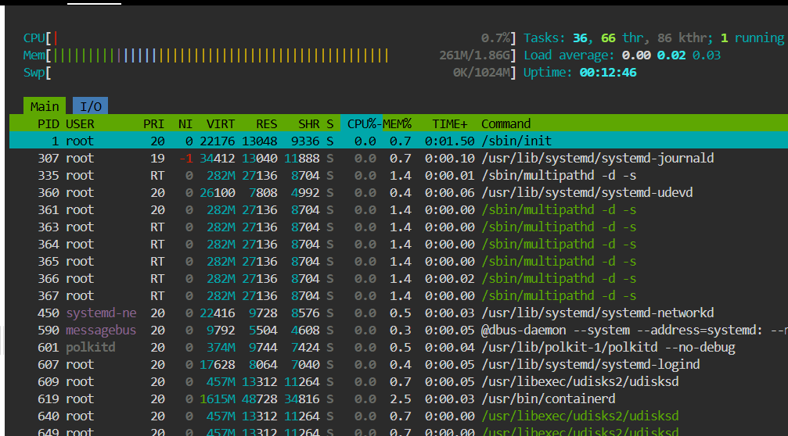

## 1. Core Components of Linux

### Kernel

* The **core of the OS**; runs in privileged mode
* Manages **CPU, memory, disks, network, and devices**
* Handles **process scheduling, system calls, and hardware interaction**

### User Space

* Where **applications and users operate**
* Includes shell (bash), utilities (ls, ps), libraries (glibc)
* Cannot access hardware directly; talks to kernel via system calls

### Init / systemd

* The **first process (PID 1)** started by the kernel
* Responsible for **starting, stopping, and managing services**
* Handles boot order, service restarts, logging, and dependencies

PID (Process ID) is a unique number that the Linux kernel assigns to every running process.

Why PID Exists
Linux needs a way to:

Schedule CPU time

Allocate memory

Send signals (kill, stop, restart)

Monitor process state

It does this using PID numbers.

---

## 2. Process Creation & Management

### How a Process is Created

1. A parent process calls `fork()` → creates a child process
2. Child process may call `exec()` → loads a new program
3. Kernel assigns **PID**, memory, file descriptors, and CPU time

### Process Lifecycle

* Created → Running → Waiting/Sleeping → Terminated
* Managed by the kernel scheduler

### Common Process States

* **Running (R):** Actively executing on CPU
* **Sleeping (S):** Waiting for I/O or event (most common)
* **Uninterruptible Sleep (D):** Waiting on disk I/O
* **Stopped (T):** Paused (signal or debugger)
* **Zombie (Z):** Finished execution but parent hasn’t collected status

---

## 3. systemd – What & Why

### What systemd Does

* Manages **services, sockets, mounts, timers**
* Replaces traditional init scripts
* Uses **unit files** to define service behavior

### Why systemd Matters in DevOps

* Automatic **service restarts** on failure
* Clear **logs via journalctl**
* Dependency-based startup (faster boot)
* Standard way to manage services across Linux servers

---

## 4. Daily Linux Commands (Must-Know)

* `ps aux` → View running processes

* `top` / `htop` → Live CPU & memory usage

* `systemctl status <service>` → Check service health

* `journalctl -u <service>` → View service logs

* `kill / kill -9 <PID>` → Stop misbehaving processes
kill <PID>
Signal sent: SIGTERM (15)
Graceful shutdown
Process can:
Always try this first

kill -9 <PID>
Signal sent: SIGKILL (9)
Immediate termination
Process cannot:
Use only if process is stuck

---

## 5. DevOps Takeaway

* Kernel controls **resources and stability**
* Processes explain **CPU/memory issues**
* systemd explains **service crashes and restarts**

---

