command for 
file system 
process management
network management

 File System Commands

* `ls` → list files & folders
* `ls -lh` → list with sizes
* `pwd` → show current path
* `cd /path` → change directory
* `mkdir dir` → create directory
* `touch file` → delete file
* `rm file` → delete file
* `rm -d dir` → delete folder
* `rm -rf dir` → force delete folder
* `cp src dest` → copy file
* `mv src dest` → move / rename
* `find / -name file` → search file
* `du -sh dir` → folder size
* `df -h` → disk usage
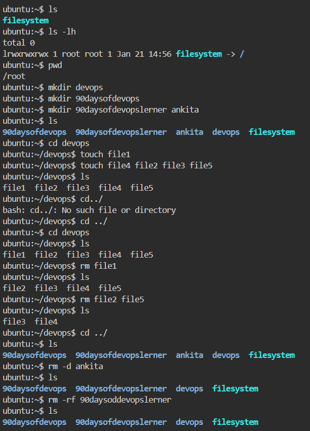

step by step excution 

 🔹 Step 1: Listing files and checking directory details

* Used `ls` to list files and folders in the current directory.
* Used `ls -lh` to view files with permissions, ownership, and size in a human-readable format.
* Verified the current working directory using `pwd`.
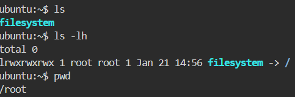
 *Screenshot shows basic directory listing and current path.*

 🔹 Step 2: Creating directories

* Created multiple directories using `mkdir`:

  * `devops`
  * `90daysofdevops`
  * `90daysofdevopslerner`
  * `ankita`
* Verified directory creation using `ls`.

*Screenshot confirms directories are successfully created.*
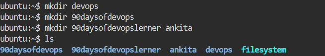

 🔹 Step 3: Creating files inside a directory

* Navigated into the `devops` directory using `cd devops`.
* Created files using `touch`:

  * Single file: `touch file1`
  * Multiple files at once: `touch file2 file3 file4 file5`
* Verified file creation using `ls`.

*Screenshot shows multiple files created inside the directory.*
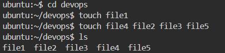

 🔹 Step 4: Navigating directories

* Tried `cd../` (incorrect syntax) and received an error.
* Corrected the command using `cd ..` to move to the parent directory.
* Navigated back into the `devops` directory.

*Screenshot demonstrates correct and incorrect directory navigation.*
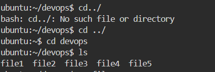

 🔹 Step 5: Deleting files

* Deleted a single file using `rm file1`.
* Deleted multiple files using `rm file2 file5`.
* Verified remaining files using `ls`.

 *Screenshot shows files removed successfully.*
 

 🔹 Step 6: Deleting directories

* Deleted an empty directory using `rm -d ankita`.
* Deleted a directory forcefully using `rm -rf 90daysofdevopslerner`.
* Verified deletion using `ls`.

 *Screenshot confirms directory removal.*

 🔹 Step 7: Copying files

* Copied a file from `devops` directory to the parent directory using:

  * `cp file3 ..`
* Verified file copy using `ls` in the parent directory.

 *Screenshot shows file copied successfully.*
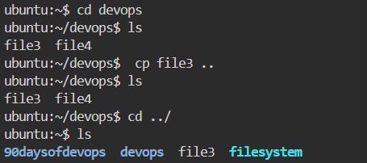

🔹 Step 8: Moving files

* Created new files using `touch file1 file2`.
* Moved a file into the `devops` directory using:

  * `mv file2 devops`
* Verified the file movement using `ls`.

 *Screenshot confirms file relocation.*

🔹 Step 9: Checking directory size

* Used `du -sh devops` to check the total size of the `devops` directory.

*Screenshot displays directory size in human-readable format.*

🔹 Step 10: Checking disk usage

* Used `df -h` to check disk usage of all mounted file systems.
* Verified available space, used space, and mount points.

*Screenshot shows disk usage details.*

In this hands-on exercise, I practiced:

* Creating, listing, copying, moving, and deleting files & directories
* Navigating the Linux file system
* Monitoring disk and directory usage

_________________________________________________________________________

 Process Management
 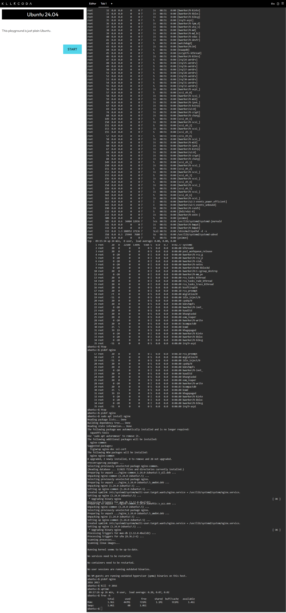

* `ps aux` → list running processes
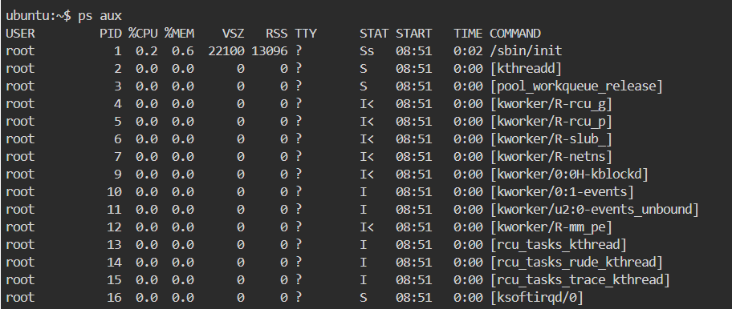

* `top` → live process monitor
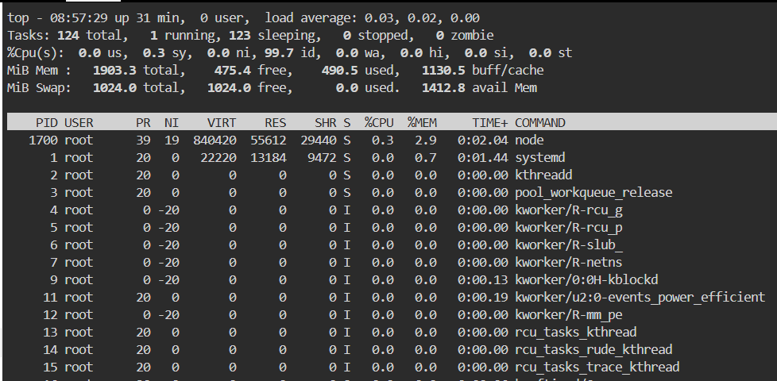

* `htop` → better top (if installed)
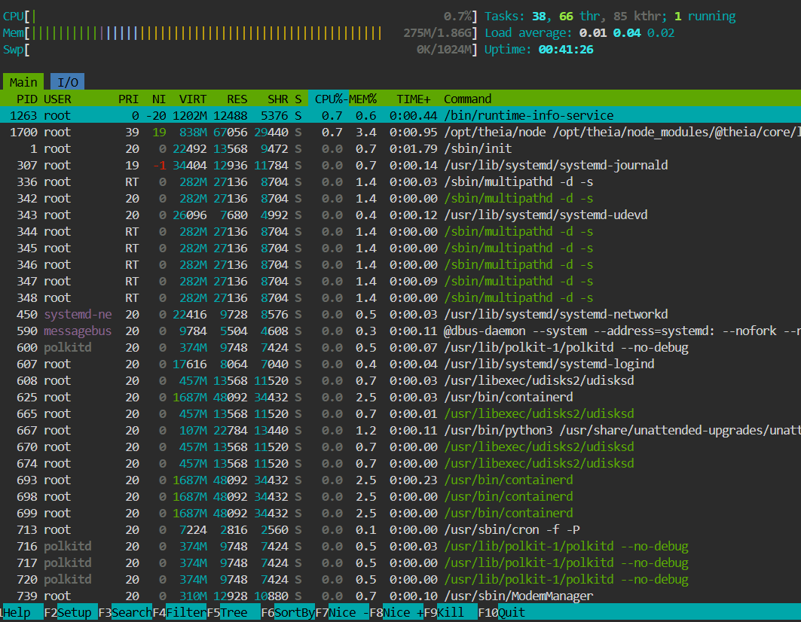

* `pidof nginx` → get process ID
* `kill PID` → stop process
* `kill -9 PID` → force kill
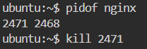

* `uptime` → system running time
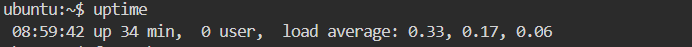

* `free -h` → memory usage
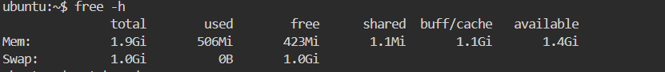

* `watch cmd` → repeat command
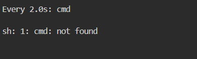

____________________________________________________________________________________

 Networking Troubleshooting

* `ping google.com` → check network
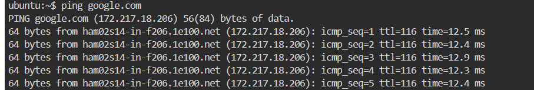

* `ip addr` → show IP address
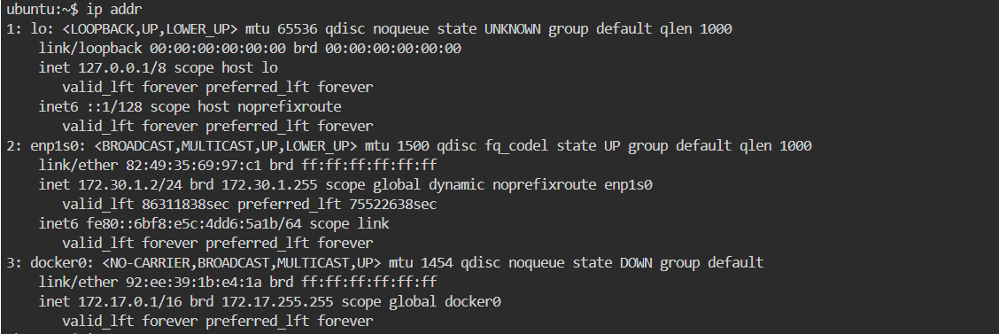

* `ip route` → routing table
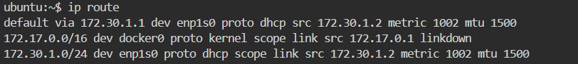

* `ss -tulnp` → open ports
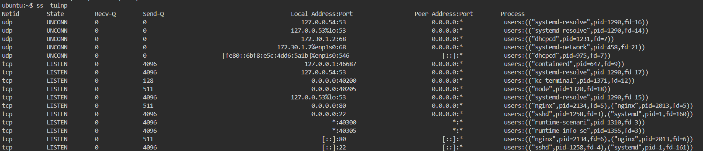

* `curl url` → test API / website
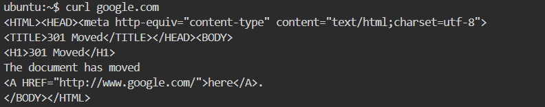

* `dig domain` → DNS lookup

