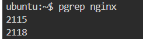
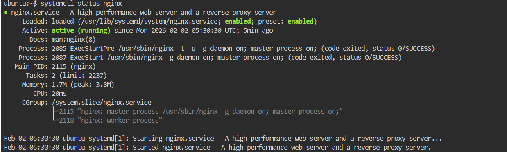
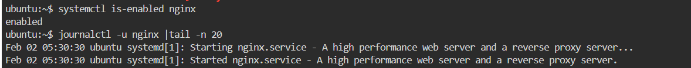
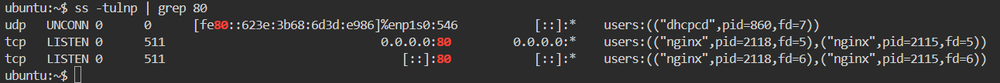

Day 04
Topic: Processes & Services (Linux)

Service used: Nginx (web server)

>> What am I doing today?
Checking running processes
Inspecting an installed service (Nginx)
Checking logs
Following basic troubleshooting steps
-------------------------------------------------------------------------------
 Step 1: Process Check

command :ps -ef | head
-> ps → shows running processes
-> -ef → full format (PID, PPID, user)
-> head → shows first few lines

>> Why head? 
Because process list is very big. Head helps quick verification.

command: top
* Shows processes in real time
* CPU usage
* Memory usage
* Used during performance issues

command: pgrep nginx

* Finds PID of nginx process
* Faster than ps | grep

>> Why pgrep?

To quickly confirm whether a process is running

Commonly used in scripts & automation

--------------------------------------------------------------------------------------------------------
 Step 2: Service Inspection (Nginx)

command: systemctl status nginx

* Checks if service is running or stopped
* Shows uptime + recent logs
* First command to run when service issue occurs

>>Lists all running services

command: systemctl list-units --type=service --state=running
Article content

>> Why we use this?

To quickly verify active services on the system Useful when multiple services are running

command: stemctl is-enabled nginx

* Checks auto-start on boot

* Important after reboot / server restart

--------------------------------------------------------------------------------------------------------

 Step 3: Log Checking

command: journalctl -u nginx | tail -n 10
* journalctl → systemd logs
* -u nginx → nginx logs only
* tail → last lines

>> Why tail? Latest errors are always at the bottom.

* checking the nginx is listening on port 

 command :Check port ss -tulnp | grep 80
 

command: tail -n 20 /var/log/nginx/error.log
* Reads nginx error log file
* Helps find config / port errors
-----------------------------------------------------------------------------------------------------------------
Step 4: Troubleshooting Flow (Real Life)
Problem: Website not opening

1️. Check service systemctl status nginx

2️. Restart service systemctl restart nginx

3️. Check logs journalctl -u nginx --since "5 min ago"

4️. Check process ps -ef | grep nginx

5️ .Check port ss -tulnp | grep 80
----------------------------------------------------------------------------

>>Learning Summary

Always follow Process → Service → Logs
head = quick preview
tail = recent errors
Logs = root cause

