# Day 05 – Linux Troubleshooting Drill: CPU, Memory, and Logs

>> Objective
To run a focused Linux troubleshooting drill by capturing system health
(CPU, memory, disk, network), inspecting logs, and documenting next steps
using a repeatable runbook.

---

>> Target Service / Process
- Service: **nginx**
- Type: Web server
- Reason: Frequently used production-facing service

---------------------------------------------------------------------------------------------

# Environment Basics

 1. Kernel & system details

command : uname -a

**Observation:**
Shows kernel version and architecture. Useful to detect OS or kernel-related issues.
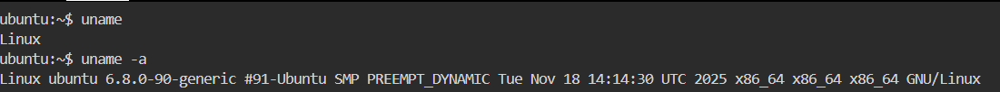
---

 2. OS version

command : lsb_release -a


*(or `cat /etc/os-release`)*

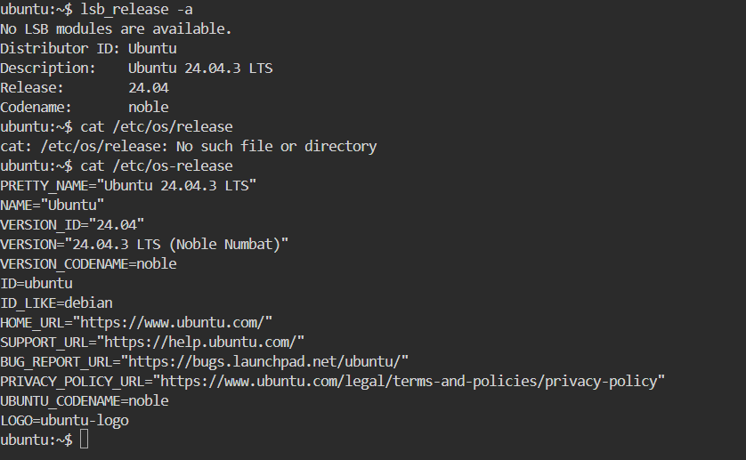
**Observation:**
Confirms OS distribution and version for compatibility checks.

--------------------------------------------------------------------------------------

# Filesystem Sanity

3. Create a temporary directory

command: mkdir /tmp/runbook-demo


**Observation:**
Directory created successfully, confirming filesystem is writable.

-----

 4. Copy file and list contents

command: cp /etc/hosts /tmp/runbook-demo/hosts-copy && ls -l /tmp/runbook-demo


**Observation:**
 File copied without errors → No permission or disk I/O issues


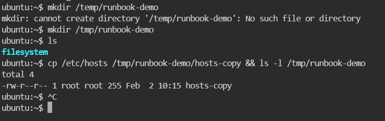
---
>> 
## Command Explained

```
cp /etc/hosts /tmp/runbook-demo/hosts-copy && ls -l /tmp/runbook-demo
```

This is actually **TWO commands joined together**.

---

## 1 `cp /etc/hosts /tmp/runbook-demo/hosts-copy`

### 🔹 What it does

* `cp` = **copy**
* `/etc/hosts` = source file
  → System file that maps hostnames to IP addresses
* `/tmp/runbook-demo/hosts-copy` = destination file

 This command **copies the `/etc/hosts` file** into the temporary directory 
  The copied file is renamed to **`hosts-copy`**

---

### 🔹 Why we use `/etc/hosts`

* It is:

  * Small
  * Always present
  * Readable by default
* Safe file for **filesystem write tests**

---

###  Why copy into `/tmp`

* `/tmp` is:

  * Writable by default
  * Temporary
  * Safe for testing

 This confirms:
✔ Filesystem is writable
✔ Disk is mounted correctly
✔ No permission or I/O errors

---

##  `&&` (Very Important)

### 🔹 Meaning of `&&`

```
command1 && command2
```

* `command2` runs **ONLY IF** `command1` succeeds
* Success = exit status `0`

 In our case:

```
cp ... && ls -l ...
```

* `ls` runs **only if copy succeeds**
* Prevents misleading output


> "`&&` ensures the second command runs only if the first command is successful."

---

##  `ls -l /tmp/runbook-demo`

### What it does

* `ls` = list files
* `-l` = long format (detailed view)

Shows:

* File permissions
* Owner & group
* File size
* Timestamp
* File name

---

##  Output Explained

```
total 4
-rw-r--r-- 1 root root 255 Feb  2 10:15 hosts-copy
```

###  `total 4`

* Disk blocks used by files in this directory
* Not file size (this confuses many beginners!)

---

###  File permission breakdown

```
-rw-r--r--
```

| Part  | Meaning              |
| ----- | -------------------- |
| `-`   | Regular file         |
| `rw-` | Owner → read & write |
| `r--` | Group → read only    |
| `r--` | Others → read only   |

---

###  Owner & Group

```
1 root root
```

* File owner: **root**
* Group: **root**
* `1` → number of hard links

 Expected because `/etc/hosts` is owned by root

---

###  File size

```
255
```

* Size in **bytes**
* Small → safe test file

---

###  Timestamp

```
Feb  2 10:15
```

* Last modification time
* Confirms file was **just copied**

---

###  File name

```
hosts-copy
```

* Copied file exists
* Confirms command worked


------------------------------------------------------------------------------------

# CPU / Memory Snapshot 

 5. Real-time CPU and memory usage

command: top
htop


**Observation:**
CPU usage is stable. No abnormal spikes from nginx or other processes.


6. Process-Specific CPU / Memory

Command:

ps -o pid 


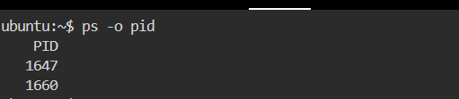

**Observation:**
 Inspect exact resource usage of nginx PID → Helpful during performance issues


 7. Memory usage overview

command: free -h
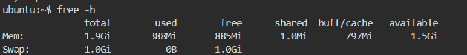

**Observation:**
Sufficient available memory. No swap pressure detected.

-------------------------------------------------------------------------------------

#  Disk / IO Snapshot 

8. Disk usage per filesystem

command: df -h

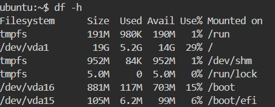
**Observation:**
All filesystems below critical usage threshold.

---

 9. Log directory size

command: 
du -sh /var/log

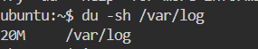

**Observation:**
Log size is reasonable. No excessive log growth.


-----------------------------------------------------------------------------------------------------

 # Disk / IO Performance

Commands: iostat 

vmstat 
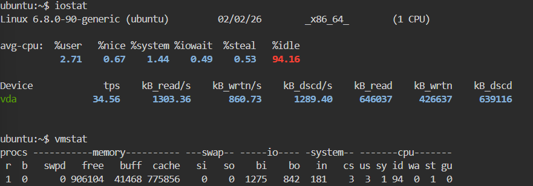

**Observation:**
 Identify I/O wait or disk bottlenecks → Useful when app is slow but CPU is idle

----------------------------------------------------------------------------------------------

# Network Snapshot 

10. Check listening ports

command: 
ss -tulpn | grep nginx

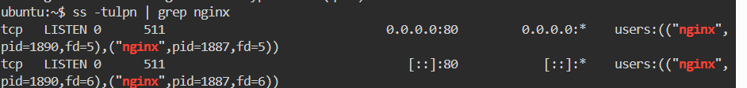

**Observation:**
Nginx is listening on port 80.

---

 11. Service connectivity check

command: 
curl -I http://localhost

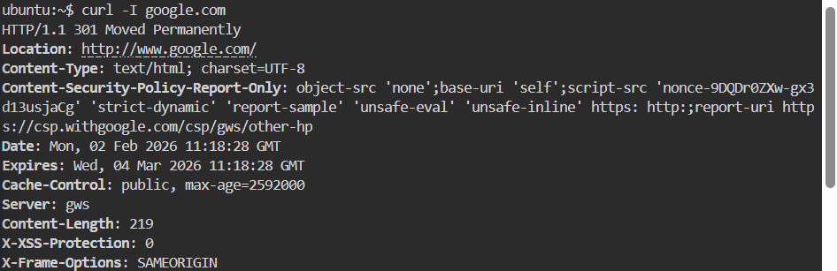

**Observation:**
HTTP response received, confirming nginx is reachable.

12. Network Reachability
Command: ping <host>
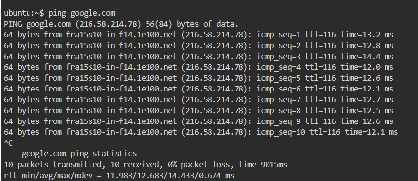
**Observation:**
 Checks basic network connectivity

-----------------------------------------------------------------------------------------------

# Logs Reviewed 

13. systemd service logs

command :
journalctl -u nginx -n 50

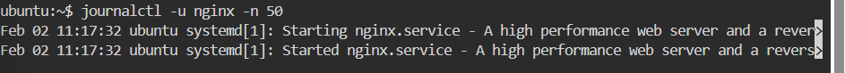

**Observation:**
No critical errors found in recent logs.

---

 14. Application error logs

command:
tail -n 50 /var/log/nginx/error.log

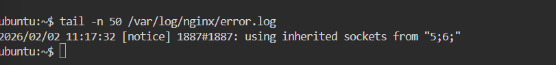

**Observation:**
No configuration or runtime errors detected.

---------------------------------------------------------------------------------------------------

# Quick Findings

* CPU, memory, disk, and network are healthy
* Nginx service is running and accessible
* Logs do not indicate recent failures
* No immediate remediation required


