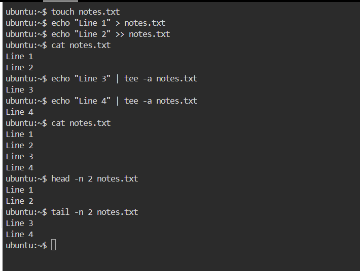

 **Day 06 – Linux Fundamentals: Read & Write Text Files**

# Objective

→ Practice basic **file read & write operations**
→ Use simple Linux commands
→ Create, write, append, and read a text file

-----------------------------------------------------------------

# File Used

**File name:** `notes.txt`

>> Commands Practiced & Explanation

---------------------------------------------------------------------------------------

1. Create an empty file

command :

touch notes.txt

→ Creates a new empty file
→ If file exists, updates timestamp

----------------------------------------------------------------------------------------------

2. Write first line (overwrite)

command :
echo "Line 1" > notes.txt

→ `>` redirects output to file
→ Overwrites existing content

-----------------------------------------------------------------------------------------------
3. Append second line

command :
echo "Line 2" >> notes.txt

→ `>>` appends text
→ Keeps previous content

----------------------------------------------------------------------------------------------

4. Append & display together

command :
echo "Line 3" | tee -a notes.txt

→ `tee` writes to file and shows output
→ `-a` means append

--------------------------------------------------------------------------------------------

5.Read full file

command: 
cat notes.txt

→ Displays complete file content

---------------------------------------------------------------------------------------------------

 6. Read first 2 lines

command:

head -n 2 notes.txt

→ Shows top part of file
→ Useful for configs & logs

------------------------------------------------------------------------------------------

7. Read last 2 lines

command: 
tail -n 2 notes.txt

→ Shows latest entries
→ Commonly used for logs

--------------------------------------------------------------------------------------
>> final output 

>> Key Learnings

✔ `>` overwrites file
✔ `>>` appends data
✔ `tee` writes + displays
✔ `cat`, `head`, `tail` are essential for logs

