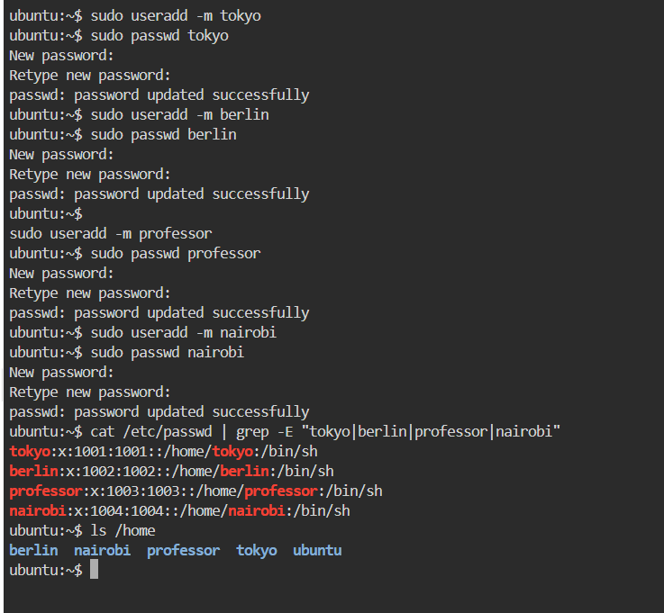
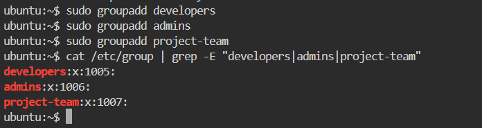
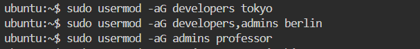
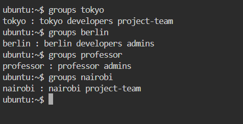
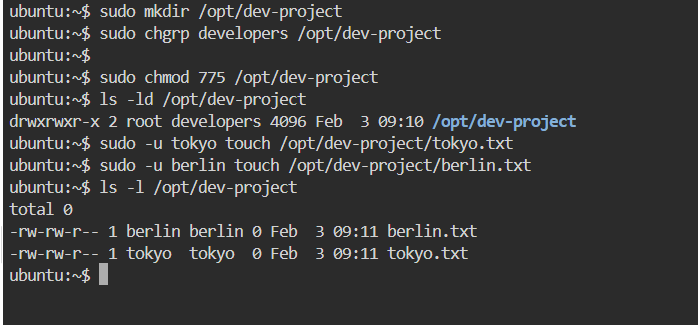
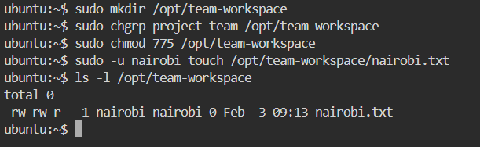

#  Day 09 – Linux User & Group Management
The objective of this file is to practice and document Linux user, group, and permission management for real-world DevOps collaboration and access control.”

# Users Created

# >> create users with home directories
sudo useradd -m tokyo
sudo passwd tokyo

sudo useradd -m berlin
sudo passwd berlin

sudo useradd -m professor
sudo passwd professor

sudo useradd -m nairobi
sudo passwd nairobi

#  >> verify users
cat /etc/passwd | grep -E "tokyo|berlin|professor|nairobi"
ls /home

----------------------------------------------------------------------------------------------

# Groups Created

#  >> create groups
sudo groupadd developers
sudo groupadd admins
sudo groupadd project-team

# >> verify groups
cat /etc/group | grep -E "developers|admins|project-team"

----------------------------------------------------------------------------------------

# Group Mapping

#  >> add users to groups (IMPORTANT: use -aG)
sudo usermod -aG developers tokyo
sudo usermod -aG developers,admins berlin
sudo usermod -aG admins professor
sudo usermod -aG project-team nairobi
sudo usermod -aG project-team tokyo

# >> verify group membership
groups tokyo
groups berlin
groups professor
groups nairobi

--------------------------------------------------------------------------------------------

# Shared Directory: /opt/dev-project

# >> create shared directory
sudo mkdir /opt/dev-project

# >> change group ownership to developers
sudo chgrp developers /opt/dev-project

#  >> set permissions: rwx for owner & group
sudo chmod 775 /opt/dev-project

# >> verify permissions
ls -ld /opt/dev-project

# >> test access as users
sudo -u tokyo touch /opt/dev-project/tokyo.txt
sudo -u berlin touch /opt/dev-project/berlin.txt
ls -l /opt/dev-project

-------------------------------------------------------------------------------------------------

# Team Workspace: /opt/team-workspace

#  >> create team workspace
sudo mkdir /opt/team-workspace

#  >> assign group and permissions
sudo chgrp project-team /opt/team-workspace
sudo chmod 775 /opt/team-workspace

#  >> test access
sudo -u nairobi touch /opt/team-workspace/nairobi.txt
ls -l /opt/team-workspace

------------------------------------------------------------------------------------------------

# Commands Used (Quick Bash Notes)

useradd -m        # create user with home directory
passwd            # set user password
groupadd          # create a group
usermod -aG       # add user to group (append, safe)
mkdir             # create directory
chgrp             # change group ownership
chmod 775         # rwx for owner & group, r-x for others
groups            # check group membership
ls -ld            # check directory permissions

#  Key Learnings 

# groups = shared access control
# chmod 775 = best for team collaboration
# always use usermod -aG (prevents permission loss)
# shared dirs used for CI/CD, logs, deployments
# verify using: groups, ls -ld, /etc/passwd, /etc/group

---------------------------------------------------------------------------

