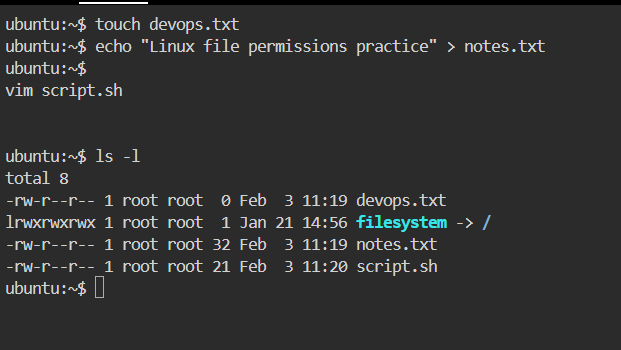
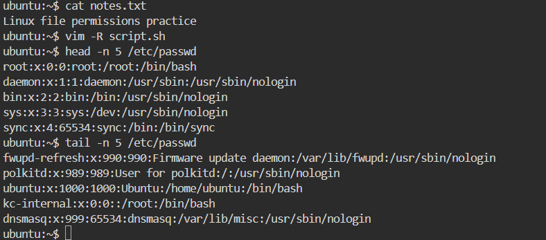
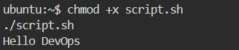
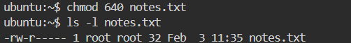
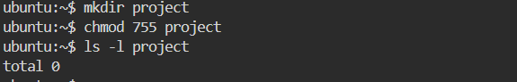
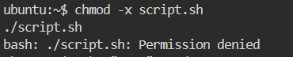

# Day 10 – File Permissions & File Operations

## Objective
To understand **Linux file operations** and **file permission management** using real commands and practical testing, just like in real DevOps environments.

--------------------------------------------------------------------------------------------

# Files Created


touch devops.txt

echo "Linux file permissions practice" > notes.txt

vim script.sh


**script.sh content**


echo "Hello DevOps"


# Verification


ls -l



## Reading Files


cat notes.txt


vim -R script.sh


head -n 5 /etc/passwd


tail -n 5 /etc/passwd



-----------------------------------------------------------------------

# Understanding File Permissions

Permission format:


rwxrwxrwx
│ │ │
│ │ └── Others
│ └──── Group
└────── Owner


Value mapping:

* r = 4
* w = 2
* x = 1

# Initial Permissions


ls -l devops.txt notes.txt script.sh


-rw-r--r-- devops.txt
-rw-r--r-- notes.txt
-rw-r--r-- script.sh


# Meaning

| File       | Owner       | Group | Others |
| ---------- | ----------- | ----- | ------ |
| devops.txt | read, write | read  | read   |
| notes.txt  | read, write | read  | read   |
| script.sh  | read, write | read  | read   |

 No execute permission yet.


---------------------------------------------------------------------------------------- 
-----------------------------------------------------------------------------

## Modifying Permissions

# 1. Make script executable

```bash
chmod +x script.sh
./script.sh
```

Output:




------------------------------------------------------------------------------
### 2. Make devops.txt read-only

```bash
chmod a-w devops.txt
```


---------------------------------------------------------------------------------

### 3. Set notes.txt permission to 640

```bash
chmod 640 notes.txt
```


---------------------------------------------------------------------------------

### 4. Create directory with 755 permission

```bash
mkdir project
chmod 755 project
```


----------------------------------------------------------------------------------------------

## Testing Permissions

### 1. Write to read-only file

```bash
echo "test" >> devops.txt
```

❌ Error:

```text
Permission denied
```


### 2. Execute file without execute permission

```bash
chmod -x script.sh
./script.sh
```

 Error:


-------------------------------------------------------------------------

## Commands Used


touch
echo
cat
vim
ls -l
chmod
head
tail
mkdir


-----------------------------------------------------------------------------

## What I Learned

1. Linux permissions control **who can read, write, or execute** files.
2. `chmod` can be used in **symbolic** (`+x`, `-w`) and **numeric** (`755`, `640`) modes.
3. Execute permission is mandatory to run shell scripts.

--------------------------------------------------------------------------------

# Real Interview Scenarios

**Q: Why script not running even if content is correct?**
➡ Execute permission missing (`chmod +x` required).

**Q: Difference between 755 and 777?**
➡ 755 is secure (no write for others), 777 is unsafe.

**Q: What happens if write permission is removed?**
➡ File becomes read-only → Permission denied on edit.

---
