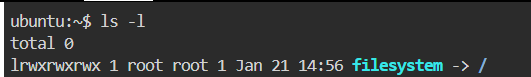
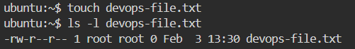
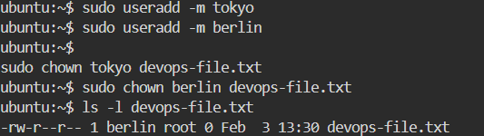
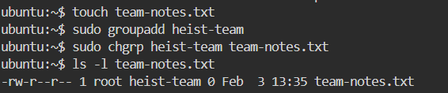
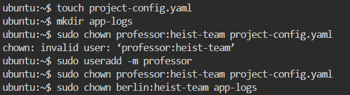
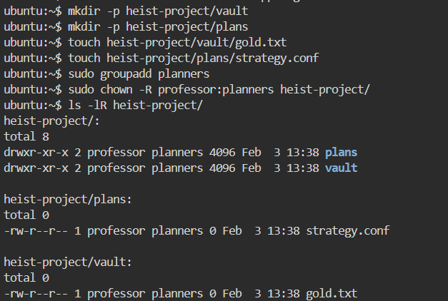
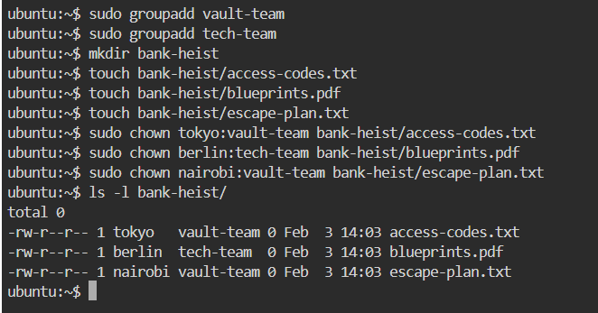

# Day 11 – File Ownership (chown & chgrp)

## Objective
To understand and practice **Linux file and directory ownership**, including:
- User ownership
- Group ownership
- Changing ownership using `chown` and `chgrp`
- Applying ownership changes recursively

---

## Task 1: Understanding File Ownership

### Command Used
```bash
ls -l
````

### Output Format

```
-rw-r--r-- 1 owner group size date filename
```

### Explanation

* **Owner** → The user who owns the file
* **Group** → The group associated with the file
* Owner controls primary access
* Group allows shared access among team members

### Difference Between Owner and Group

| Owner                       | Group                       |
| --------------------------- | --------------------------- |
| Individual user             | Collection of users         |
| Has full control by default | Used for shared permissions |
| Only one owner per file     | One group per file          |

------------------------------------------------------------------------------------------

## Task 2: chown – Change File Owner

# Files Created

```bash
touch devops-file.txt
```

### Check Ownership

```bash
ls -l devops-file.txt
```

### Change Owner

```bash
sudo chown tokyo devops-file.txt
sudo chown berlin devops-file.txt
```

### Verification

```bash
ls -l devops-file.txt
```

---------------------------------------------------------------------------------------------------

## Task 3: chgrp – Change File Group

### Files Created

```bash
touch team-notes.txt
```

### Create Group

```bash
sudo groupadd heist-team
```

### Change Group

```bash
sudo chgrp heist-team team-notes.txt
```

### Verify

```bash
ls -l team-notes.txt
```

-----------------------------------------------------------------------------------------

## Task 4: Change Owner and Group Together

### Files & Directories

```bash
touch project-config.yaml
mkdir app-logs
```

### Commands Used

```bash
sudo chown professor:heist-team project-config.yaml
sudo chown berlin:heist-team app-logs
```

----------------------------------------------------------------------------------

## Task 5: Recursive Ownership Change

### Directory Structure

```bash
mkdir -p heist-project/vault
mkdir -p heist-project/plans
touch heist-project/vault/gold.txt
touch heist-project/plans/strategy.conf
```

### Create Group

```bash
sudo groupadd planners
```

### Recursive Ownership Change

```bash
sudo chown -R professor:planners heist-project/
```

### Verification

```bash
ls -lR heist-project/
```


----------------------------------------------------------------------------

## Task 6: Practice Challenge

### Users Created

```bash
sudo useradd tokyo
sudo useradd berlin
sudo useradd nairobi
```

### Groups Created

```bash
sudo groupadd vault-team
sudo groupadd tech-team
```

### Directory & Files

```bash
mkdir bank-heist
touch bank-heist/access-codes.txt
touch bank-heist/blueprints.pdf
touch bank-heist/escape-plan.txt
```

### Ownership Mapping

```bash
sudo chown tokyo:vault-team bank-heist/access-codes.txt
sudo chown berlin:tech-team bank-heist/blueprints.pdf
sudo chown nairobi:vault-team bank-heist/escape-plan.txt
```

### Verify

```bash
ls -l bank-heist/
```

-----------------------------------------------------------------------------------

## Commands Reference

```bash
ls -l filename
sudo chown user filename
sudo chgrp group filename
sudo chown user:group filename
sudo chown -R user:group directory/
sudo chown :group filename
```

---

## What I Learned

1. Every file in Linux has **one owner and one group**
2. `chown` can change both owner and group in a single command
3. Recursive ownership (`-R`) is critical for real projects
4. File ownership is essential for security and collaboration

---

## Real-Time Interview Scenarios

### Q1: Why is file ownership important in DevOps?

**Answer:**
To control access to application files, logs, CI/CD artifacts, and shared resources securely.

### Q2: Can a normal user change file ownership?

**Answer:**
No. Only `root` (or sudo users) can change file ownership.

### Q3: Difference between chown and chgrp?


* `chown` → changes owner (and group)
* `chgrp` → changes only group


