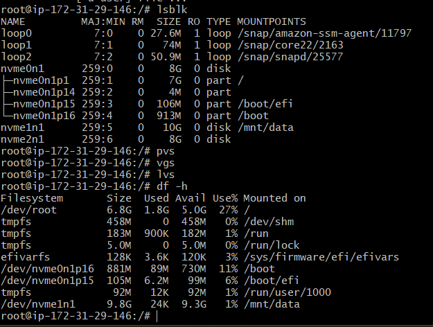
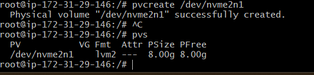
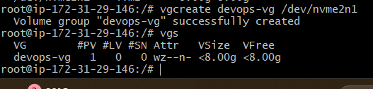
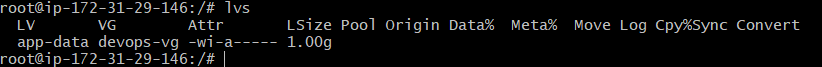
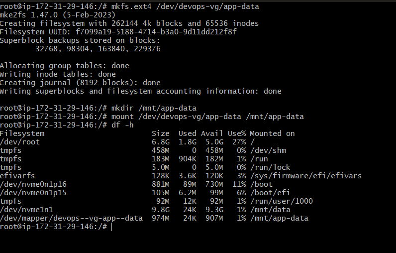
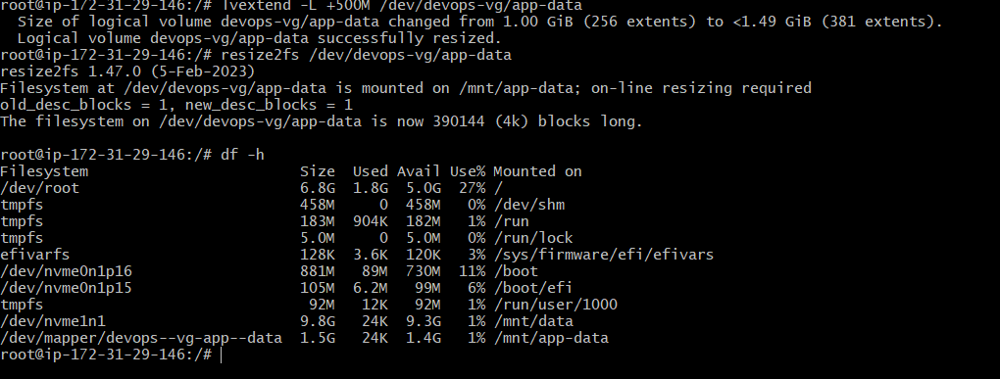

# Day 13 – Linux Volume Management (LVM)

## Objective
Learn and practice Linux LVM to manage storage flexibly by creating, extending, and mounting logical volumes.

---

## Environment Details
- OS: Linux
- User: root
- Storage Type: Loop device (virtual disk)

---

## Task 1: Check Current Storage

### Commands Used
```bash
lsblk
pvs
vgs
lvs
df -h
````

### Output Screenshot




## Task 2: Create Physical Volume (PV)

### Command

```bash
pvcreate /dev/nvme2n1
```

### Verify

```bash
pvs
```

### Output Screenshot


---

## Task 3: Create Volume Group (VG)

### Command

```bash
vgcreate devops-vg /dev/nvme2n1

```

### Verify

```bash
vgs
```

### Output Screenshot



---

## Task 4: Create Logical Volume (LV)

### Command

```bash
lvcreate -L 1G -n app-data devops-vg
```

### Verify

```bash
lvs
```

### Output Screenshot



---

## Task 5: Format and Mount Logical Volume

### Commands

```bash
mkfs.ext4 /dev/devops-vg/app-data
mkdir -p /mnt/app-data
mount /dev/devops-vg/app-data /mnt/app-data
```

### Verify

```bash
df -h /mnt/app-data
```

### Output Screenshot



---

## Task 6: Extend the Logical Volume

### Commands

```bash
lvextend -L +200M /dev/devops-vg/app-data
resize2fs /dev/devops-vg/app-data
```

### Verify

```bash
df -h /mnt/app-data
```

### Output Screenshot



---

## What I Learned

1. LVM allows **dynamic resizing** of storage without downtime.
2. Storage is managed in layers: **PV → VG → LV**, making it flexible and scalable.
3. Logical volumes can be extended **online** using `lvextend` and `resize2fs`.

---

## Conclusion

LVM simplifies disk management in Linux and is widely used in production servers for scalability, flexibility, and efficient storage utilization.

---
