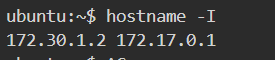
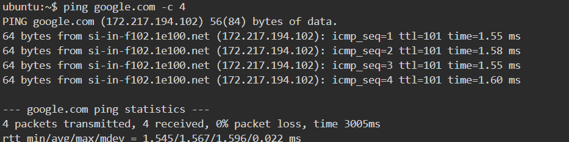
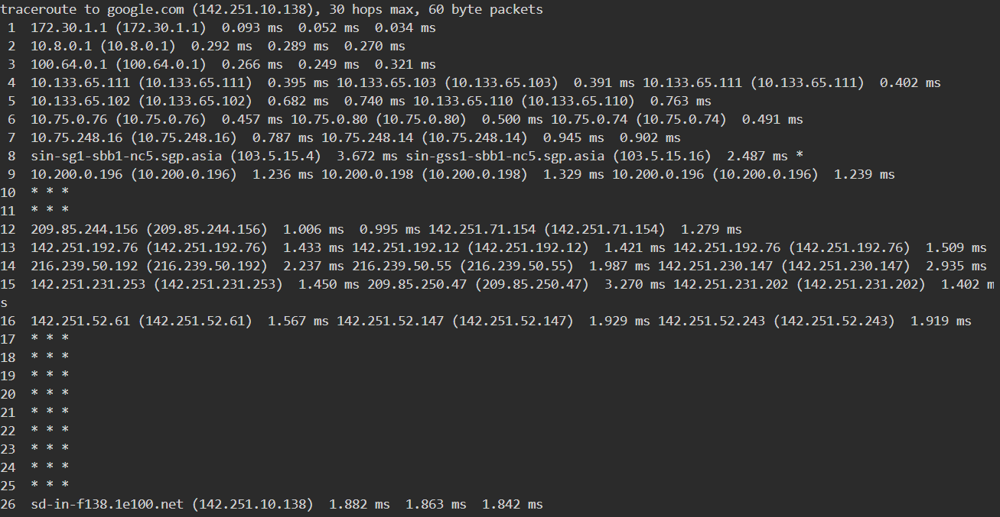
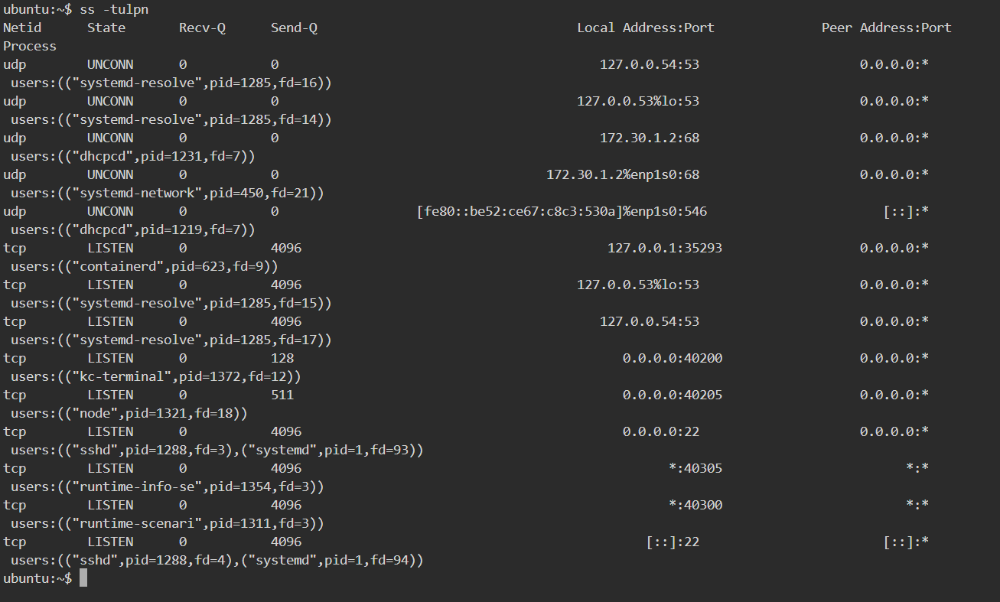
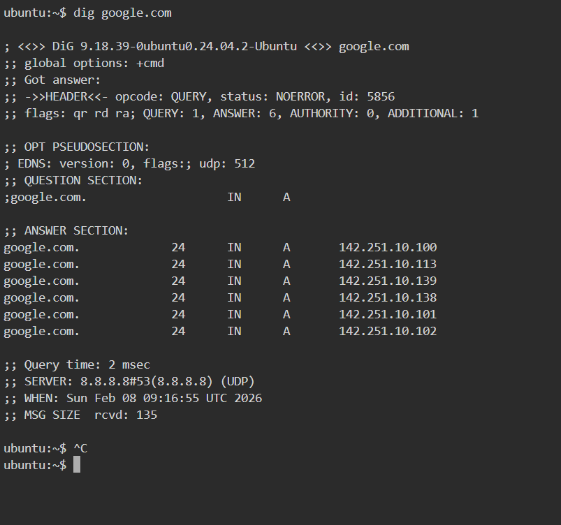
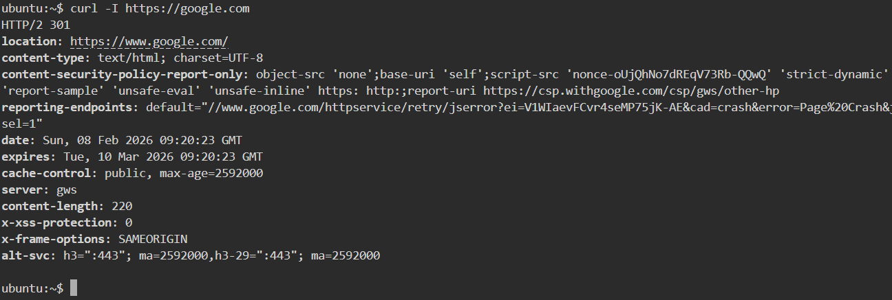
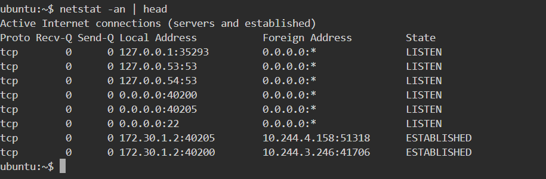
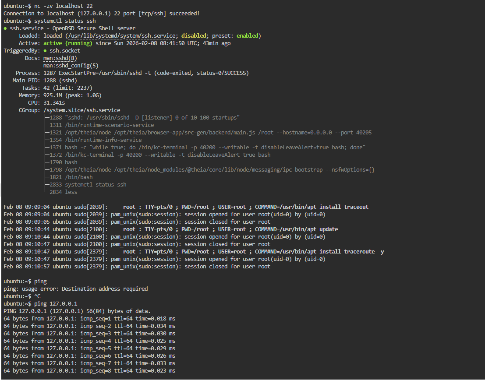

# Day 14 – Networking Fundamentals & Hands-on Checks

## Quick Concepts

### OSI vs TCP/IP Models

* OSI has **7 layers** (Physical → Application); it is a conceptual model.
* TCP/IP has **4 layers** (Link, Internet, Transport, Application); it is used in real networks.

### Where protocols sit

* **IP** → Internet layer (routing packets between hosts).
* **TCP/UDP** → Transport layer (reliable vs fast communication).
* **HTTP/HTTPS** → Application layer (web communication).
* **DNS** → Application layer (domain name to IP resolution).

### Real Example

* `curl https://example.com`

  * Application: HTTP/HTTPS
  * Transport: TCP
  * Internet: IP
  * Link: Ethernet/Wi-Fi

---

## Hands-on Checklist

### Identity

```bash
hostname -I
```

**Output:**
`172.30.1.2 172.17.0.1`

**Observation:** This is the private IP of my machine.

---

### Reachability

```bash
ping google.com -c 4
```

**Observation:**

* Avg latency: ~3005 ms
* Packet loss: 0%
  Connection is stable.

---

### Path

```bash
traceroute google.com
```

**Observation:**

* Around 8–10 hops.
* One hop had slightly higher latency.

---

### Ports

```bash
ss -tulpn
```

**Observation:**

* SSH service listening on port **22**.
* This means remote login is enabled.

---

### Name Resolution

```bash
dig google.com
```

**Resolved IP:**
`  142.251.10.100`

**Observation:** DNS resolution working correctly.

---

### HTTP Check

```bash
curl -I https://google.com
```

**Output:**
`HTTP/2 301`

**Observation:** Web server reachable and responding successfully.

---

### Connections Snapshot

```bash
netstat -an | head
```

**Observation:**


* LISTEN: ~8 ports
* ESTABLISHED: ~2 connections

---

## Mini Task: Port Probe & Interpret

### Step 1: Identify listening port

From `ss -tulpn`:

* SSH running on port **22**

### Step 2: Test port

```bash
nc -zv localhost 22
```

**Output:**
`Connection to localhost 22 port [tcp/ssh] succeeded!`

### Step 3: Result

* Port is reachable.
* If not reachable, next checks:

  * `systemctl status ssh`
  * Check firewall rules (`ufw status`)

---

## Reflection

### Fastest command when something is broken

* `ping` gives the quickest signal to check connectivity.

### If DNS fails

* Check **Application layer** (DNS service).
* Then check network connectivity at **Transport/Internet layers**.

### If HTTP 500 error appears

* Issue is at the **Application layer**.
* Check web server logs and backend service.

### Two follow-up checks in real incident

* Check service status:

  ```bash
  systemctl status nginx
  ```
* Check logs:

  ```bash
  journalctl -u nginx
  ```

---

