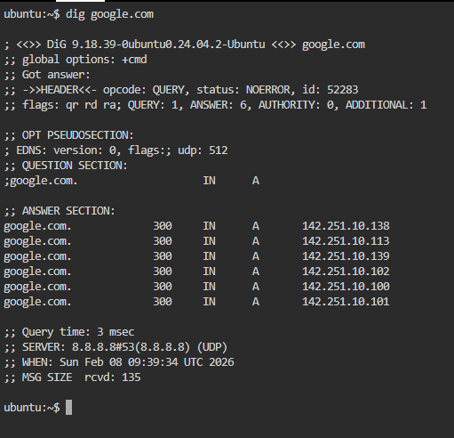
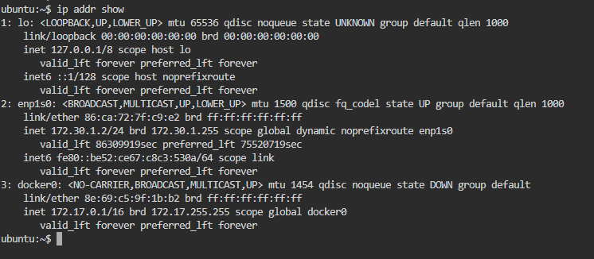
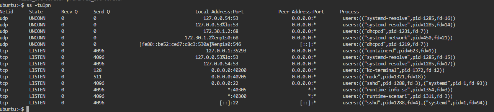

# Day 15 – Networking Concepts: DNS, IP, Subnets & Ports


## Task 1: DNS – How Names Become IPs

### 1. What happens when we type `google.com` in a browser?

* The browser sends a request to the DNS server to find the IP address of `google.com`.
* The DNS server looks into its records or asks other DNS servers.
* It returns the IP address of `google.com`.
* The browser then connects to that IP and loads the website.

---
--------------------------------------------------------------------------------


### 2. DNS Record Types

**A record**

* Maps a domain name to an IPv4 address.

**AAAA record**

* Maps a domain name to an IPv6 address.

**CNAME record**

* Points one domain name to another domain name.

**MX record**

* Specifies the mail server for a domain.

**NS record**

* Shows which DNS server is responsible for the domain.

---
--------------------------------------------------------------------------------


### 3. `dig google.com` output (example)

```bash
dig google.com
```


**A record:**
oogle.com.             300     IN      A       142.251.10.138
google.com.             300     IN      A       142.251.10.113
google.com.             300     IN      A       142.251.10.139
google.com.             300     IN      A       142.251.10.102
google.com.             300     IN      A       142.251.10.100
google.com.             300     IN      A       142.251.10.101

**TTL:**
`300`


---
--------------------------------------------------------------------------------


## Task 2: IP Addressing

### 1. What is an IPv4 address?

* IPv4 is a **32-bit number**.
* It is written in **four decimal parts** separated by dots.
* Example: `192.168.1.10`

Each part is called an **octet** and ranges from **0–255**.

---
--------------------------------------------------------------------------------


### 2. Public vs Private IP

**Public IP**

* Used on the internet.
* Unique globally.
* Example: `8.8.8.8`

**Private IP**

* Used inside local networks.
* Not accessible directly from the internet.
* Example: `192.168.1.5`

---

### 3. Private IP ranges

* `10.0.0.0 – 10.255.255.255`
* `172.16.0.0 – 172.31.255.255`
* `192.168.0.0 – 192.168.255.255`

---

### 4. From `ip addr show` (example)

```bash
ip addr show
```

**Private IP:**
`


---
--------------------------------------------------------------------------------


## Task 3: CIDR & Subnetting

### 1. What does `/24` mean?

* `/24` means **24 bits are used for the network part**.
* Remaining **8 bits are for hosts**.

---
--------------------------------------------------------------------------------


### 2. Usable hosts

| CIDR | Total IPs | Usable Hosts |
| ---- | --------- | ------------ |
| /24  | 256       | 254          |
| /16  | 65,536    | 65,534       |
| /28  | 16        | 14           |

---
--------------------------------------------------------------------------------


### 3. Why do we subnet?

* To divide large networks into smaller parts.
* Improves security.
* Reduces traffic.
* Makes network management easier.

---
--------------------------------------------------------------------------------


### 4. CIDR Table

| CIDR | Subnet Mask     | Total IPs | Usable Hosts |
| ---- | --------------- | --------- | ------------ |
| /24  | 255.255.255.0   | 256       | 254          |
| /16  | 255.255.0.0     | 65,536    | 65,534       |
| /28  | 255.255.255.240 | 16        | 14           |

---
--------------------------------------------------------------------------------


## Task 4: Ports – The Doors to Services

### 1. What is a port?

* A port is a **logical door** on a computer.
* It allows multiple services to run on the same IP.

Example:

* Same IP
* Different ports = different services

---
--------------------------------------------------------------------------------


### 2. Common ports

| Port  | Service |
| ----- | ------- |
| 22    | SSH     |
| 80    | HTTP    |
| 443   | HTTPS   |
| 53    | DNS     |
| 3306  | MySQL   |
| 6379  | Redis   |
| 27017 | MongoDB |

---
--------------------------------------------------------------------------------


### 3. From `ss -tulpn` (example)

```bash
ss -tulpn
```

**Port 22 → SSH service**
**Port 68 → DHCP client**


---
--------------------------------------------------------------------------------


## Task 5: Putting It Together

### 1. `curl http://myapp.com:8080`

Concepts involved:

* DNS resolves `myapp.com` to IP.
* TCP connects to port 8080.
* HTTP request is sent to the server.

---
--------------------------------------------------------------------------------


### 2. App cannot reach database at `10.0.1.50:3306`

Things to check first:

* Is the database running?
* Is port 3306 open?
* Network connectivity (ping or telnet).
* Firewall or security group rules.

---
--------------------------------------------------------------------------------


## What I Learned (3 Key Points)

1. DNS converts domain names into IP addresses.
2. Subnetting divides networks for better performance and security.
3. Ports allow multiple services to run on a single IP.

--------------------------------------------------------------------------------

