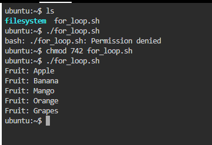
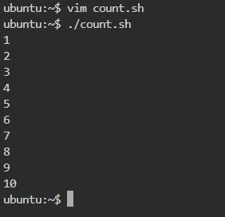
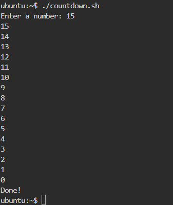
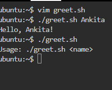
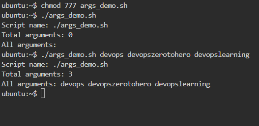
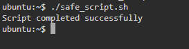

# Day 17 – Shell Scripting: Loops, Arguments & Error Handling

# Task 1: For Loop

# **1. `for_loop.sh`**

```bash
#!/bin/bash
# Loop through a list of 5 fruits
fruits=("Apple" "Banana" "Mango" "Orange" "Grapes")
for fruit in "${fruits[@]}"; do
  echo "Fruit: $fruit"
done
```

**Output**


------------------------------------------------------------------------------------

### **2. `count.sh`**

```bash
#!/bin/bash
# Print numbers 1 to 10
for i in {1..10}; do
  echo $i
done
```

**Output**


------------------------------------------------------------------------------------
---------------------------------------------------------------------------------------

# Task 2: While Loop

# **`countdown.sh`**

```bash
#!/bin/bash
# Countdown from user input to 0
read -p "Enter a number: " num
while [ $num -ge 0 ]; do
  echo $num
  ((num--))
done
echo "Done!"
```

**output**


------------------------------------------------------------------------------------
---------------------------------------------------------------------------------------

## Task 3: Command-Line Arguments

### **1. `greet.sh`**

```bash
#!/bin/bash
# Greet user by name
if [ -z "$1" ]; then
  echo "Usage: ./greet.sh <name>"
  exit 1
fi
echo "Hello, $1!"
```

**output**


---------------------------------------------------------------------------------------

### **2. `args_demo.sh`**

```bash
#!/bin/bash
# Display arguments info
echo "Script name: $0"
echo "Total arguments: $#"
echo "All arguments: $@"
```

**output Run**

------------------------------------------------------------------------------------
------------------------------------------------------------------------------------

## Task 4: Install Packages via Script

### **`install_packages.sh`**

```bash
#!/bin/bash
# Check if script is run as root
if [ "$EUID" -ne 0 ]; then
  echo "Please run as root"
  exit 1
fi

packages=("nginx" "curl" "wget")

for pkg in "${packages[@]}"; do
  if dpkg -s $pkg &> /dev/null; then
    echo "$pkg is already installed"
  else
    echo "Installing $pkg..."
    apt-get update -qq
    apt-get install -y $pkg && echo "$pkg installed successfully" || echo "Failed to install $pkg"
  fi
done
```

**Output**


---------------------------------------------------------------------------------------
------------------------------------------------------------------------------------

## Task 5: Error Handling

### **`safe_script.sh`**

```bash
#!/bin/bash
set -e  # Exit on error

mkdir /tmp/devops-test || echo "Directory already exists"
cd /tmp/devops-test || { echo "Failed to navigate to /tmp/devops-test"; exit 1; }
touch testfile.txt || echo "Failed to create testfile.txt"

echo "Script completed successfully"
```

**output**



---------------------------------------------------------------------------------------
------------------------------------------------------------------------------------

# Key Learnings from Day 17

1. **Loops:** `for` and `while` loops make repetitive tasks simple and readable.
2. **Arguments & Input:** `$1`, `$#`, `$@` help scripts be dynamic and reusable.
3. **Error Handling:** Using `set -e`, `||`, and root checks improves script safety and reliability.


