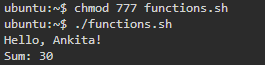
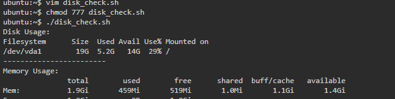
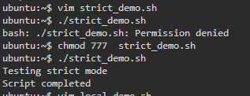
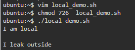
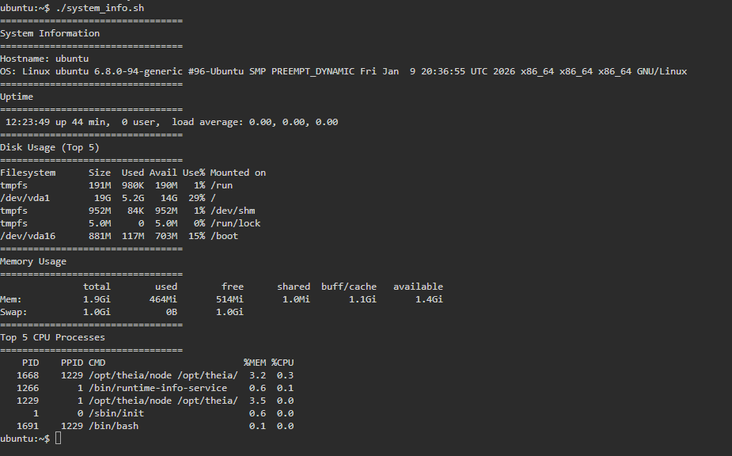

# Day 18 – Shell Scripting: Functions & Slightly Advanced Concepts


# Task 1: Basic Functions

# `functions.sh`

```bash
#!/bin/bash

# Function to greet
greet() {
  local name="$1"
  echo "Hello, $name!"
}

# Function to add two numbers
add() {
  local num1="$1"
  local num2="$2"
  local sum=$((num1 + num2))
  echo "Sum: $sum"
}

# Calling functions
greet "Ankita"
add 10 20
```

# Output



-----------------------------------------------------

#  Task 2: Disk & Memory Check

# `disk_check.sh`

```bash
#!/bin/bash

check_disk() {
  echo "Disk Usage:"
  df -h /
}

check_memory() {
  echo "Memory Usage:"
  free -h
}

# Main
check_disk
echo "------------------------"
check_memory
```

# Output




-----------------------------------------------------

#  Task 3: Strict Mode – `set -euo pipefail`

# `strict_demo.sh`

```bash
#!/bin/bash
set -euo pipefail

echo "Testing strict mode"

# Uncomment one at a time to test

# 1 Undefined variable (set -u)
# echo $UNDEFINED_VAR

# 2 Command failure (set -e)
# false

# 3 Pipe failure (set -o pipefail)
# grep "hello" nonexistentfile | wc -l

echo "Script completed"
```


-----------------------------------------------------

##  What Each Flag Does

| Flag              | Meaning                                          |
| ----------------- | ------------------------------------------------ |
| `set -e`          | Exit immediately if any command fails            |
| `set -u`          | Exit if using an undefined variable              |
| `set -o pipefail` | If any command in a pipe fails, whole pipe fails |

------------------------------------------------------------

##  What Happens?

* `set -u` → Script stops if variable is undefined
* `set -e` → Script exits when a command returns non-zero
* `set -o pipefail` → Even if last pipe command succeeds, failure in first part stops script

-----------------------------------------------------------------------
#  Task 4: Local Variables

## `local_demo.sh`

```bash
#!/bin/bash

global_var="I am global"

test_local() {
  local local_var="I am local"
  echo "$local_var"
}

test_global() {
  temp_var="I leak outside"
}

test_local
echo "$local_var"   # Will NOT print anything

test_global
echo "$temp_var"    # Will print value

```

# Output

```

```

 `local_var` does not exist outside function
 `temp_var` exists globally because it wasn't declared `local`


-----------------------------------------------------

# Task 5: System Info Reporter

# `system_info.sh`

```bash
#!/bin/bash
set -euo pipefail

print_header() {
  echo "================================="
  echo "$1"
  echo "================================="
}

system_info() {
  print_header "System Information"
  echo "Hostname: $(hostname)"
  echo "OS: $(uname -a)"
}

uptime_info() {
  print_header "Uptime"
  uptime
}

disk_info() {
  print_header "Disk Usage (Top 5)"
  df -h | head -n 6
}

memory_info() {
  print_header "Memory Usage"
  free -h
}

cpu_info() {
  print_header "Top 5 CPU Processes"
  ps -eo pid,ppid,cmd,%mem,%cpu --sort=-%cpu | head -n 6
}

main() {
  system_info
  uptime_info
  disk_info
  memory_info
  cpu_info
}

main
```


# Output 

``


--------------------------------------------------------

#  Explanation of `set -euo pipefail`

This is called **Bash Strict Mode**.

It makes scripts:

* Safer
* Fail fast
* Production-ready
* Easier to debug

In DevOps production scripts, this is **very important**.


-----------------------------------------------------

#  What You Learned 

1. Functions make scripts modular and reusable
2. `local` prevents variable leakage
3. `set -euo pipefail` makes scripts production-safe


