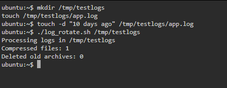
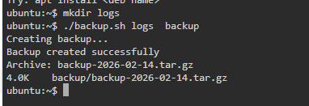

# Day 19 – Log Rotation, Backup & Crontab


#  Task 1 – Log Rotation Script

# `log_rotate.sh`

```bash
#!/bin/bash
set -euo pipefail

LOG_DIR="${1:-}"

if [ -z "$LOG_DIR" ]; then
  echo "Usage: $0 <log_directory>"
  exit 1
fi

if [ ! -d "$LOG_DIR" ]; then
  echo "Error: Directory does not exist"
  exit 1
fi

echo "Processing logs in $LOG_DIR"

# Compress .log files older than 7 days
COMPRESSED_COUNT=$(find "$LOG_DIR" -type f -name "*.log" -mtime +7 -print -exec gzip {} \; | wc -l)

# Delete .gz files older than 30 days
DELETED_COUNT=$(find "$LOG_DIR" -type f -name "*.gz" -mtime +30 -print -delete | wc -l)

echo "Compressed files: $COMPRESSED_COUNT"
echo "Deleted old archives: $DELETED_COUNT"
```

---

# Sample Output



---------------------------------------------------------------------------

#  Task 2 – Server Backup Script

# `backup.sh`

```bash
#!/bin/bash
set -euo pipefail

SOURCE="${1:-}"
DEST="${2:-}"

if [ -z "$SOURCE" ] || [ -z "$DEST" ]; then
  echo "Usage: $0 <source_directory> <backup_destination>"
  exit 1
fi

if [ ! -d "$SOURCE" ]; then
  echo "Error: Source directory does not exist"
  exit 1
fi

mkdir -p "$DEST"

TIMESTAMP=$(date +%Y-%m-%d)
ARCHIVE_NAME="backup-$TIMESTAMP.tar.gz"
ARCHIVE_PATH="$DEST/$ARCHIVE_NAME"

echo "Creating backup..."

tar -czf "$ARCHIVE_PATH" "$SOURCE"

if [ -f "$ARCHIVE_PATH" ]; then
  echo "Backup created successfully"
  echo "Archive: $ARCHIVE_NAME"
  du -h "$ARCHIVE_PATH"
else
  echo "Backup failed"
  exit 1
fi

# Delete backups older than 14 days
find "$DEST" -type f -name "backup-*.tar.gz" -mtime +14 -delete
```

---

# Output



------------------------------------------------------------------------------


# Task 3 – Crontab

# View current cron jobs

```bash
crontab -l
```

------------------------------------------------------------------------------


# Cron Entries

# Run `log_rotate.sh` daily at 2 AM

```
0 2 * * * /path/to/log_rotate.sh /var/log/myapp
```

# Run `backup.sh` every Sunday at 3 AM

```
0 3 * * 0 /path/to/backup.sh /home/app /backups
```

# Health check every 5 minutes

```
*/5 * * * * /path/to/health_check.sh
```

------------------------------------------------------------------------------


# Task 4 – Combined Maintenance Script

# `maintenance.sh`

```bash
#!/bin/bash
set -euo pipefail

LOG_FILE="/var/log/maintenance.log"

log() {
  echo "$(date '+%Y-%m-%d %H:%M:%S') - $1" >> "$LOG_FILE"
}

run_log_rotation() {
  log "Starting log rotation"
  /path/to/log_rotate.sh /var/log/myapp >> "$LOG_FILE" 2>&1
  log "Log rotation completed"
}

run_backup() {
  log "Starting backup"
  /path/to/backup.sh /home/app /backups >> "$LOG_FILE" 2>&1
  log "Backup completed"
}

main() {
  log "Maintenance job started"
  run_log_rotation
  run_backup
  log "Maintenance job finished"
}

main
```

---

# Sample `/var/log/maintenance.log`

```


---------------------------------------------------------------------------

## 🕒 Cron Entry for Maintenance (Daily at 1 AM)

```bash
0 1 * * * /path/to/maintenance.sh
```

---------------------------------------------------------------------------


# What I Learned 

1. Automating log cleanup prevents disk space issues
2. Backups must be timestamped and auto-cleaned
3. Cron enables fully automated server maintenance

