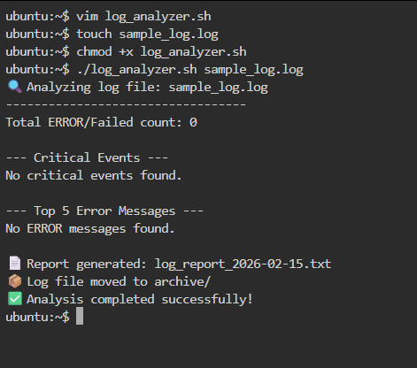
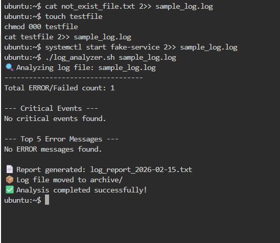

# Day 20 – Bash Log Analyzer

## Overview
This script analyzes system log files and generates a summary report.

## Features Implemented

### 1. Input Validation
- Checks if argument is passed
- Checks if file exists

### 2. Error Count
Counts lines containing:
- ERROR
- Failed

### 3. Critical Events
Displays CRITICAL lines with line numbers.

### 4. Top 5 Error Messages
Extracts ERROR messages and displays top 5 occurrences.

### 5. Summary Report
Generates file:
log_report_<date>.txt

Includes:
- Date
- Log file name
- Total lines
- Error count
- Top 5 errors
- Critical events

### 6. Archive Feature
- Creates archive/ directory
- Moves processed log into archive/

---

## Commands Used

- grep
- awk
- sort
- uniq
- wc
- cut
- date
- mv
- mkdir

---

## Sample Execution

```bash
./log_analyzer.sh sample_log.log
```





# What I Learned

- How to combine grep, awk, sort, uniq for log analysis.

- How to generate structured reports dynamically.

- How to automate log archival in Bash scripting.