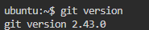
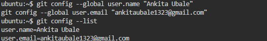
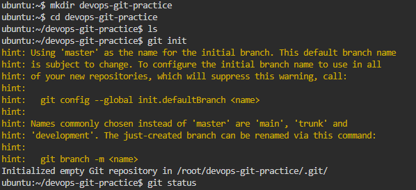
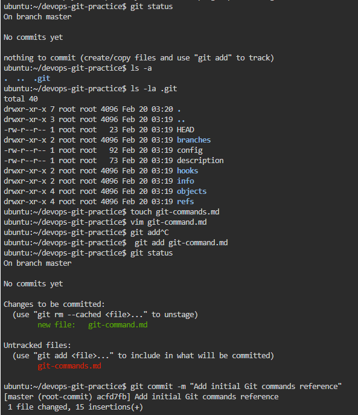
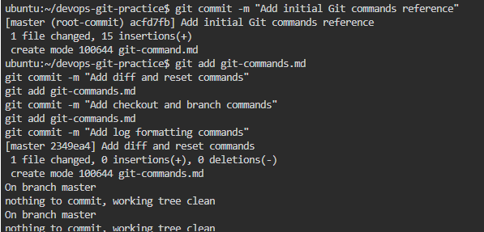
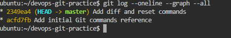

## **Task 1: Install and Configure Git**

1. **Check Git installation**

```bash
git --version
```



2. **Set up your identity**

```bash
git config --global user.name "Ankita Ubale"
git config --global user.email "ankitaubale1323@gmail.com"
```

3. **Verify your config**

```bash
git config --list
```



---

## **Task 2: Create Your Git Project**

1. **Create a folder**

```bash
mkdir devops-git-practice
cd devops-git-practice
```

2. **Initialize Git repository**

```bash
git init
```



3. **Check status**

```bash
git status
```


4. **Explore `.git/`**

```bash
ls -la .git
```


---

## **Task 3: Create Git Commands Reference**

Create a file `git-commands.md`:

```bash
touch git-commands.md
```

Example contents:

```markdown
# Git Commands Reference

## Setup & Config
- `git config --global user.name "Your Name"`: Sets your Git username
- `git config --global user.email "you@example.com"`: Sets your Git email

## Basic Workflow
- `git init`: Initialize a Git repository
- `git add <file>`: Stage file changes
- `git commit -m "message"`: Commit staged changes with a message

## Viewing Changes
- `git status`: Shows the state of working directory and staging area
- `git log`: View commit history
```

---

## **Task 4: Stage and Commit**

1. **Stage the file**

```bash
git add git-commands.md
```

2. **Check staged files**

```bash
git status
```

3. **Commit your changes**

```bash
git commit -m "Add initial Git commands reference"
```

4. **View commit history**

```bash
git log --oneline
```

---

## **Task 5: Make More Changes and Build History**

* Add more commands to `git-commands.md`, e.g., `git diff`, `git reset`, `git checkout`.
* Repeat **add → commit** 3 times:

```bash
git add git-commands.md
git commit -m "Add diff and reset commands"
git add git-commands.md
git commit -m "Add checkout and branch commands"
git add git-commands.md
git commit -m "Add log formatting commands"
```

* View history in compact form:

```bash
git log --oneline --graph --all
```

---
