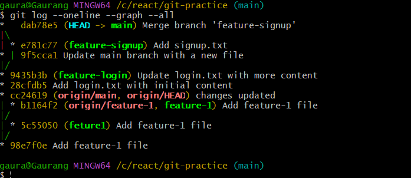
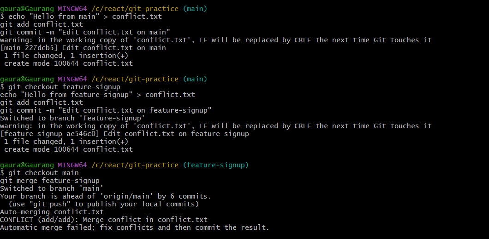
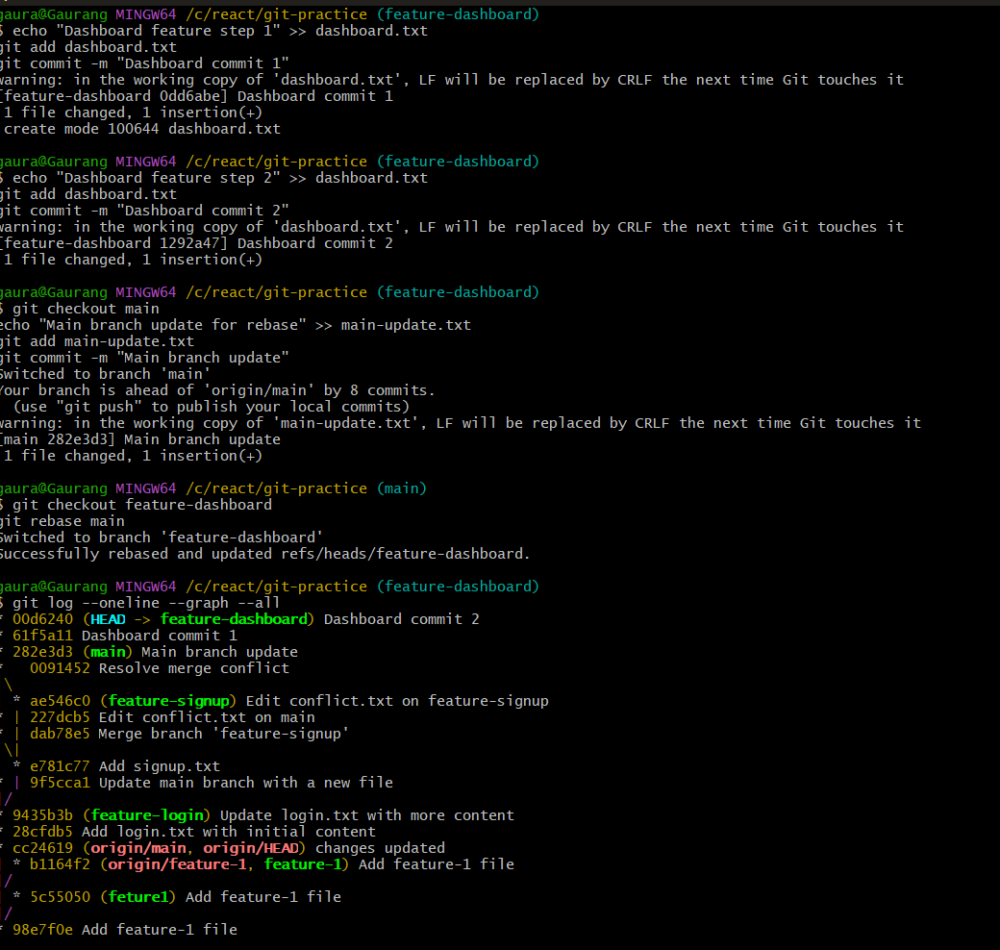
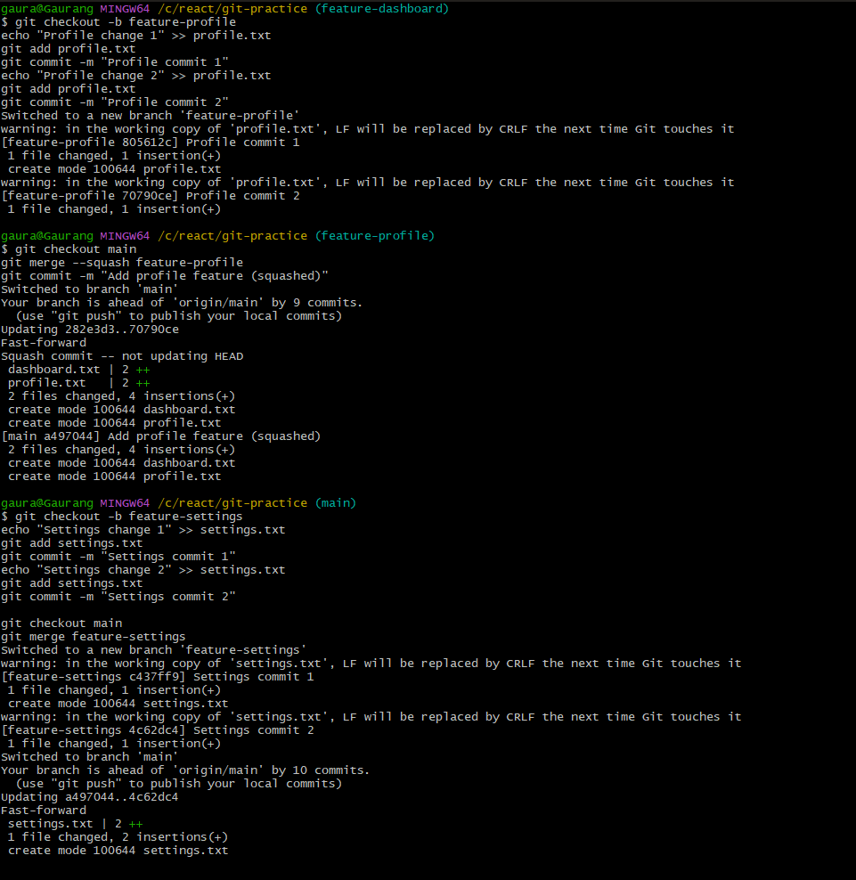

## **Setup**

Make sure you’re on your project repo:

```bash
cd devops-git-practice
git checkout main
git pull origin main
```

---

## **Task 1: Git Merge**

### Step 1 – Fast-Forward Merge

```bash
# Create and switch to feature-login
git checkout -b feature-login

# Make some changes, e.g., edit README or add a file
echo "Login feature code" >> login.txt
git add login.txt
git commit -m "Add login.txt with initial content"

# Add another commit
echo "More login updates" >> login.txt
git add login.txt
git commit -m "Update login.txt with more content"

# Switch back to main
git checkout main

# Merge feature-login
git merge feature-login

# Check history
git log --oneline --graph --all
```
 Observe: This should be a **fast-forward merge** (no merge commit).

---

### Step 2 – Merge Commit

```bash
# Create feature-signup branch
git checkout -b feature-signup

# Add commits
echo "Signup feature" >> signup.txt
git add signup.txt
git commit -m "Add signup.txt"

# Meanwhile, make a commit in main
git checkout main
echo "Main branch update" >> main-update.txt
git add main-update.txt
git commit -m "Update main branch with a new file"

# Switch back and merge
git checkout main
git merge feature-signup

# Check history
git log --oneline --graph --all
```

 Observe: Git will create a **merge commit** this time.

---

### Step 3 – Merge Conflict (Optional)

```bash
# On main
echo "Hello from main" > conflict.txt
git add conflict.txt
git commit -m "Edit conflict.txt on main"

# On feature-signup
git checkout feature-signup
echo "Hello from feature-signup" > conflict.txt
git add conflict.txt
git commit -m "Edit conflict.txt on feature-signup"

# Merge feature-signup into main
git checkout main
git merge feature-signup
```

* Git will throw a conflict: manually edit `conflict.txt`, then:

```bash
git add conflict.txt
git commit -m "Resolve merge conflict"
```


---

## **Task 2: Git Rebase**

```bash
# Create feature-dashboard branch
git checkout -b feature-dashboard

# Add 2-3 commits
echo "Dashboard feature step 1" >> dashboard.txt
git add dashboard.txt
git commit -m "Dashboard commit 1"

echo "Dashboard feature step 2" >> dashboard.txt
git add dashboard.txt
git commit -m "Dashboard commit 2"

# Meanwhile, main moves ahead
git checkout main
echo "Main branch update for rebase" >> main-update.txt
git add main-update.txt
git commit -m "Main branch update"

# Rebase feature-dashboard onto main
git checkout feature-dashboard
git rebase main

# Visualize history
git log --oneline --graph --all
```

 Observe: history is **linear** now, commits from `feature-dashboard` appear on top of main.

---

## **Task 3: Squash Commit vs Merge Commit**

```bash
# Squash Merge
git checkout -b feature-profile
echo "Profile change 1" >> profile.txt
git add profile.txt
git commit -m "Profile commit 1"
echo "Profile change 2" >> profile.txt
git add profile.txt
git commit -m "Profile commit 2"

# Merge with squash
git checkout main
git merge --squash feature-profile
git commit -m "Add profile feature (squashed)"

# Regular merge
git checkout -b feature-settings
echo "Settings change 1" >> settings.txt
git add settings.txt
git commit -m "Settings commit 1"
echo "Settings change 2" >> settings.txt
git add settings.txt
git commit -m "Settings commit 2"

git checkout main
git merge feature-settings
```


Check history:

```bash
git log --oneline --graph --all
```!
[alt text](image-7.png)

* Squash: single commit
* Regular: multiple commits

---

## **Task 4: Git Stash**

```bash
# Make changes but don't commit
echo "Work in progress" >> temp.txt

# Try switching branch (Git will warn)
git checkout main

# Stash your work
git stash push -m "WIP temp.txt changes"

# Switch branch, do some work
git checkout feature-login
echo "Some updates" >> login.txt
git add login.txt
git commit -m "Update login in feature-login"

# Go back and apply stash
git checkout main
git stash pop

# List multiple stashes
git stash list

# Apply specific stash
git stash apply stash@{0}
```

---

## **Task 5: Cherry Pick**

```bash
# Create hotfix branch
git checkout -b feature-hotfix
echo "Hotfix 1" >> hotfix.txt
git add hotfix.txt
git commit -m "Hotfix commit 1"
echo "Hotfix 2" >> hotfix.txt
git add hotfix.txt
git commit -m "Hotfix commit 2"
echo "Hotfix 3" >> hotfix.txt
git add hotfix.txt
git commit -m "Hotfix commit 3"

# Switch to main and cherry-pick 2nd commit
git checkout main
git cherry-pick <commit-hash-of-hotfix-2>

# Check log
git log --oneline --graph --all
```

---
