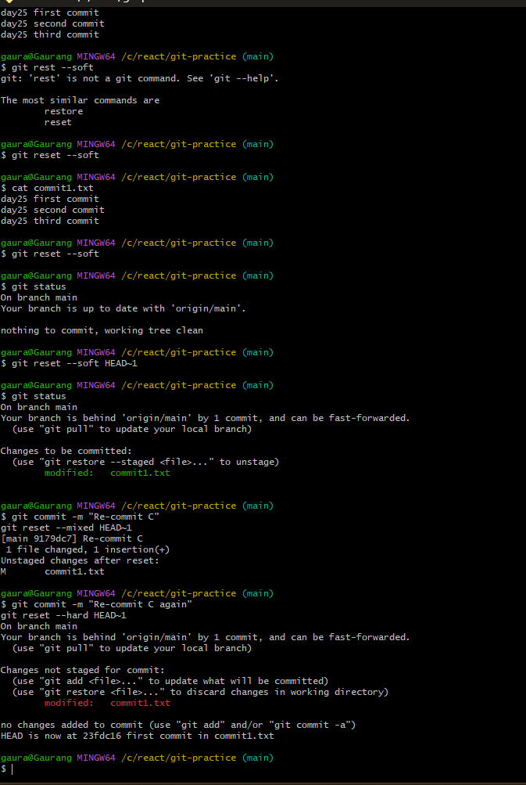

# Day 25 – Git Reset vs Revert & Branching Strategies

## Task 1: Git Reset — Observations

**Commands Used:**

```bash
git reset --soft HEAD~1
git reset --mixed HEAD~1
git reset --hard HEAD~1
```

**Observations:**
---
---


---

## Git Reset – Observations 

When I created three commits (A, B, C) and used different reset options, here is what I observed:

### 1️⃣ git reset --soft HEAD~1

* The last commit was removed.
* HEAD moved back to the previous commit.
* The changes from the removed commit were still staged.
* Nothing was lost.

This is useful when I want to redo or modify the last commit without losing the changes.

---

### 2️⃣ git reset --mixed HEAD~1

* The last commit was removed.
* HEAD moved back.
* The changes were still in my working directory.
* But the changes were unstaged.

This is useful when I want to edit the files again before committing.

Note: `--mixed` is the default option if we just run `git reset HEAD~1`.

---

### 3️⃣ git reset --hard HEAD~1

* The last commit was removed.
* HEAD moved back.
* The changes in the working directory were completely deleted.
* The staging area was also cleared.

This is dangerous because the changes are permanently lost (unless recovered using `git reflog`).

---

## Important Understanding

* `--soft` → safest, keeps changes staged
* `--mixed` → keeps changes but unstaged
* `--hard` → deletes everything

`git reset` should only be used for local (unpushed) commits.
If commits are already pushed to a shared branch, using reset can cause problems for other team members because it rewrites history.

---




---
---

**Answers:**

* **Difference between `--soft`, `--mixed`, and `--hard`**

  * `--soft` → only moves HEAD, keeps changes staged
  * `--mixed` → moves HEAD, keeps changes in working dir but unstaged
  * `--hard` → moves HEAD, deletes changes in working dir

* **Which one is destructive?**

  * `--hard` is destructive because it deletes changes from working directory and staging area.

* **When to use each?**

  * `--soft` → to combine or redo commits
  * `--mixed` → to unstage changes but keep them for editing
  * `--hard` → to completely discard mistakes before committing

* **Should you use `git reset` on pushed commits?**

  * No. It rewrites history and can break shared branches. Only safe for local/unpushed commits.

---

## Task 2: Git Revert — Observations

**Commands Used:**

```bash
git revert <commit-hash-of-Y>
```

**Observations:**

* Reverting commit Y creates a **new commit** that undoes the changes of Y.
* `git log` still shows commit Y in history.
* No commits are removed; history remains intact.

**Answers:**

* **Difference from reset:**

  * `reset` rewrites history, removing commits.
  * `revert` creates a new commit to safely undo changes.

* **Why is revert safer than reset for shared branches?**

  * It doesn’t rewrite history, so other collaborators won’t face conflicts.

* **When to use revert vs reset:**

  * **Revert:** Undo a mistake on a branch that’s already shared/pushed.
  * **Reset:** Undo local mistakes before pushing commits.

---


---

## Task 4: Branching Strategies — Observations

1. **GitFlow**

   * **Description:** Uses `develop`, `feature`, `release`, and `hotfix` branches.
   * **When used:** Large teams, scheduled releases.
   * **Pros:** Structured, predictable, good for multiple concurrent features.
   * **Cons:** Can be heavy for small teams, overhead in managing multiple branches.

```
main
 │
 ├─ develop
 │   ├─ feature/xyz
 │   └─ release/v1.0
 └─ hotfix/v1.0.1
```

2. **GitHub Flow**

   * **Description:** Simple main branch with short-lived feature branches → PR → merge.
   * **When used:** Startups, rapid delivery.
   * **Pros:** Lightweight, easy to use, fast.
   * **Cons:** Less structured for large releases.

```
main
 │
 ├─ feature/login
 └─ feature/payment
```

3. **Trunk-Based Development**

   * **Description:** Everyone commits to main or very short-lived branches (<1 day).
   * **When used:** Continuous delivery, CI/CD-focused teams.
   * **Pros:** Fast feedback, minimal branch management.
   * **Cons:** Requires strict CI/CD testing, can be risky without automated checks.

```
main ──●──●──●
      └─ temp_branch ●
```

**Strategy Recommendations:**

| Scenario                           | Recommended Strategy    |
| ---------------------------------- | ----------------------- |
| Startup shipping fast              | GitHub Flow             |
| Large team with scheduled releases | GitFlow                 |
| Open-source project like React     | Trunk-Based Development |

---

## Task 5: Git Commands Reference Update

**Reset & Revert Section:**

## Reset & Revert

- `git reset --soft HEAD~1` → undo commit, keep changes staged
- `git reset --mixed HEAD~1` → undo commit, keep changes unstaged
- `git reset --hard HEAD~1` → undo commit, discard all changes
- `git revert <commit>` → create a new commit that undoes a previous commit safely
```

---

