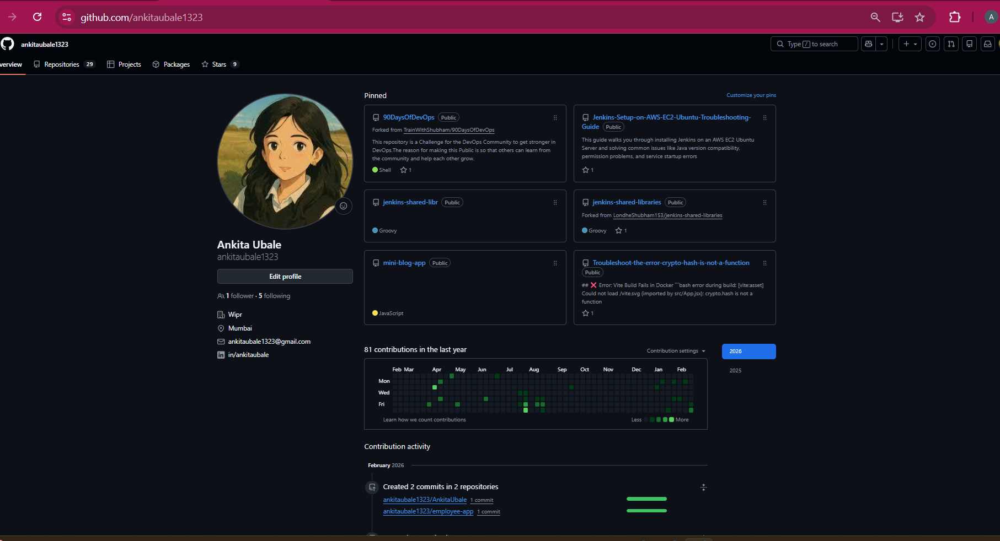

# Day 27 – GitHub Profile Makeover

## After
github: https://github.com/ankitaubale1323/AnkitaUbale/blob/main/README.md

## Improvements

1. Added professional profile README
2. Organized repositories into focused categories
3. Removed unused and irrelevant repositories

## Why This Matters

A clean GitHub improves credibility and helps recruiters quickly understand my DevOps journey.