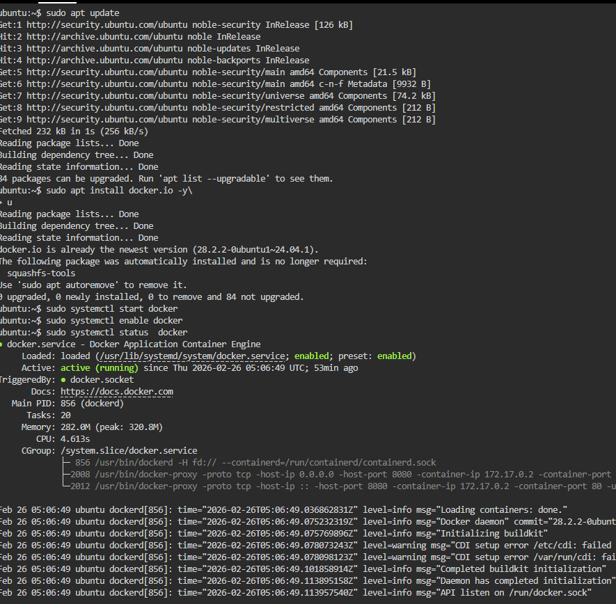
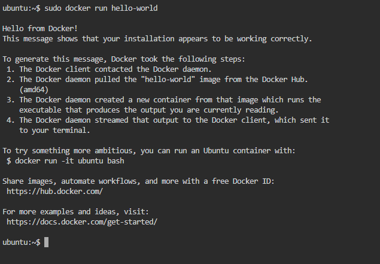
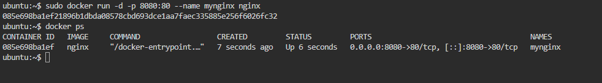
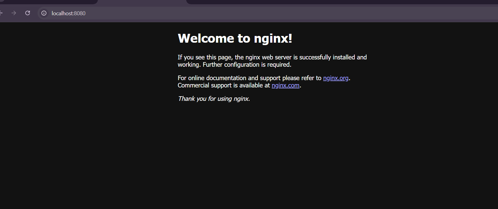
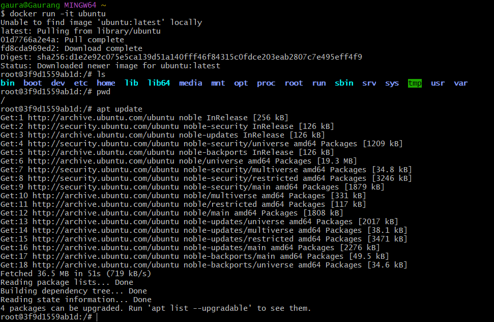
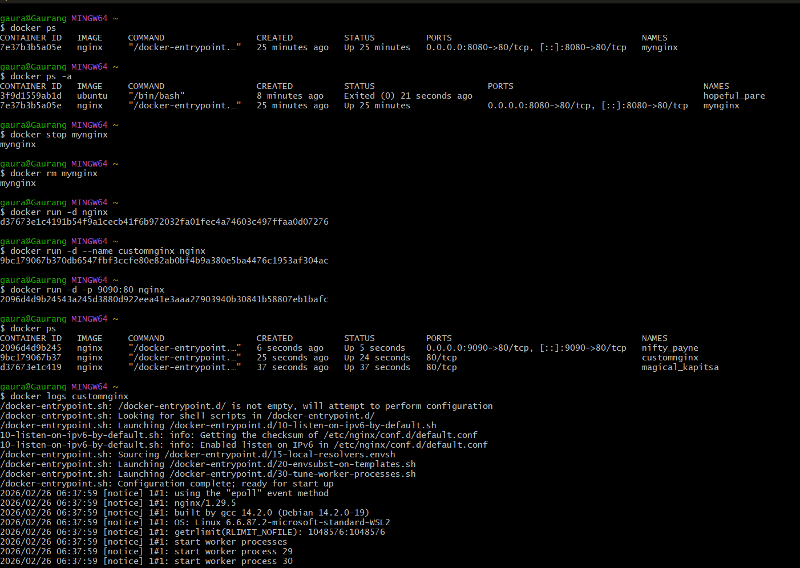

# Day 29 – Docker Basics

## Task 1: What is Docker?

### What is a Container?

A **container** is a lightweight, standalone, executable package that includes:

* Application code
* Runtime
* System libraries
* Dependencies
* Configuration

It runs consistently across environments.

### Why Do We Need Containers?

Before containers:

* "It works on my machine" problem 😅
* Dependency conflicts
* Difficult environment setup

Containers solve this by:

* Packaging everything together
* Running consistently across dev, test, prod
* Being lightweight and fast

---

## Containers vs Virtual Machines

| Feature        | Containers           | Virtual Machines    |
| -------------- | -------------------- | ------------------- |
| Boot Time      | Seconds              | Minutes             |
| Size           | MBs                  | GBs                 |
| OS             | Share host OS kernel | Each VM has full OS |
| Performance    | Near-native          | Slight overhead     |
| Resource Usage | Lightweight          | Heavy               |

### Key Difference

* **VMs virtualize hardware**
* **Containers virtualize the OS**

VM Example:

* Hypervisor → VM → Guest OS → App

Container Example:

* Host OS → Docker Engine → Container → App

Containers are more efficient because they share the host OS kernel.

---

## Docker Architecture

Docker uses a **client-server architecture**.

### Main Components

1. **Docker Client**

   * CLI (`docker run`, `docker ps`, etc.)
   * Sends commands to daemon

2. **Docker Daemon (dockerd)**

   * Runs in background
   * Manages images, containers, networks, volumes

3. **Docker Images**

   * Blueprint/template to create containers
   * Read-only

4. **Docker Containers**

   * Running instance of an image

5. **Docker Registry**

   * Stores images
   * Example: Docker Hub

---

### Docker Architecture (My Understanding)

User → Docker CLI → Docker Daemon → Pull Image from Registry → Create & Run Container

Flow:

1. I run `docker run nginx`
2. Docker checks locally for image
3. If not found, pulls from Docker Hub
4. Creates container
5. Runs container

---

# Task 2: Install Docker

## Install Docker (Ubuntu Example)

```bash
sudo apt update
sudo apt install docker.io -y
```

Enable and start Docker:

```bash
sudo systemctl start docker
sudo systemctl enable docker
```

Verify installation:

```bash
docker --version
```

---


## Run Hello World Container

```bash
sudo docker run hello-world
```

### What Happened?

* Docker client contacted daemon
* Daemon pulled `hello-world` image
* Container was created and executed
* Output confirmed Docker is working



---

# Task 3: Run Real Containers

## Run Nginx Container

```bash
sudo docker run -d -p 8080:80 --name mynginx nginx
```

Access in browser:

```
http://localhost:8080
```

You should see the Nginx welcome page.

---

## Run Ubuntu in Interactive Mode

```bash
sudo docker run -it ubuntu
```

Now you're inside a mini Linux system.

Try:

```bash
ls
pwd
apt update
```

Exit:

```bash
exit
```

---

## List Running Containers

```bash
docker ps
```

## List All Containers

```bash
docker ps -a
```

## Stop a Container

```bash
docker stop mynginx
```

## Remove a Container

```bash
docker rm mynginx
```

---

# Task 4: Explore Docker

## Detached Mode

```bash
docker run -d nginx
```

Difference:

* `-d` runs container in background
* Without `-d`, it runs in foreground

---

## Custom Container Name

```bash
docker run -d --name customnginx nginx
```

---

## Port Mapping

```bash
docker run -d -p 9090:80 nginx
```

* 9090 = host port
* 80 = container port

Access via:

```
http://localhost:9090
```

---

## Check Logs

```bash
docker logs customnginx
```

---

## Execute Command Inside Running Container

```bash
docker exec -it customnginx /bin/bash
```

Now you’re inside the running container.


# Why Docker Matters in DevOps

* Used in CI/CD pipelines
* Used in Kubernetes
* Ensures environment consistency
* Makes microservices easier
* Speeds up deployment

Docker is the foundation of modern DevOps workflows.

---

# What I Learned Today

* Containers are lightweight and efficient
* Docker architecture flow
* Running containers in interactive & detached mode
* Port mapping and container management
* How to inspect logs and exec into containers

