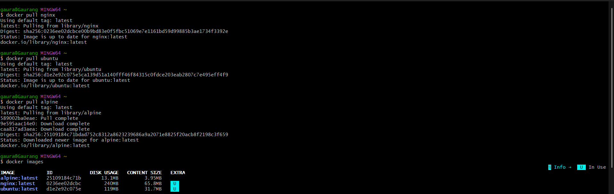
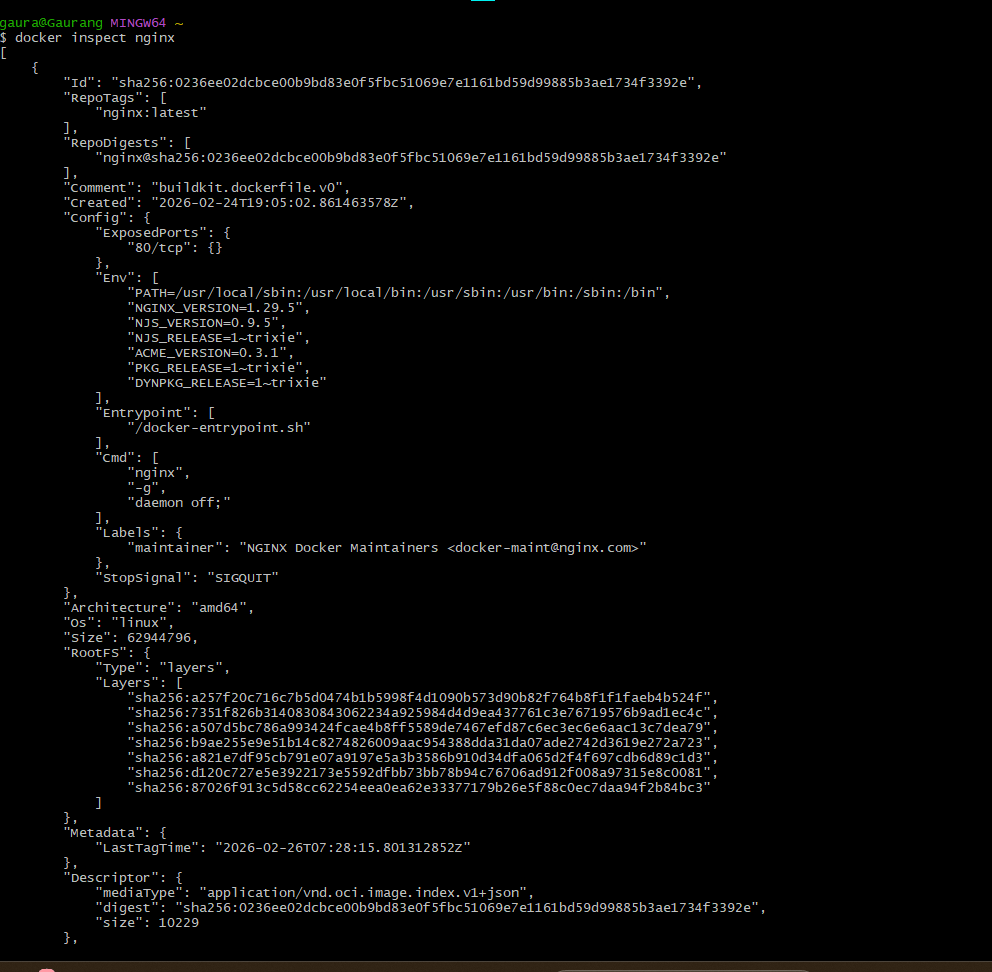
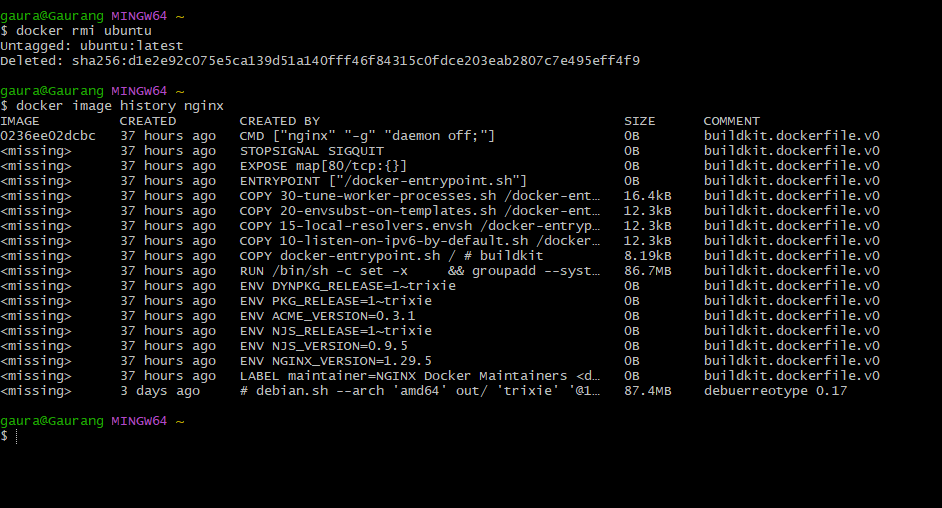
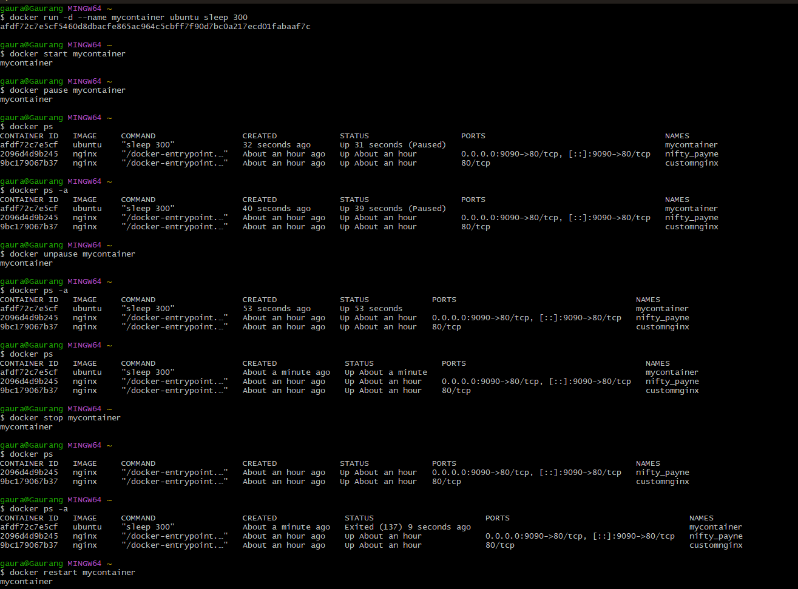
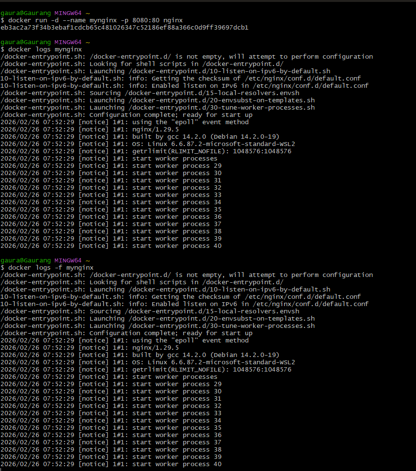
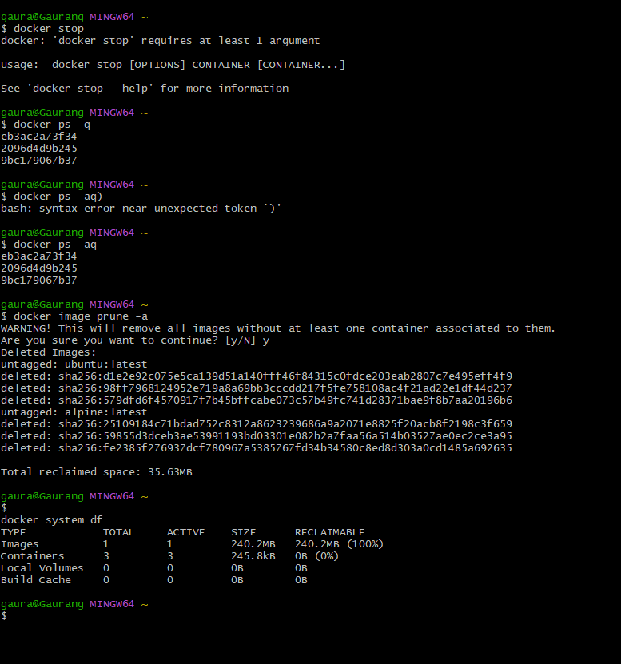

# Day 30 – Docker Images & Container Lifecycle


#  Images vs Containers

## What is a Docker Image?

A Docker Image is:

* A **read-only template**
* Used to create containers
* Built using layers

Think of it like:

* Image = Blueprint
* Container = Running house built from that blueprint

## What is a Container?

A Container is:

* A **running instance** of an image
* Has writable layer on top
* Can be started, stopped, paused, removed

---

#  Task 1 – Working with Images

## 1️⃣ Pull Images

```bash
docker pull nginx
docker pull ubuntu
docker pull alpine
```

## 2️⃣ List Images

```bash
docker images
```

 Output:

 

## 3️⃣ Why is Alpine So Small?

* Alpine uses **musl libc**
* Minimal packages
* Designed for containers
* No unnecessary tools

Ubuntu includes:

* Full GNU utilities
* Larger base libraries

 Alpine = lightweight production image
 Ubuntu = more tools, bigger size

## 4️⃣ Inspect Image

```bash
docker inspect nginx
```


## 5️⃣ Remove Image

```bash
docker rmi ubuntu
```

---

# 🏗 Task 2 – Image Layers

## Check Image History

```bash
docker image history nginx
```

 

##  What Are Layers?

Docker images are built in layers.

Each instruction in a Dockerfile creates a layer:

* FROM
* RUN
* COPY
* CMD

### Why Docker Uses Layers?

* Faster builds (layer caching)
* Reusability
* Efficient storage
* Shared layers between images

If 10 containers use nginx image → base layers stored only once.

---

# 🔄 Task 3 – Full Container Lifecycle

Let’s practice with Ubuntu.

## 1️⃣ Create (Without Starting)

```bash
docker create --name mycontainer ubuntu
```

Check:

```bash
docker ps -a
```

State: **Created**

---

## 2️⃣ Start

```bash
docker start mycontainer
```

State: **Running**

---

## 3️⃣ Pause

```bash
docker pause mycontainer
```

State: **Paused**

---

## 4️⃣ Unpause

```bash
    docker unpause mycontainer
```

---

## 5️⃣ Stop

```bash
docker stop mycontainer
```

State: **Exited**

---

## 6️⃣ Restart

```bash
docker restart mycontainer
```

---

## 7️⃣ Kill

```bash
docker kill mycontainer
```

Immediate stop (SIGKILL)

---

## 8️⃣ Remove

```bash
docker rm mycontainer
```

State: Removed

---

# 🔍 Task 4 – Working with Running Containers

## Run Nginx in Detached Mode

```bash
docker run -d --name mynginx -p 8080:80 nginx
```

Access:

```
http://localhost:8080
```

---

## View Logs

```bash
docker logs mynginx
```

## Real-Time Logs

```bash
docker logs -f mynginx
```

---

## Exec into Container

```bash
docker exec -it mynginx /bin/bash
```

Explore:

```bash
ls /
```

---

## Run Single Command Without Entering

```bash
docker exec mynginx ls /usr/share/nginx/html
```

---

## Inspect Container

```bash
docker inspect mynginx
```

Find:

* IP Address
* Port Bindings
* Mounts
* Network Mode

---

# 🧹 Task 5 – Cleanup

## Stop All Running Containers

```bash
docker stop $(docker ps -q)
```

## Remove All Stopped Containers

```bash
docker rm $(docker ps -aq)
```

## Remove Unused Images

```bash
docker image prune -a
```

## Check Disk Usage

```bash
docker system df
```

---

#  What Surprised Me Today

* Containers have multiple states: Created, Running, Paused, Exited
* Images are layered and cached
* Alpine is extremely small compared to Ubuntu
* Removing containers does NOT remove images

---
##  Objective

Today I learned:

* The relationship between **Docker Images and Containers**
* How **image layers & caching** work
* The **complete lifecycle** of a container
* How to inspect, manage, and clean Docker resources

---
#  Key Takeaways

* Image = Blueprint
* Container = Running instance
* Layers = Efficient storage & caching
* Lifecycle management is critical in DevOps

---

