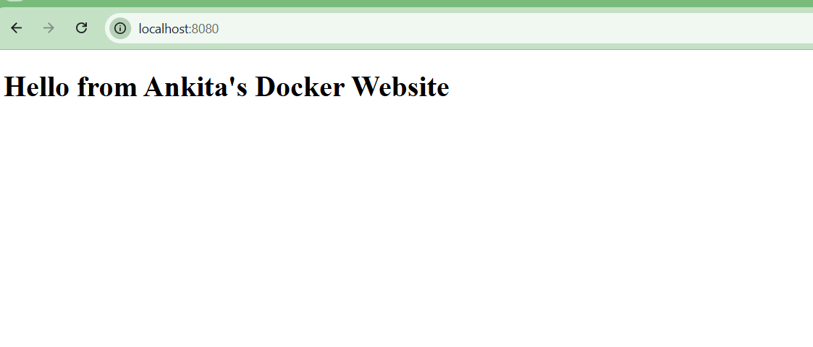
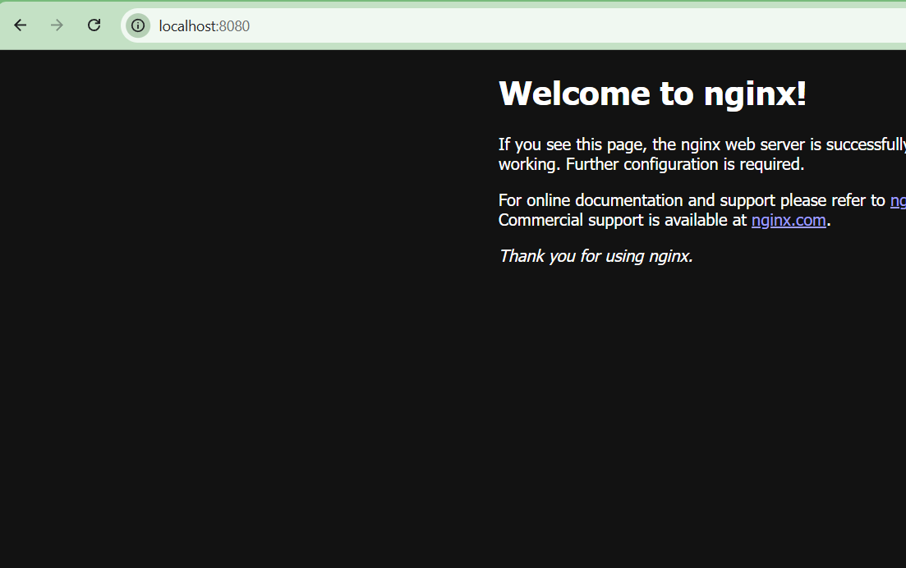

# Day 31 – Dockerfile: Build Your Own Images

##  Task 1: My First Dockerfile

### Dockerfile
```dockerfile
FROM ubuntu:latest

# Install curl
RUN apt-get update && apt-get install -y curl

# Set working directory
WORKDIR /app

# Copy file from host to image
COPY app.txt .

# Document exposed port
EXPOSE 8080

# Default command
CMD ["cat", "app.txt"]
````

### Build

```bash
docker build -t my-ubuntu:v1 .
```

### Run

```bash
docker run my-ubuntu:v1
```

### Output


---

## Task 2: Dockerfile Instructions

### Dockerfile

```dockerfile
FROM ubuntu:latest

RUN apt update && apt install -y nginx

WORKDIR /app

COPY sample.txt /app/sample.txt

EXPOSE 80

CMD ["nginx", "-g", "daemon off;"]
```

### Explanation

* FROM → Base image
* RUN → Executes commands during build
* WORKDIR → Sets working directory
* COPY → Copies files from host to container
* EXPOSE → Documents port
* CMD → Default runtime command

---

##  Task 3: CMD vs ENTRYPOINT

### CMD Example

```dockerfile
FROM ubuntu
CMD ["echo", "hello"]
```

Run:

```bash
docker run cmd-image
docker run cmd-image echo "override"
```

Observation:
CMD can be overridden by passing a new command.

---

### ENTRYPOINT Example

```dockerfile
FROM ubuntu
ENTRYPOINT ["echo"]
```

Run:

```bash
docker run entrypoint-image hello
docker run entrypoint-image world
```

Observation:
ENTRYPOINT does NOT get replaced.
Arguments are appended.

---

### When to use?

* CMD → When you want default command that users can override.
* ENTRYPOINT → When image should behave like a fixed executable.

---

##  Task 4: Simple Web App with Nginx

### index.html

```html
<!DOCTYPE html>
<html>
<head>
    <title>My Website</title>
</head>
<body>
    <h1>Hello from Ankita's Docker Website 🚀</h1>
</body>
</html>
```

### Dockerfile

```dockerfile
FROM nginx:alpine

COPY index.html /usr/share/nginx/html/index.html
```

### Build

```bash
docker build -t my-website:v1 .
```

### Run

```bash
docker run -d -p 8080:80 my-website:v1
```

Access:
[http://localhost:8080]


---
## 🚀 Task 5: .dockerignore

### .dockerignore

```
node_modules
.git
*.md
.env
```

Purpose:
Prevents unnecessary files from being added to image build context.

---

##  Task 6: Build Optimization & Cache

Observation:
Docker builds in layers.
If a layer doesn't change, Docker reuses cache.

Best Practice:
Place frequently changing instructions (like COPY . .) at the bottom.
This prevents rebuilding all layers.

Why layer order matters?

Because Docker rebuilds layers from the first changed instruction onward.
Better ordering = faster builds.

````
