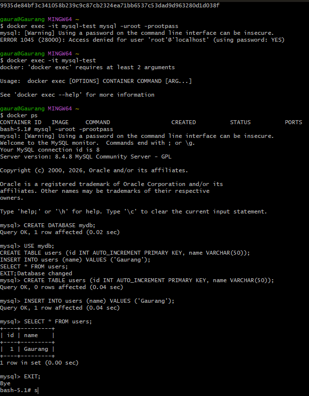
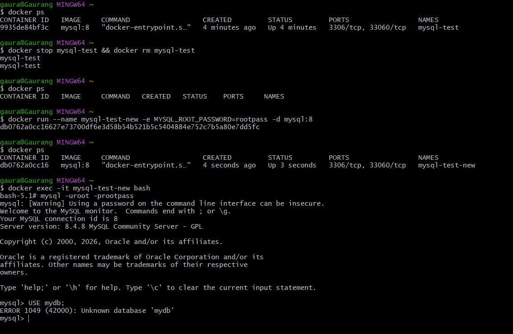
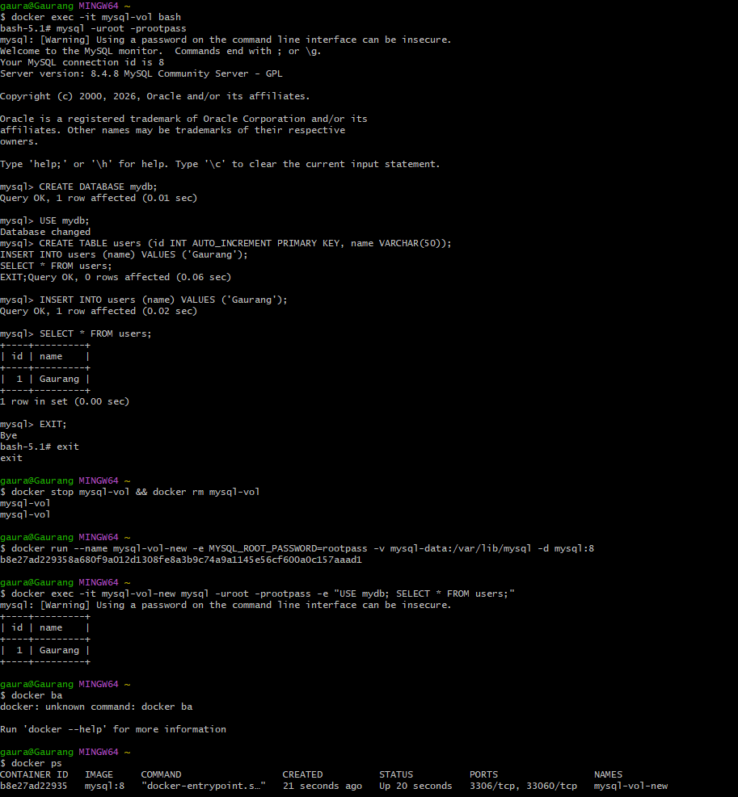
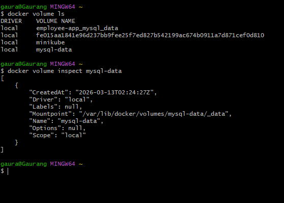
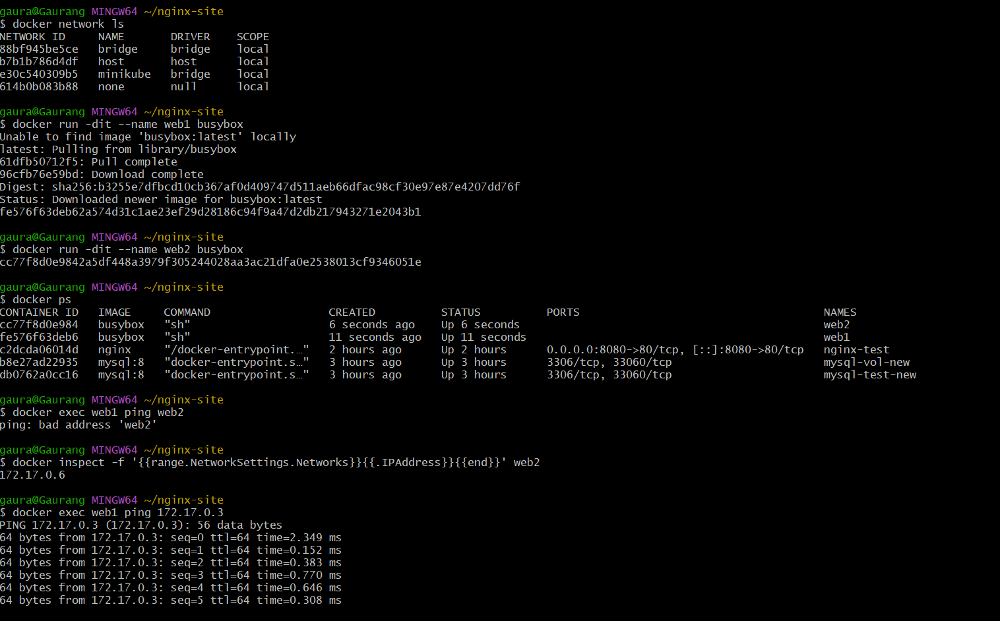
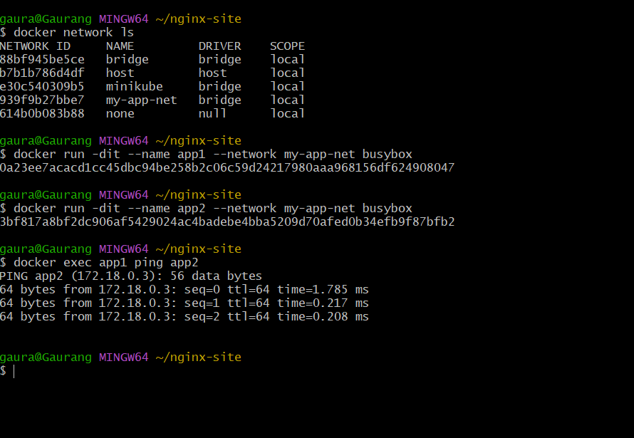
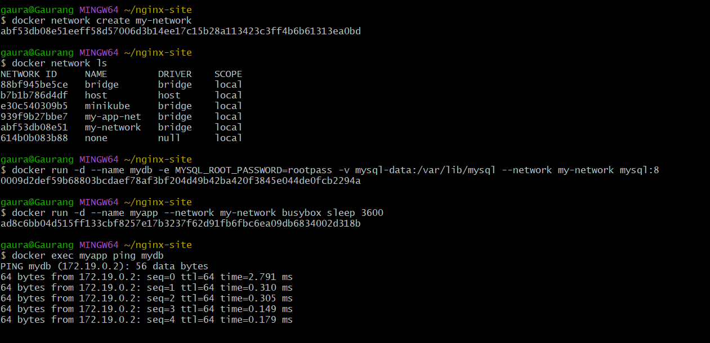

# Day 32 – Docker Volumes & Networking

## Objective

Learn **data persistence** and **container networking** in Docker. Today, we solve **two main problems**:

1. Containers are ephemeral — data disappears when removed.
2. Containers cannot easily communicate with each other by default.

We’ll use **MySQL** and **Nginx/BusyBox** containers to demonstrate volumes, bind mounts, and networking.

---

## Task 1: Ephemeral Containers – Data Loss without Volumes

**Step 1:** Run a MySQL container

```bash
docker run --name mysql-test -e MYSQL_ROOT_PASSWORD=rootpass -d mysql:8
```

**Step 2:** Connect and create a database/table

```bash
docker exec -it mysql-test mysql -uroot -prootpass
```

```sql
CREATE DATABASE mydb;
USE mydb;
CREATE TABLE users (id INT AUTO_INCREMENT PRIMARY KEY, name VARCHAR(50));
INSERT INTO users (name) VALUES ('Gaurang');
SELECT * FROM users;
EXIT;
```

**Step 3:** Stop and remove the container

```bash
docker stop mysql-test
docker rm mysql-test
```

**Step 4:** Run a new container without volume

```bash
docker run --name mysql-test-new -e MYSQL_ROOT_PASSWORD=rootpass -d mysql:8
docker exec -it mysql-test-new mysql -uroot -prootpass -e "USE mydb; SHOW TABLES;"
```

**Observation:**
The database and table are **gone**.

**Reason:**
MySQL stores data inside the container’s filesystem. When the container is removed, all data is lost.

---

## Task 2: Named Volumes – Persistent Data

**Step 1:** Create a named volume

```bash
docker volume create mysql-data
```

**Step 2:** Run MySQL with the named volume

```bash
docker run --name mysql-vol -e MYSQL_ROOT_PASSWORD=rootpass -v mysql-data:/var/lib/mysql -d mysql:8
```

**Step 3:** Connect and create table/data

```bash
docker exec -it mysql-vol mysql -uroot -prootpass
CREATE DATABASE mydb;
USE mydb;
CREATE TABLE users (id INT AUTO_INCREMENT PRIMARY KEY, name VARCHAR(50));
INSERT INTO users (name) VALUES ('Gaurang');
SELECT * FROM users;
EXIT;
```

**Step 4:** Stop and remove container

```bash
docker stop mysql-vol
docker rm mysql-vol
```

**Step 5:** Run a new container using the same volume

```bash
docker run --name mysql-vol-new -e MYSQL_ROOT_PASSWORD=rootpass -v mysql-data:/var/lib/mysql -d mysql:8
docker exec -it mysql-vol-new mysql -uroot -prootpass -e "USE mydb; SELECT * FROM users;"
```


**Observation:**
Data **persists** across container removal.

**Verification:**

```bash
docker volume ls
docker volume inspect mysql-data
```

---

## Task 3: Bind Mount – Real-time File Sync

**Step 1:** Create a folder on host

```bash
mkdir ~/nginx-site
echo "<h1>Hello from Host</h1>" > ~/nginx-site/index.html
```

**Step 2:** Run Nginx with bind mount

```bash
docker run -d --name nginx-test -p 8080:80 -v ~/nginx-site:/usr/share/nginx/html nginx
```

**Step 3:** Access in browser

Open: `http://localhost:8080` → should show **"Hello from Host"**

**Step 4:** Edit host file

```bash
echo "<h1>Updated Content</h1>" > ~/nginx-site/index.html
```


**Observation:**
Refreshing the browser shows **updated content instantly**.

**Difference:**

| Type         | Location        | Persistence | Use Case                      |
| ------------ | --------------- | ----------- | ----------------------------- |
| Named Volume | Docker managed  | Persistent  | Database storage              |
| Bind Mount   | Host filesystem | Persistent  | Code/static files (real-time) |

---

## Task 4: Docker Networking – Default Bridge

**Step 1:** List networks

```bash
docker network ls
docker network inspect bridge
```

**Step 2:** Run two containers on default bridge

```bash
docker run -d --name web1 nginx
docker run -d --name web2 nginx
```

**Step 3:** Test communication

```bash
docker exec web1 ping web2   # ❌ Fails by name
docker exec web1 ping <web2-ip>  # ✅ Works by IP
```

**Observation:**

* Cannot ping by container **name** on default bridge.
* IP works but is not reliable (changes after container restart).

---


## Task 5: Custom Bridge Network

**Step 1:** Create network

```bash
docker network create my-app-net
```

**Step 2:** Run containers on custom network

```bash
docker run -d --name app1 --network my-app-net nginx
docker run -d --name app2 --network my-app-net nginx
```

**Step 3:** Ping by name

```bash
docker exec app1 ping app2   #


```


**Reason:**
Custom networks include **internal DNS**, resolving container names automatically.

---

## Task 6: Database + App on Custom Network

**Step 1:** Create custom network

```bash
docker network create my-network
```

**Step 2:** Run MySQL with named volume

```bash
docker run -d --name mydb -e MYSQL_ROOT_PASSWORD=rootpass -v mysql-data:/var/lib/mysql --network my-network mysql:8
```

**Step 3:** Run app container (BusyBox) on same network

```bash
docker run -d --name myapp --network my-network busybox sleep 3600
```

**Step 4:** Test connectivity

```bash
docker exec myapp ping mydb   # ✅ Works
docker exec myapp mysql -h mydb -uroot -prootpass -e "SHOW DATABASES;"
```

**Observation:**
App container can connect to database by **container name**.

---

## Key Takeaways

1. Containers are ephemeral; **volumes are necessary for persistent data**.
2. **Named volumes**: managed by Docker, ideal for databases.
3. **Bind mounts**: instant host-container sync, ideal for static files/code.
4. Default bridge network **does not allow DNS name resolution**.
5. Custom networks **allow name-based communication** via built-in DNS.
6. Combining **volumes + custom networks** is a production-ready pattern for apps with databases.

---
