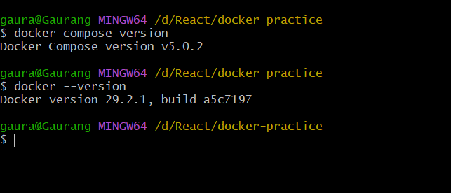
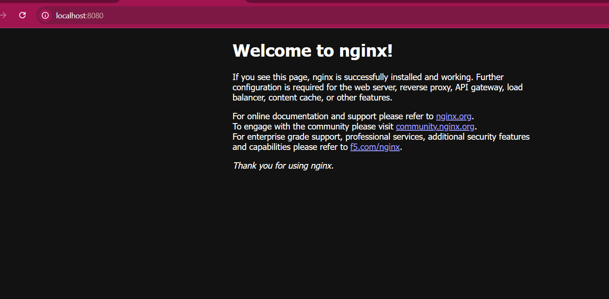
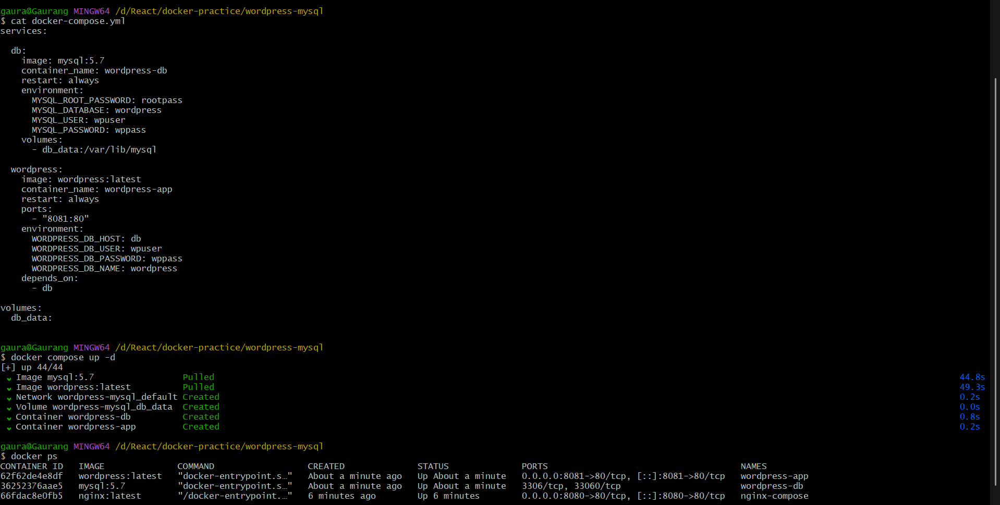
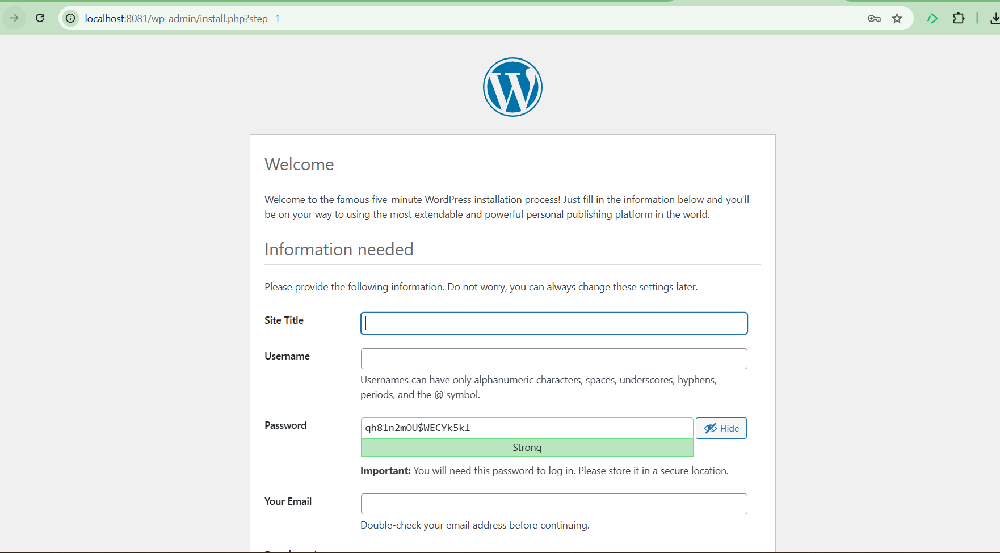
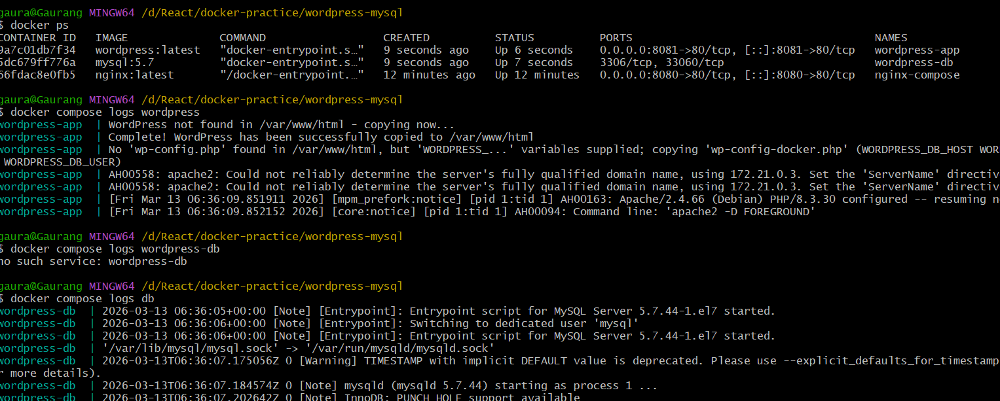
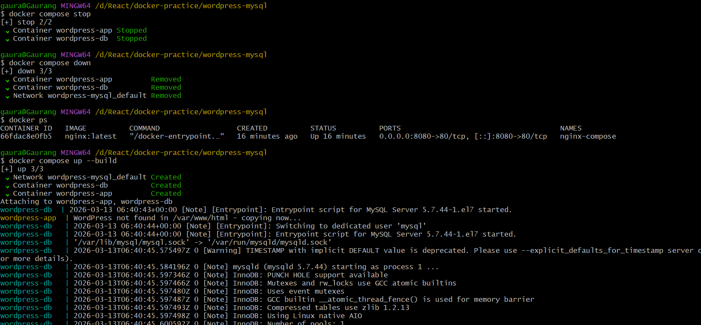
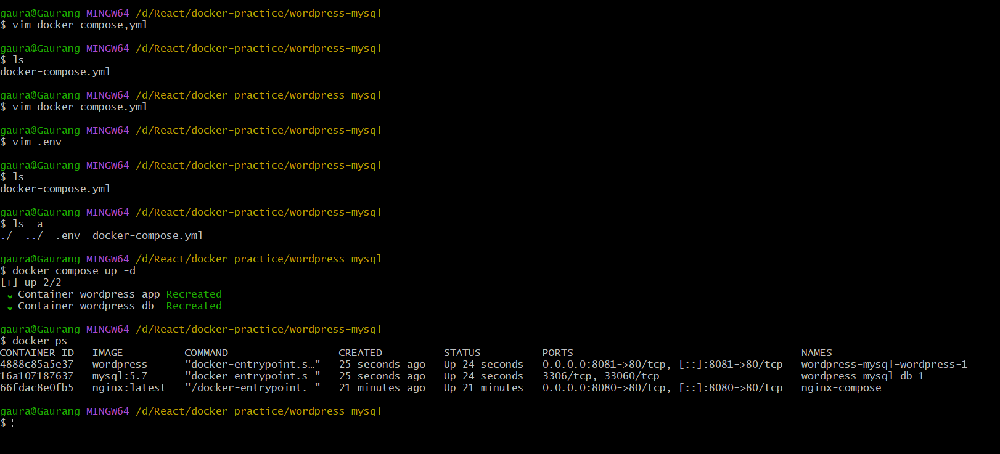

# Day 33 – Docker Compose

## Task 1 – Verify Docker Compose

Command:
docker compose version

Output:

---

## Task 2 – Nginx Compose Setup

Created docker-compose.yml for nginx.

Command used:
docker compose up -d

Accessed in browser:
http://localhost:8080

Stopped using:
docker compose down

---

## Task 3 – WordPress + MySQL

Services:
- WordPress
- MySQL

Features:
- Named volume for MySQL data
- Automatic network created by Docker Compose

Access:
http://localhost:8081

Verified persistence by stopping and restarting containers.

Result:
- WordPress site and database data remained intact.
- This confirms the named volume `db_data` is storing MySQL data persistently.
---

## Task 4 – Important Commands

Start:
docker compose up -d

View running services:
docker compose ps

View logs:
docker compose logs -f

View logs of service:
docker compose logs wordpress

Stop services:
docker compose stop

Remove containers:
docker compose down

Rebuild containers:
docker compose up --build

---

## Task 5 – Environment Variables

Created `.env` file and referenced variables in docker-compose.yml.

Docker Compose automatically loads `.env`.

Verified containers start successfully using environment variables.