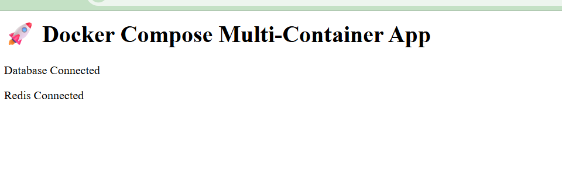
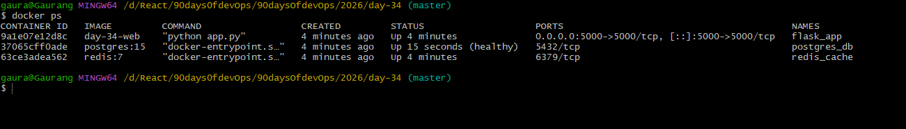
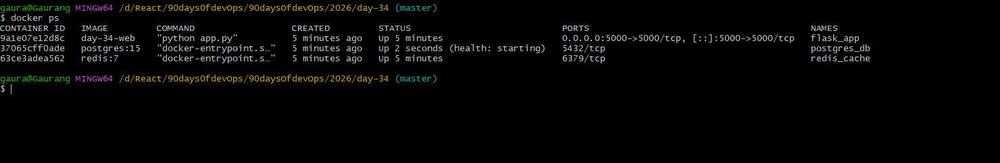
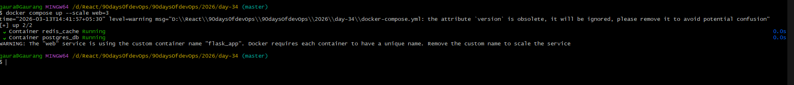

# Project Structure

```
2026/day-34/
│
├── docker-compose.yml
│
├── app/
│   ├── Dockerfile
│   ├── app.py
│   └── requirements.txt
│
└── day-34-compose-advanced.md
```

---


# 1 Commands to Run

Start everything:

```bash
docker compose up --build
```

Check containers:

```bash
docker compose ps
```

Open app:

```
http://localhost:5000
```

 output:



# 2 Test Restart Policy

Kill DB container:

```bash
docker kill postgres_db
```

Because we used:

```
restart: always
```

Docker will **automatically restart it**.

---

# 3 Test Scaling

Run:

```bash
docker compose up --scale web=3
```

What happens?

Only **one container will bind port 5000** because:

```
ports:
 - "5000:5000"
```


Multiple containers **cannot share the same host port**.

Production solution:

* Load balancer
* Nginx
* Kubernetes Service

---

# 4 Markdown Notes File

##  day-34-compose-advanced.md

```markdown
# Day 34 – Docker Compose Advanced

## 3-Service Architecture

Services used:

- Flask Web Application
- PostgreSQL Database
- Redis Cache

Docker Compose manages networking and container dependencies.

---

# Service Dependency

The web service depends on the database.

depends_on with healthcheck ensures the database is fully ready before the application starts.

Example:

depends_on:
  db:
    condition: service_healthy

---

# Healthcheck

Postgres healthcheck:

pg_isready -U postgres

Docker waits until the database is healthy before starting the app.

---

# Restart Policies

restart: always

Container always restarts even if manually stopped.

restart: on-failure

Container restarts only when it crashes.

Use Cases:

always → databases, monitoring tools  
on-failure → application containers

---

# Named Volumes

postgres_data volume stores database data persistently.

Even if the container stops, data remains.

---

# Custom Network

Custom bridge network created:

app-network

This allows services to communicate using service names.

Example:

web → db  
web → redis

---

# Scaling Test

Command used:

docker compose up --scale web=3

Problem:

Port mapping prevents multiple containers from binding the same port.

Solution:

Use load balancer or container orchestration.

---

# Key Learning

Docker Compose allows running multi-container production-like environments locally.

It manages:

- networking
- service dependencies
- volumes
- scaling
```

---
