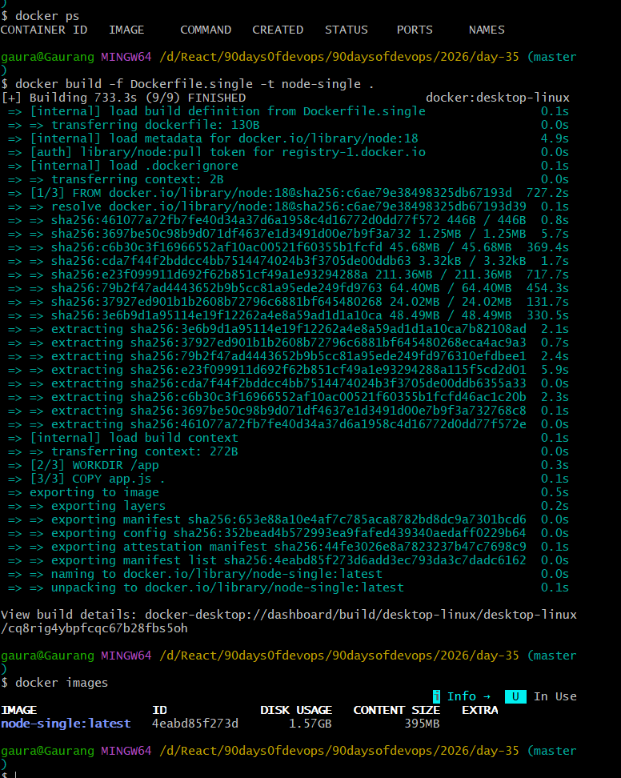
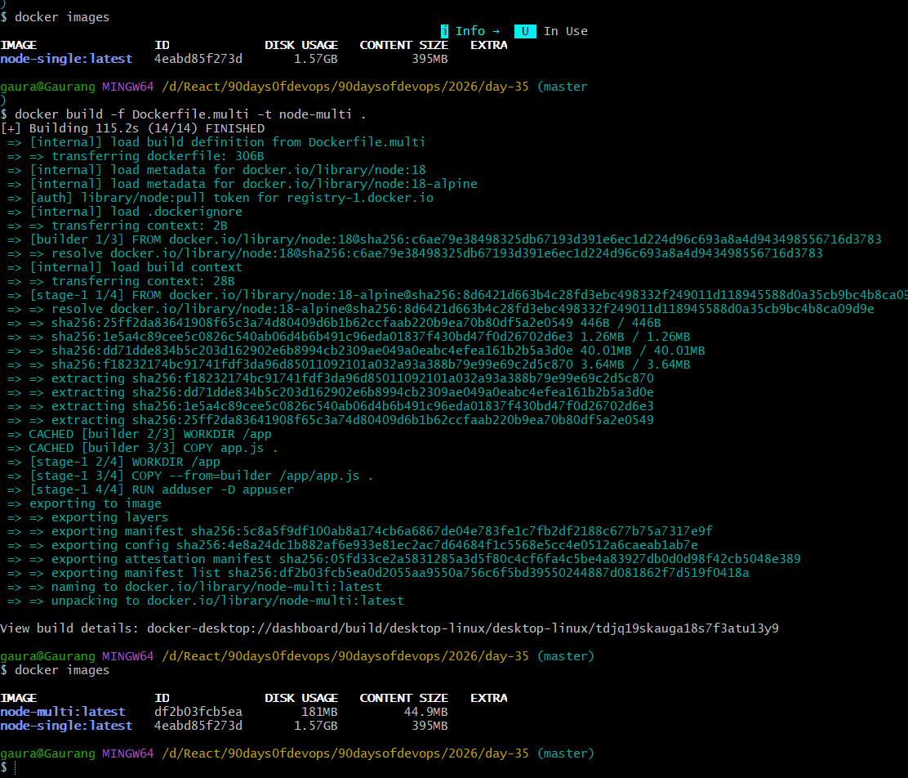
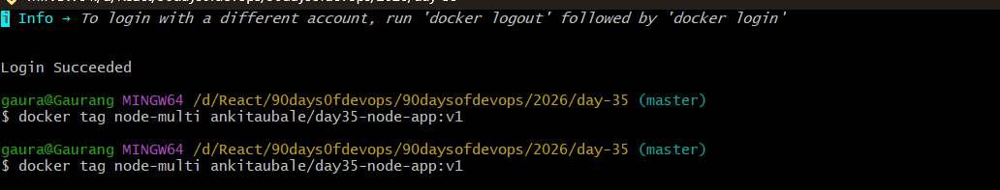
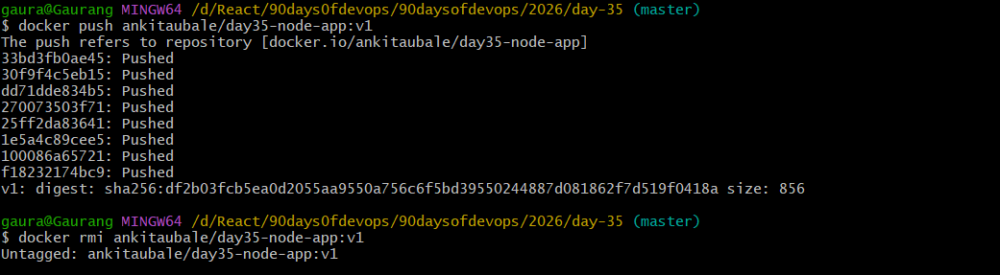
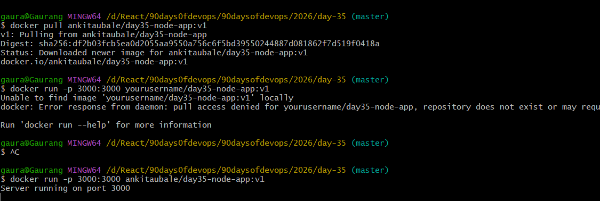
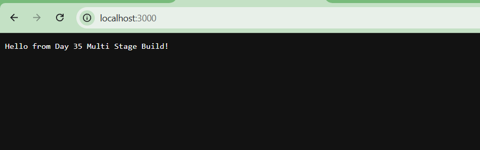

# 📁 Folder Structure

```
2026/day-35/
│
├── app.js
├── Dockerfile.single
├── Dockerfile.multi
└── day-35-multistage-hub.md
```

## Task Overview

Today's goal was to build optimized Docker images using multi-stage builds and push them to Docker Hub.

---

# Task 1 – Single Stage Build

### Dockerfile


## Build Image

```bash
docker build -f Dockerfile.single -t node-single .
```

Check size:

```bash
docker images
```

 output
 


# 2 Multi-Stage Dockerfile (Optimized)

**Dockerfile.multi**

```dockerfile
# Stage 1 - Builder
FROM node:18 AS builder


## Build Multi-stage Image

```bash
docker build -f Dockerfile.multi -t node-multi .
```

Check size again

```bash
docker images
```


Huge difference 


# Why Multi-Stage Images Are Smaller

Multi-stage builds separate the **build environment** from the **runtime environment**.

Builder stage contains:
- compilers
- dependencies
- development tools

Final stage contains only:
- built application
- minimal runtime

This removes unnecessary packages and significantly reduces image size.


---

# 3 Push to Docker Hub

### Login

```bash
docker login
```

---

### Tag Image


```bash
docker tag node-multi ankitaubale/day35-node-app:v1
```

---

### Push Image

```bash
docker push ankitaubale/day35-node-app:v1
```

---

# 4 Verify by Pulling

Delete local image

```bash
docker rmi ankitaubale/day35-node-app:v1
```

Pull again

```bash
docker pullankitaubale/day35-node-app:v1
```

Run it

```bash
docker run -p 3000:3000 ankitaubale/day35-node-app:v1
```


Open

```bash
http://localhost:3000
```


# Docker Hub Repository:

https://hub.docker.com/r/ankitaubale/day35-node-app

---

# 5 Task  – Docker Hub Tags

Tags represent different versions of the same image.


# Key Learning

Multi-stage builds help:

- Reduce image size
- Improve security
- Remove unnecessary build dependencies
- Speed up container deployment
```
