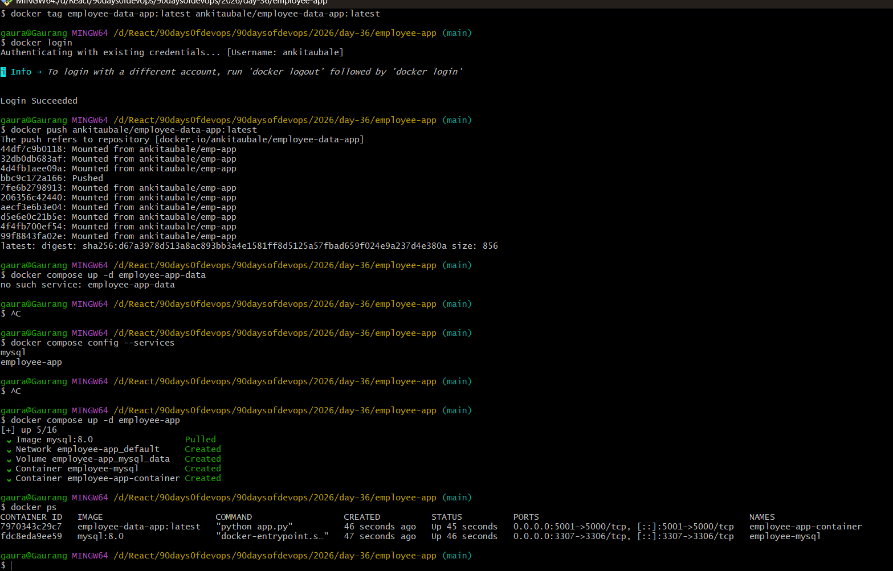

# `day-36-docker-project.md`

```markdown
# Day 36 – Docker Project: Dockerize a Full Application

## Project Overview

For Day 36, I Dockerized a **Full Stack Employee Data Application** and deployed it using **Docker and Docker Compose**.

The goal was to containerize the application, connect it with a database, and run the entire stack using Docker Compose.

---

# Application Description

The **Employee Data App** is a web application that stores and displays employee information using a backend service and a database.

The application consists of:

- Backend application container
- MySQL database container
- Docker network for communication
- Docker volumes for persistent database storage

---

# Project Structure

```

employee-app/
│
├── Dockerfile
├── docker-compose.yml
├── .dockerignore
├── .env
├── src/
└── README.md


# Dockerfile Explanation

| Instruction         | Purpose                                 |
| ------------------- | --------------------------------------- |
| FROM node:18-alpine | Uses a lightweight Node.js base image   |
| WORKDIR /app        | Sets working directory inside container |
| COPY . .            | Copies application files into container |
| RUN npm install     | Installs project dependencies           |
| EXPOSE 3000         | Exposes application port                |
| CMD ["npm","start"] | Starts the application                  |

Using **Alpine** keeps the Docker image small and efficient.

---

# .dockerignore

```
node_modules
.git
Dockerfile
README.md
.env
```

This prevents unnecessary files from being copied into the image.

---

# Docker Compose Setup

The `docker-compose.yml` file is used to run both the **application and database together**.


---

# Docker Compose Features Used

This project uses several important Docker Compose features:

* Multiple services
* Custom Docker network
* Persistent database volumes
* Environment variables
* Healthchecks
* Container dependency management

---

# Build the Docker Image

```
docker build -t employee-data-app .
```

---

# Tag the Image

```
docker tag employee-data-app ankitaubale/employee-data-app:latest
```

---

# Push Image to Docker Hub

```
docker push ankitaubale/employee-data-app:latest
```

Docker Hub Repository:

```
https://hub.docker.com/r/ankitaubale/employee-data-app
```

---

# Run the Application

Start all services:

```
docker compose up -d
```

Check running containers:

```
docker ps
```

Stop services:

```
docker compose down
```

---

# Challenges Faced

### Issue 1 – Dockerfile not found

Error:

```
failed to read dockerfile: open Dockerfile: no such file
```

Solution:

Specified the correct Dockerfile path using the `-f` flag during build.

---

### Issue 2 – Docker image tagging error

Docker push failed because the image name was not tagged correctly.

Solution:

Tagged the image using:

```
docker tag employee-data-app ankitaubale/employee-data-app:latest
```

---

### Issue 3 – Docker Compose service name mismatch

Error:

```
no such service
```

Solution:

Checked service names using:

```
docker compose config --services
```

---

# Final Image Details

Image Name:

```
ankitaubale/employee-data-app:latest
```

Image Size:

```
~367 MB
```

---

# Key Learnings

Through this project I learned:

* How to containerize real applications
* How to create optimized Docker images
* How to orchestrate multi-container apps using Docker Compose
* How to push images to Docker Hub
* How containers communicate through Docker networks

---

# Conclusion

Dockerizing a full application simplifies development and deployment. Using Docker Compose allows developers to manage multiple services easily and ensures consistent environments across machines.

This project demonstrates how containerization improves portability, scalability, and deployment efficiency.

```

