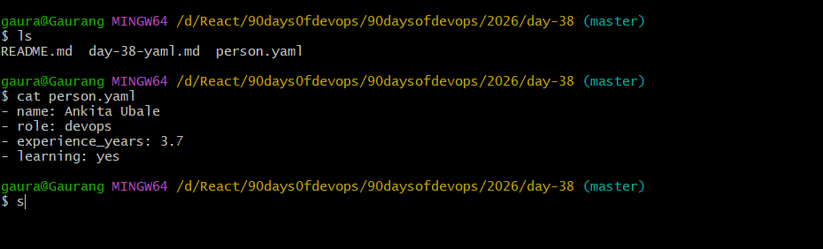
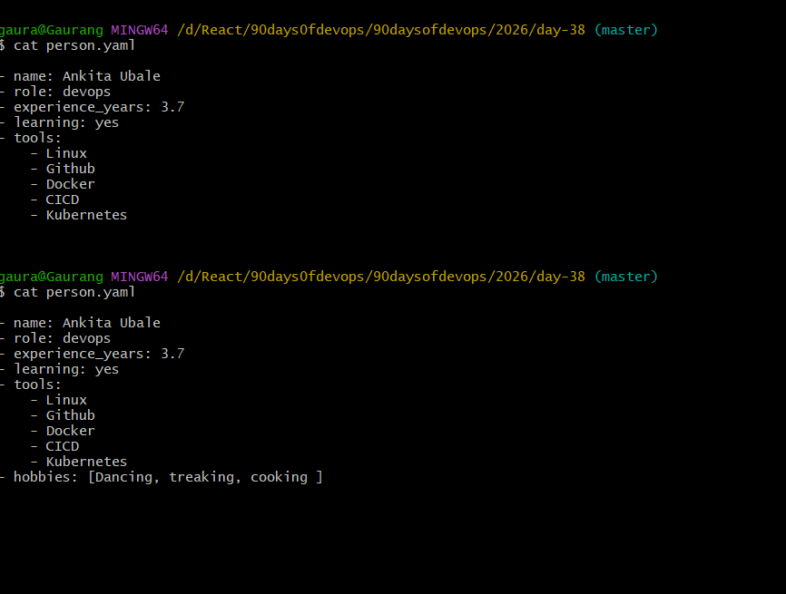
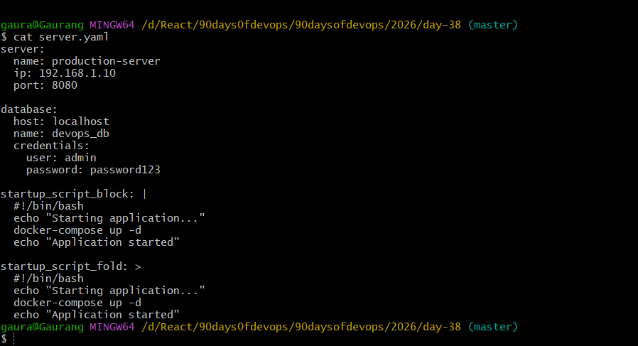
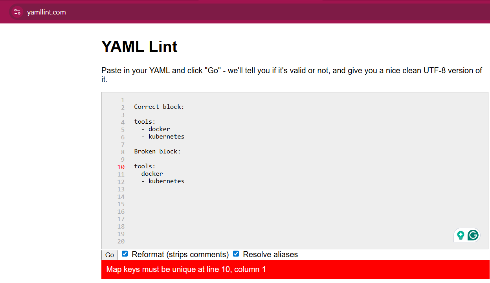

# Day 38 – YAML Basics

## Challenge Tasks

### Task 1: Key-Value Pairs
Create `person.yaml` that describes yourself with:
- `name`
- `role`
- `experience_years`
- `learning` (a boolean)

**Verify:** Run `cat person.yaml` — does it look clean? No tabs?

### Task 2: Lists
Add to `person.yaml`:
- `tools` — a list of 5 DevOps tools you know or are learning
- `hobbies` — a list using the inline format `[item1, item2]`

 there are twos to add 
 # 1
  tools:
      - item1
      - item2

# 2
  tools: [item1 , item2, item3]

  

## Task 3 – Nested Objects

server:
  name: production-server
  ip: 192.168.1.10
  port: 8080

database:
  host: localhost
  name: devops_db
  credentials:
    user: admin
    password: password123

Nested objects are created using indentation.

---

## Task 4 – Multiline Strings

### Block Style (`|`)
Preserves line breaks exactly as written.

### Fold Style (`>`)
Combines multiple lines into a single line.

---

## Task 5 – YAML Validation

I validated YAML using yamllint.  
When indentation is incorrect or tabs are used instead of spaces, YAML throws parsing errors.

Example error:

error: syntax error: found character that cannot start any token

---

## Task 6 – Spot the Difference

Correct block:

tools:
  - docker
  - kubernetes

Broken block:

tools:
- docker
  - kubernetes

Problem: indentation is inconsistent. YAML requires proper spacing for lists.

---

## Key Learnings

1. YAML uses **spaces, not tabs**.
2. Indentation defines the structure.
3. Lists can be written in **block format (-)** or **inline format ([ ])**.

 