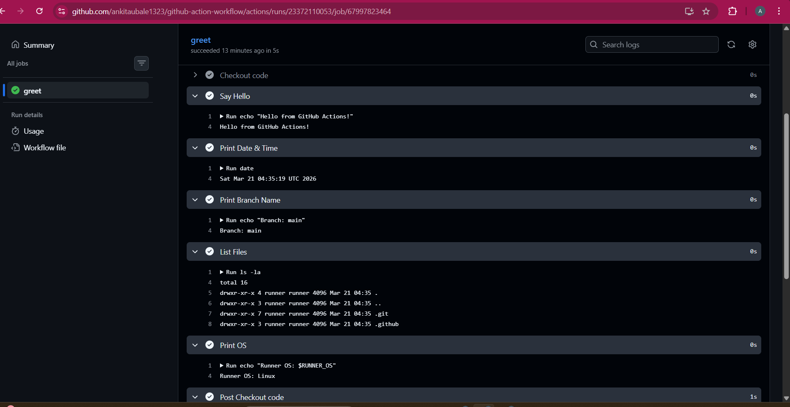

# Day 40 – First GitHub Actions Workflow

## Objective

Today I created and executed my **first GitHub Actions CI/CD workflow**.
This helped me understand how automation works in the cloud when code is pushed to a repository.

---

##  Repository Setup

* Created a public repository: `github-actions-practice`
* Created folder structure:

  ```
  .github/workflows/
  ```

---

##  Workflow File: `hello.yml`

```yaml
name: First GitHub Actions Workflow

on:
  push:

jobs:
  greet:
    runs-on: ubuntu-latest

    steps:
      - name: Checkout code
        uses: actions/checkout@v4

      - name: Say Hello
        run: echo "Hello from GitHub Actions!"

      - name: Print Date & Time
        run: date

      - name: Print Branch Name
        run: echo "Branch: ${{ github.ref_name }}"

      - name: List Files
        run: ls -la

      - name: Print OS
        run: echo "Runner OS: $RUNNER_OS"
```

---

##  Execution Steps

1. Added workflow file to repository
2. Committed and pushed code:

   ```bash
   git add .
   git commit -m "Added first GitHub Actions workflow"
   git push
   ```
3. Navigated to **GitHub → Actions tab**
4. Observed workflow execution

---

##  Output

* Workflow triggered successfully on `push`
* Job `greet` executed on `ubuntu-latest`
* All steps completed successfully
* Pipeline status: **SUCCESS (Green)**

---

##  Understanding Workflow Anatomy

###  `on:`

Defines the event that triggers the workflow
Example: `push` triggers workflow on every commit

###  `jobs:`

Defines a group of tasks that run in the workflow

###  `runs-on:`

Specifies the operating system/environment where the job runs
Example: `ubuntu-latest`

###  `steps:`

Sequence of actions executed inside a job

###  `uses:`

Used to call pre-built reusable actions
Example: `actions/checkout@v4`

###  `run:`

Executes shell commands in the runner

###  `name:`

Provides a readable label for jobs or steps

---

##  Additional Steps Added

* Printed current date and time using `date`
* Displayed branch name using `${{ github.ref_name }}`
* Listed repository files using `ls -la`
* Printed runner OS using `$RUNNER_OS`

---

##  Failure Testing

### Step Added to Break Pipeline

```yaml
- name: Break the build
  run: exit 1
```

### Observations

* Pipeline failed (Red )
* Execution stopped at failing step
* Error logs were visible in Actions tab

### Learning

* Even a single failed step stops the pipeline
* Logs help identify the exact issue
* Debugging is a key part of CI/CD


##  Key Takeaways

* GitHub Actions automates tasks on code changes
* CI/CD pipelines run on cloud-based runners
* YAML syntax must be precise (indentation matters)
* Pipelines can succeed or fail based on step execution
* Debugging using logs is essential

---

##  Conclusion

This was my **first step into CI/CD automation**.
I successfully built, executed, and debugged a workflow using GitHub Actions.

