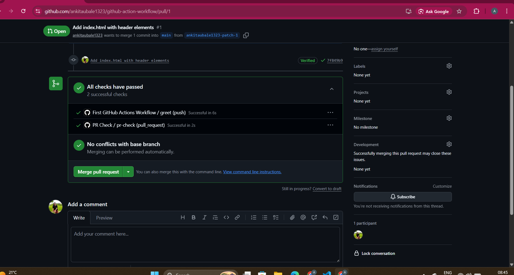
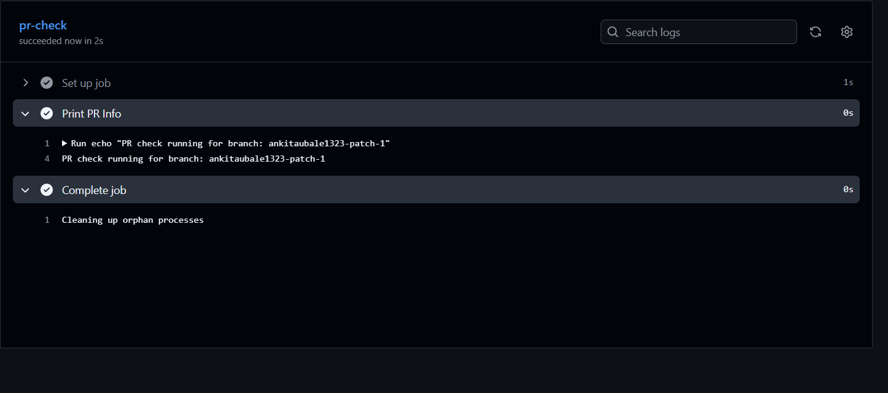
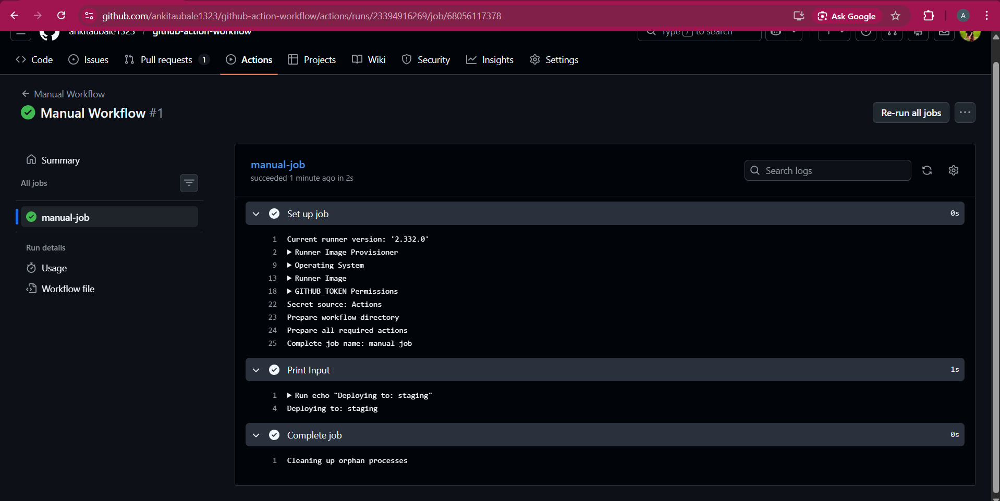
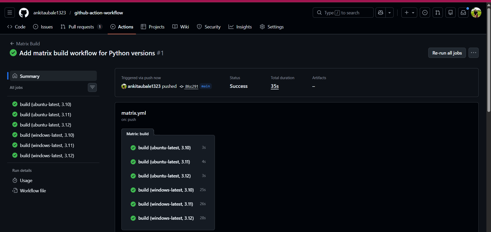
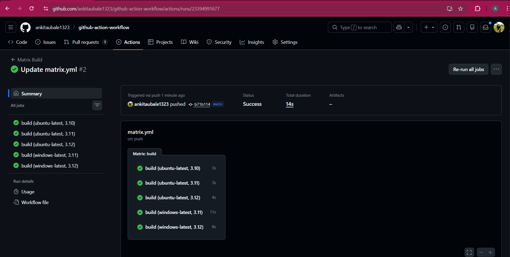

# 🚀 Day 41 – Triggers & Matrix Builds

## 📌 Objective

Today I explored different ways to **trigger GitHub Actions workflows** and learned how to run jobs across **multiple environments using matrix builds**.

---

# ✅ Task 1: Pull Request Trigger

## 📁 Workflow File

`.github/workflows/pr-check.yml`

```yaml
name: PR Check

on:
  pull_request:
    branches: [main]
    types: [opened, synchronize]

jobs:
  pr-check:
    runs-on: ubuntu-latest

    steps:
      - name: Print PR Info
        run: 'echo "PR check running for branch: ${{ github.head_ref }}"'
```

## 🔍 Verification

* Created a new branch
* Pushed changes
* Opened PR → Workflow triggered automatically ✅
* Visible in PR checks section ✅


---

# ⏰ Task 2: Scheduled Trigger

## 📁 Example

```yaml
on:
  schedule:
    - cron: '0 0 * * *'
```

## 📌 Meaning

Runs **every day at midnight (UTC)**

## ❓ Cron Answer

👉 Every Monday at 9 AM:

```yaml
0 9 * * 1
```

---

# 🖐️ Task 3: Manual Trigger

## 📁 Workflow File

`.github/workflows/manual.yml`

```yaml
name: Manual Workflow

on:
  workflow_dispatch:
    inputs:
      environment:
        description: "Enter environment (staging/production)"
        required: true
        default: "staging"

jobs:
  manual-job:
    runs-on: ubuntu-latest

    steps:
      - name: Print Input
        run: 'echo "Deploying to: ${{ github.event.inputs.environment }}"'
```



## 🔍 Verification

* Triggered from **Actions tab** ✅
* Input accepted and printed correctly ✅

---

# ⚙️ Task 4: Matrix Builds

## 📁 Workflow File

`.github/workflows/matrix.yml`

```yaml
name: Matrix Build

on:
  push:

jobs:
  build:
    runs-on: ${{ matrix.os }}

    strategy:
      matrix:
        os: [ubuntu-latest, windows-latest]
        python-version: ["3.10", "3.11", "3.12"]

    steps:
      - name: Setup Python
        uses: actions/setup-python@v5
        with:
          python-version: ${{ matrix.python-version }}

      - name: Print Python Version
        run: python --version
```

## 🔢 Total Jobs

* 3 Python versions × 2 OS = **6 jobs running in parallel** 🚀

---

# 🚫 Task 5: Exclude & Fail-Fast

## 📁 Updated Matrix

```yaml
strategy:
  fail-fast: false
  matrix:
    os: [ubuntu-latest, windows-latest]
    python-version: ["3.10", "3.11", "3.12"]

    exclude:
      - os: windows-latest
        python-version: "3.10"
```



## 🔍 Observations

### ✅ Exclude

* Skips specific combination:

  * ❌ Python 3.10 on Windows

### ✅ Fail-Fast Behavior

| Setting          | Behavior                            |
| ---------------- | ----------------------------------- |
| `true` (default) | Stops all jobs if one fails         |
| `false`          | All jobs continue even if one fails |

---


---

# 💡 Key Learnings

* Multiple triggers in GitHub Actions:

  * `push`
  * `pull_request`
  * `schedule`
  * `workflow_dispatch`
* Learned cron syntax basics
* Matrix builds allow parallel execution
* `exclude` helps control combinations
* `fail-fast` controls pipeline behavior on failure

---


