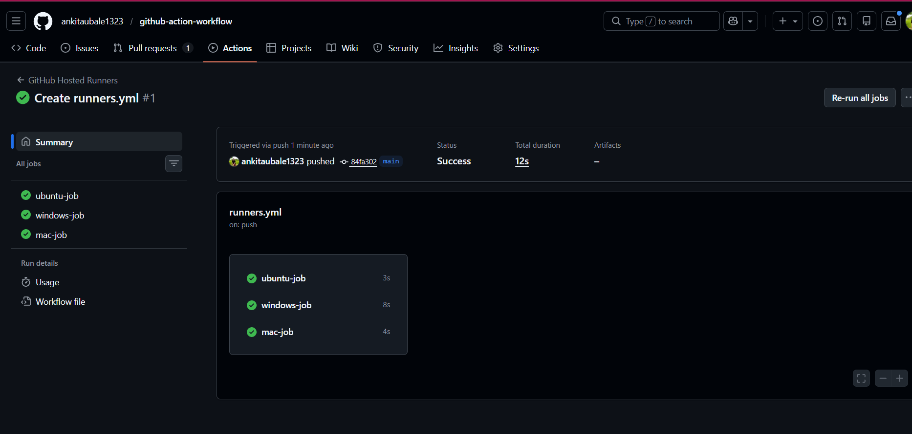
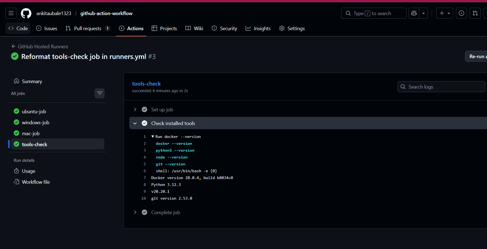
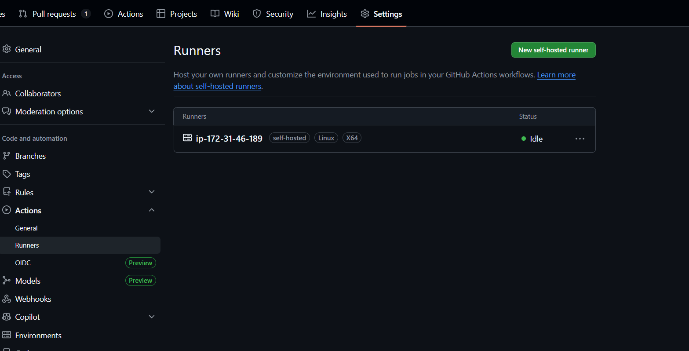
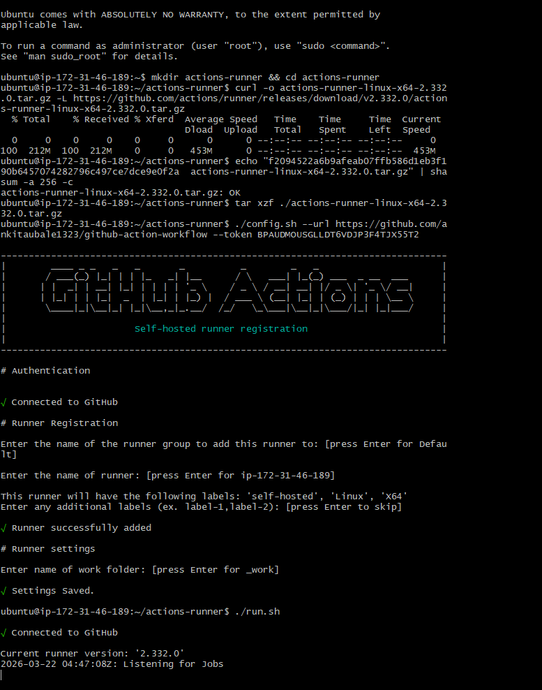
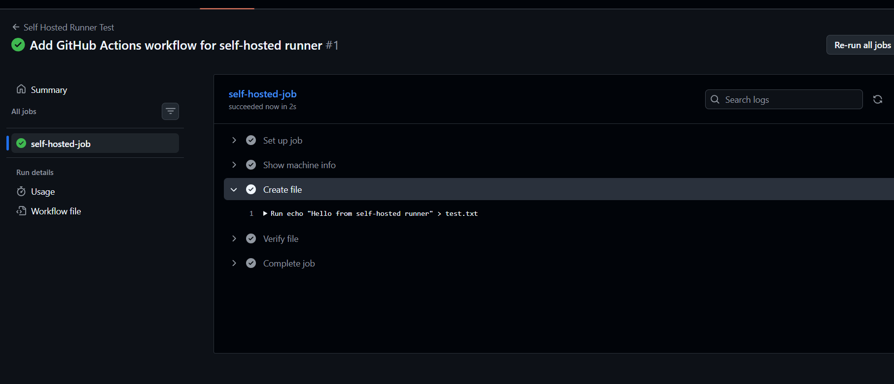

# Day 42 – Runners: GitHub-Hosted & Self-Hosted

---

## ✅ Task 1: GitHub-Hosted Runners

### Workflow Implementation

We created a workflow that runs on three different operating systems:

* Ubuntu
* Windows
* macOS

Each job prints:

* OS name
* Hostname
* Current user

### Workflow File

```yaml
name: GitHub Hosted Runners

on:
  push:

jobs:
  ubuntu-job:
    runs-on: ubuntu-latest
    steps:
      - name: Print details
        run: |
          echo "OS: Ubuntu"
          hostname
          whoami

  windows-job:
    runs-on: windows-latest
    steps:
      - name: Print details
        run: |
          echo "OS: Windows"
          hostname
          whoami

  mac-job:
    runs-on: macos-latest
    steps:
      - name: Print details
        run: |
          echo "OS: MacOS"
          hostname
          whoami
```

### Notes

* A **GitHub-hosted runner** is a virtual machine provided by GitHub.
* GitHub manages setup, maintenance, updates, and security.
* Jobs run in parallel across different environments.

---

## ✅ Task 2: Pre-installed Tools

### Workflow Step

```yaml
- name: Check installed tools
  run: |
    docker --version
    python3 --version
    node --version
    git --version
```


### Observations

* Ubuntu runners already have:

  * Docker
  * Python
  * Node.js
  * Git

### Why this matters

* Saves setup time
* Speeds up pipeline execution
* Reduces complexity in workflows

---

## ✅ Task 3: Self-Hosted Runner Setup

### Steps Followed

1. Navigated to:
   GitHub Repository → Settings → Actions → Runners → New Self-Hosted Runner

2. Selected:

   * OS: Linux

3. Ran the setup commands:

```bash
mkdir actions-runner && cd actions-runner
curl -o actions-runner.tar.gz -L <download-link>
tar xzf ./actions-runner.tar.gz
./config.sh
```

4. Started the runner:

```bash
./run.sh
```

### Result

* Runner successfully registered
* Status shows **Idle (green)** in GitHub



---

## ✅ Task 4: Using Self-Hosted Runner

### Workflow File

```yaml
name: Self Hosted Runner Test

on:
  push:

jobs:
  self-hosted-job:
    runs-on: self-hosted

    steps:
      - name: Show machine info
        run: |
          hostname
          pwd
          whoami

      - name: Create file
        run: echo "Hello from self-hosted runner" > test.txt

      - name: Verify file
        run: ls -l
```

### Verification

* Workflow ran successfully
* File `test.txt` was created on the local machine

---

## ✅ Task 5: Labels

### Steps

1. Added label to runner:

   ```
   my-linux-runner
   ```

2. Updated workflow:

```yaml
runs-on: [self-hosted, my-linux-runner]
```

### Result

* Workflow correctly picked the labeled runner

### Why labels are useful

* Target specific machines
* Manage multiple runners
* Separate workloads (e.g., high-memory, GPU, OS-specific)

---

## ✅ Task 6: Comparison Table

| Feature             | GitHub-Hosted Runner        | Self-Hosted Runner          |
| ------------------- | --------------------------- | --------------------------- |
| Who manages it?     | GitHub                      | User                        |
| Cost                | Free (limited) / Paid plans | Infrastructure cost         |
| Pre-installed tools | Yes                         | No (manual setup required)  |
| Good for            | Quick CI/CD pipelines       | Custom workloads & control  |
| Security concern    | Managed by GitHub           | Full responsibility on user |

---

## 📸 Screenshots (To Add)

* Self-hosted runner showing **Idle (green)** in GitHub
* Workflow running on self-hosted runner

---

## 🚀 Conclusion

* GitHub-hosted runners are easy and fast to use
* Self-hosted runners provide more flexibility and control
* Labels help manage multiple runners efficiently
* Understanding runners is key to real-world CI/CD pipelines

---

# #90DaysOfDevOps #DevOpsKaJosh #TrainWithShubham
