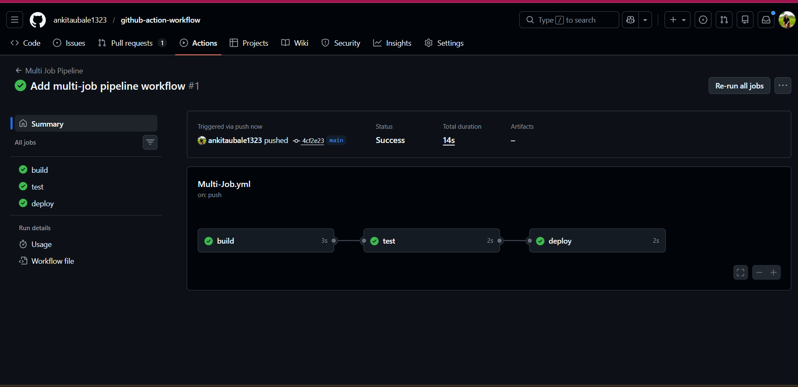
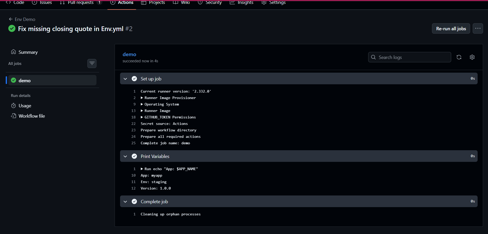
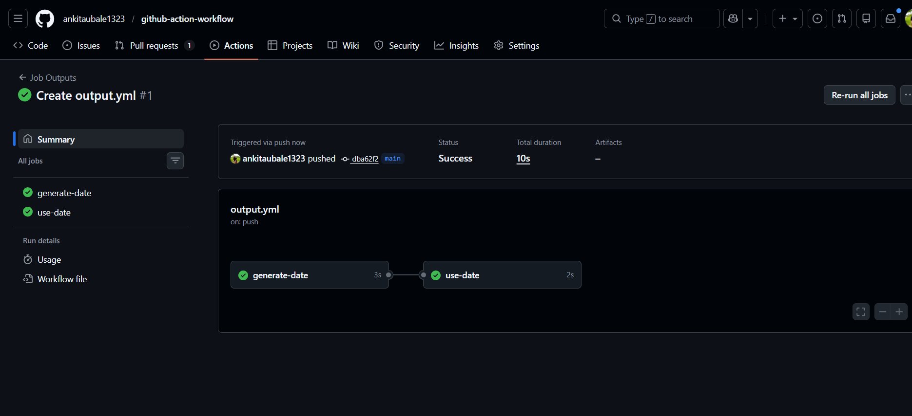
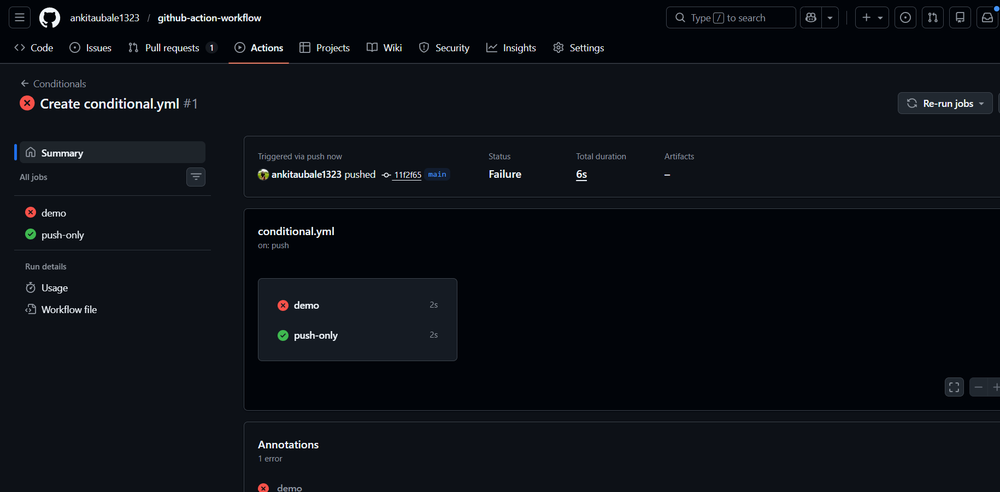

# Day 43 – Jobs, Steps, Env Vars & Conditionals (Detailed Notes)

## 📌 Introduction

Today I learned how to control and design **real-world CI/CD pipelines** using GitHub Actions.
Instead of running simple steps, I can now:

* Run multiple jobs
* Control execution order
* Share data between jobs
* Use environment variables
* Apply conditions to control execution

This is important because real production pipelines require **logic, dependency, and flexibility**.

---

# 🔹 Task 1: Multi-Job Workflow

## ✅ Concept: Jobs & Dependencies

A workflow can contain multiple jobs.
By default, jobs run **in parallel**, but we can control execution order using:

👉 `needs:`

## 🔁 Dependency Chain Example

```text
build → test → deploy
```

## 🧠 Why this is important?

* Ensures **testing happens only after build**
* Prevents **deployment of broken code**
* Mimics real CI/CD pipelines

## 💻 YAML Example

```yaml
name: Multi Job Pipeline

on:
  push:

jobs:
  build:
    runs-on: ubuntu-latest
    steps:
      - name: Build Step
        run: echo "Building the app"

  test:
    runs-on: ubuntu-latest
    needs: build
    steps:
      - name: Test Step
        run: echo "Running tests"

  deploy:
    runs-on: ubuntu-latest
    needs: test
    steps:
      - name: Deploy Step
        run: echo "Deploying"
```

## 🔍 Key Points

* `needs: build` → test waits for build
* `needs: test` → deploy waits for test
* If one job fails → next job **will not run**

---

# 🔹 Task 2: Environment Variables

## ✅ Concept: env

Environment variables allow us to store reusable values.

They can be defined at **3 levels**:

---

## 🧩 1. Workflow Level

Available to all jobs

```yaml
env:
  APP_NAME: myapp
```

---

## 🧩 2. Job Level

Available only inside that job

```yaml
jobs:
  demo:
    env:
      ENVIRONMENT: staging
```

---

## 🧩 3. Step Level

Available only in that step

```yaml
steps:
  - name: Step Variable
    env:
      VERSION: 1.0.0
```

---

## 💻 Full Example

```yaml
name: Env Demo

on: push

env:
  APP_NAME: myapp

jobs:
  demo:
    runs-on: ubuntu-latest
    env:
      ENVIRONMENT: staging

    steps:
      - name: Print Variables
        env:
          VERSION: 1.0.0
        run: |
          echo "App: $APP_NAME"
          echo "Env: $ENVIRONMENT"
          echo "Version: $VERSION"
```

---

## 🔹 GitHub Context Variables

GitHub provides built-in variables:

```yaml
echo "Commit SHA: ${{ github.sha }}"
echo "Triggered by: ${{ github.actor }}"
```

## 🧠 Use Cases

* Track who triggered pipeline
* Tag Docker images with commit SHA
* Debug pipelines

---

# 🔹 Task 3: Job Outputs

## ✅ Concept: outputs

Used to pass data from one job → another job

---

## 🔁 Flow

```text
Job 1 → generates data → Job 2 uses it
```

---

## 💻 Example

```yaml
name: Job Outputs

on: push

jobs:
  generate-date:
    runs-on: ubuntu-latest
    outputs:
      today: ${{ steps.setdate.outputs.date }}

    steps:
      - name: Set Date
        id: setdate
        run: echo "date=$(date)" >> $GITHUB_OUTPUT

  use-date:
    runs-on: ubuntu-latest
    needs: generate-date

    steps:
      - name: Print Date
        run: echo "Today's date is ${{ needs.generate-date.outputs.today }}"
```

---

## 🔍 Explanation

### Step 1:

```yaml
id: setdate
```

* Gives step a unique ID

### Step 2:

```bash
echo "date=$(date)" >> $GITHUB_OUTPUT
```

* Sets output variable

### Step 3:

```yaml
outputs:
  today: ${{ steps.setdate.outputs.date }}
```

* Exposes output at job level

### Step 4:

```yaml
${{ needs.generate-date.outputs.today }}
```

* Access in next job

---

## 🧠 Why use outputs?

* Share dynamic data (version, date, build number)
* Avoid duplication
* Useful in multi-stage pipelines

---

# 🔹 Task 4: Conditionals

## ✅ Concept: if

Conditionals allow workflows to run **only when conditions are met**

---

## 🔹 1. Run step only on main branch

```yaml
if: github.ref == 'refs/heads/main'
```

---

## 🔹 2. Run step only if previous step failed

```yaml
if: failure()
```

---

## 🔹 3. Run job only on push event

```yaml
if: github.event_name == 'push'
```

---

## 🔹 4. Continue even if step fails

```yaml
continue-on-error: true
```

---

## 💻 Full Example

```yaml
name: Conditionals

on:
  push:
  pull_request:

jobs:
  demo:
    runs-on: ubuntu-latest

    steps:
      - name: Only on main
        if: github.ref == 'refs/heads/main'
        run: echo "Main branch"

      - name: Fail step
        run: exit 1

      - name: Run after failure
        if: failure()
        run: echo "Previous step failed"

      - name: Continue even if error
        continue-on-error: true
        run: exit 1

  push-only:
    if: github.event_name == 'push'
    runs-on: ubuntu-latest
    steps:
      - run: echo "Only runs on push"
```

---

## 🧠 Key Learnings

* `if:` controls execution
* `failure()` detects failed steps
* `continue-on-error` prevents pipeline stop

---

# 🔹 Task 5: Smart Pipeline

## ✅ Goal

Combine everything into one intelligent pipeline

---

## ⚙ Features

* Trigger on push
* Parallel jobs (lint & test)
* Summary job runs after both
* Detect branch type
* Print commit message

---

## 💻 Example

```yaml
name: Smart Pipeline

on:
  push:

jobs:
  lint:
    runs-on: ubuntu-latest
    steps:
      - run: echo "Linting code..."

  test:
    runs-on: ubuntu-latest
    steps:
      - run: echo "Running tests..."

  summary:
    runs-on: ubuntu-latest
    needs: [lint, test]

    steps:
      - name: Branch Info
        run: |
          if [[ "${GITHUB_REF}" == "refs/heads/main" ]]; then
            echo "Main branch push"
          else
            echo "Feature branch push"
          fi

      - name: Commit Message
        run: echo "Commit: ${{ github.event.commits[0].message }}"
```

---

# 🔹 Final Key Concepts Summary

| Concept           | Purpose                   |
| ----------------- | ------------------------- |
| jobs              | Independent units of work |
| steps             | Tasks inside a job        |
| needs             | Control job order         |
| env               | Store reusable variables  |
| outputs           | Pass data between jobs    |
| if                | Conditional execution     |
| continue-on-error | Prevent failure           |

---

# ✅ Final Conclusion

After Day 43, I can:

* Design multi-stage pipelines
* Control execution flow
* Share data across jobs
* Add intelligent logic using conditions

This is a major step toward building **production-level CI/CD pipelines** 🚀

---

# 🚀 Real World Understanding

In real companies:

* `build` → compiles code
* `test` → runs unit/integration tests
* `deploy` → deploys to staging/production
* `outputs` → pass version/tag
* `if` → control deployment rules (only main branch)
