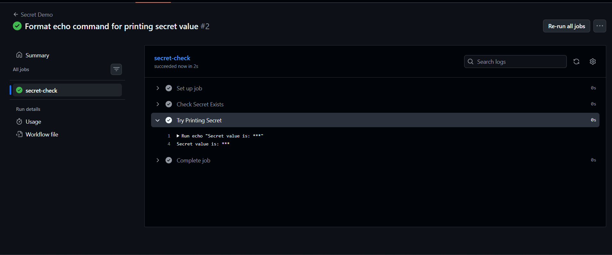
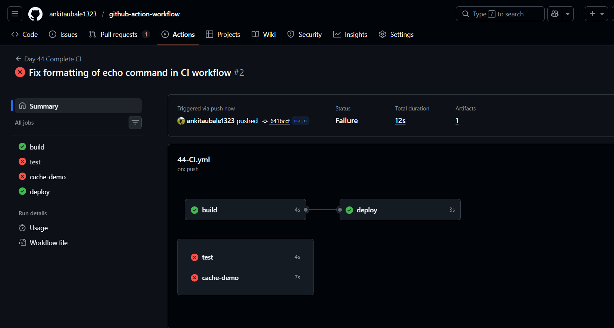

# 🚀 Day 44 – Secrets, Artifacts & Running Real Tests in CI

## 📌 Objective

In this lab, we implemented real-world CI/CD concepts:

* 🔐 Secure secrets management
* 📦 Artifact storage and sharing
* 🧪 Running real tests in CI
* ⚡ Dependency caching for faster builds

---

# 🔐 Task 1: GitHub Secrets

## ✅ Steps

1. Go to:

   ```
   Repository → Settings → Secrets and Variables → Actions
   ```
2. Add:

   ```
   MY_SECRET_MESSAGE
   ```

---

## ✅ YAML Implementation

```yaml id="wf1"
name: Secret Demo

on:
  push:

jobs:
  secret-check:
    runs-on: ubuntu-latest
    steps:
      - name: Check Secret Exists
        run: |
          if [ -z "${{ secrets.MY_SECRET_MESSAGE }}" ]; then
            echo "The secret is set: false"
          else
            echo "The secret is set: true"
          fi

      - name: Try Printing Secret
        run: |
         echo "Secret value is: ${{ secrets.MY_SECRET_MESSAGE }}"
```

---

## ✅ Output

```

```

---

## ⚠️ Why never print secrets?

* GitHub masks them (`***`)
* But logs are still visible
* Risk of leaking:

  * API keys
  * Tokens
  * Passwords

---

# 🔑 Task 2: Use Secrets as Environment Variables

## ✅ YAML

```yaml id="wf2"
- name: Use Secret as Env
  env:
    MY_SECRET: ${{ secrets.MY_SECRET_MESSAGE }}
  run: |
    echo "Using secret safely"
    echo "Length of secret: ${#MY_SECRET}"
```

---

## 📌 Learning

* Never hardcode secrets
* Always use GitHub Secrets

---

# 📦 Task 3: Upload Artifacts

## ✅ YAML

```yaml id="wf3"
- name: Create Report File
  run: |
    echo "CI Test Report - SUCCESS" > report.txt
    echo "Build Time: $(date)" >> report.txt

- name: Upload Artifact
  uses: actions/upload-artifact@v4
  with:
    name: report-artifact
    path: report.txt
```

---

## ✅ Result

* Artifact visible in **Actions tab**
* Download available after run

---

# 🔁 Task 4: Download Artifacts Between Jobs

## ✅ Complete YAML

```yaml id="wf4"
name: Artifact Sharing

on: push

jobs:
  build:
    runs-on: ubuntu-latest
    steps:
      - name: Create File
        run: echo "Hello from Job1" > file.txt

      - name: Upload Artifact
        uses: actions/upload-artifact@v4
        with:
          name: shared-file
          path: file.txt

  deploy:
    runs-on: ubuntu-latest
    needs: build
    steps:
      - name: Download Artifact
        uses: actions/download-artifact@v4
        with:
          name: shared-file

      - name: Read File
        run: cat file.txt
```

---

## 📌 Real Use Cases

* Build outputs (JAR, ZIP)
* Logs
* Test reports
* Passing data between jobs

---

# 🧪 Task 5: Run Real Tests in CI

## ✅ Script File

### `script.sh`

```bash id="wf5"
#!/bin/bash
echo "Running tests..."
exit 0
```

---

## ✅ YAML

```yaml id="wf6"
- name: Run Script
  run: |
    chmod +x script.sh
    ./script.sh
```

---

## 🔴 Failure Test

```bash id="wf7"
exit 1
```

👉 Pipeline becomes **RED**

---

## 🟢 Success Test

```bash id="wf8"
exit 0
```

👉 Pipeline becomes **GREEN**

---

## 📌 Learning

* CI fails automatically on error
* Helps catch bugs early

---

# ⚡ Task 6: Caching

## ✅ YAML

```yaml id="wf9"
- name: Cache Dependencies
  uses: actions/cache@v4
  with:
    path: ~/.npm
    key: node-cache-${{ runner.os }}-${{ hashFiles('**/package-lock.json') }}
    restore-keys: |
      node-cache-${{ runner.os }}-
```

---

## 📊 Observation

| Run        | Speed  |
| ---------- | ------ |
| First Run  | Slow   |
| Second Run | Faster |

---

## ❓ What is cached?

* npm dependencies (`~/.npm`)

## ❓ Where stored?

* GitHub-managed cache storage

---

# 🧩 FULL COMBINED WORKFLOW (FINAL)

```yaml id="finalwf"
name: Day 44 Complete CI

on:
  push:
    branches: [ main ]

jobs:

  build:
    runs-on: ubuntu-latest

    steps:
      - uses: actions/checkout@v4

      - name: Check Secret
        run: |
          if [ -z "${{ secrets.MY_SECRET_MESSAGE }}" ]; then
            echo "The secret is set: false"
          else
            echo "The secret is set: true"
          fi

      - name: Use Secret
        env:
          MY_SECRET: ${{ secrets.MY_SECRET_MESSAGE }}
        run: echo "Length: ${#MY_SECRET}"

      - name: Create File
        run: echo "Hello CI" > file.txt

      - name: Upload Artifact
        uses: actions/upload-artifact@v4
        with:
          name: file
          path: file.txt

  deploy:
    runs-on: ubuntu-latest
    needs: build

    steps:
      - name: Download Artifact
        uses: actions/download-artifact@v4
        with:
          name: file

      - run: cat file.txt

  test:
    runs-on: ubuntu-latest

    steps:
      - uses: actions/checkout@v4
      - run: |
          chmod +x script.sh
          ./script.sh

  cache-demo:
    runs-on: ubuntu-latest

    steps:
      - uses: actions/checkout@v4

      - name: Cache
        uses: actions/cache@v4
        with:
          path: ~/.npm
          key: cache-${{ runner.os }}-${{ hashFiles('**/package-lock.json') }}

      - run: npm install
```

---

# 🚀 Final Learnings

* 🔐 Secrets = secure credentials
* 📦 Artifacts = share files between jobs
* 🧪 Tests = validate code automatically
* ⚡ Cache = faster pipelines


# 🎯 Conclusion

This is a **real production-level CI pipeline**:

* Secure
* Automated
* Test-driven
* Optimized