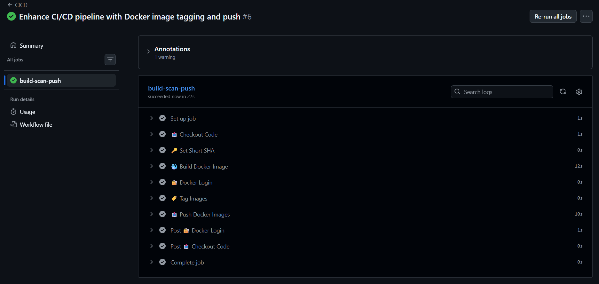
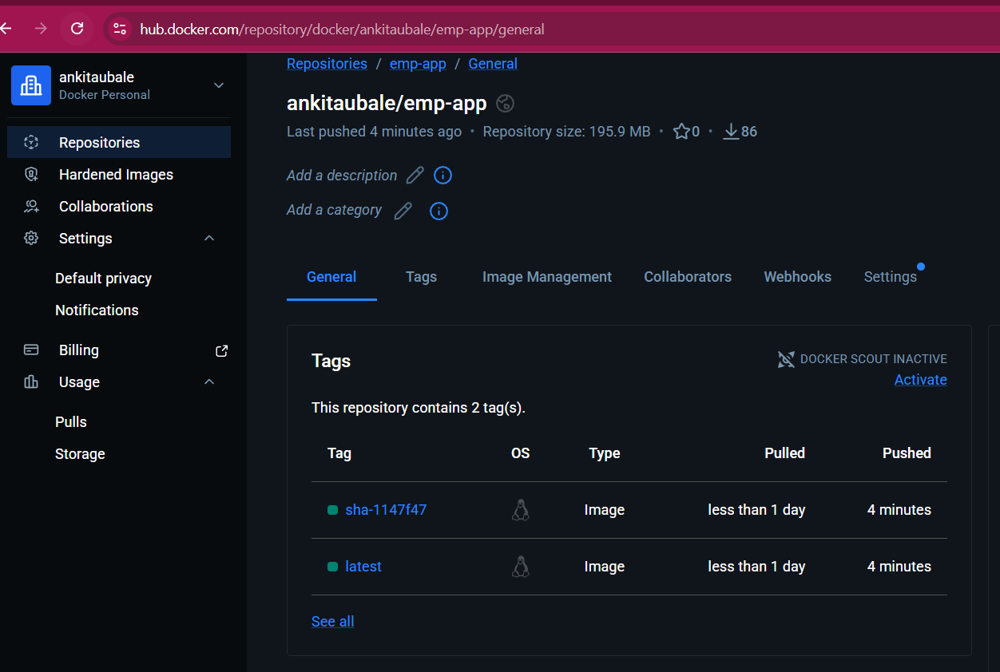

# ✅ `2026/day-45/day-45-docker-cicd.md`

```markdown
# 🚀 Day 45 – Docker Build & Push using GitHub Actions

## 📌 Objective

Build a real-world CI/CD pipeline that:
- Automatically builds a Docker image
- Tags it using latest + commit SHA
- Pushes it to Docker Hub
- Runs securely using GitHub Secrets
- Push happens only on `main` branch

---

## 🧱 Project Structure

```
github-actions-practice/
│── app.py (or index.html / Node app)
│── Dockerfile
│── README.md
└── .github/
    └── workflows/
        └── docker-publish.yml
```

---

## 🐳 Step 1: Dockerfile

### Example (Python App)

```Dockerfile
FROM python:3.9-slim

WORKDIR /app

COPY . .

RUN pip install flask

CMD ["python", "app.py"]
```

---

## 🔐 Step 2: Add GitHub Secrets

Go to:
👉 Repo → Settings → Secrets → Actions → New repository secret

Add:

| Name | Value |
|------|------|
| DOCKER_USERNAME | your Docker Hub username |
| DOCKER_TOKEN | Docker Hub access token |

---

## ⚙️ Step 3: GitHub Actions Workflow

### 📄 `.github/workflows/cicd-pipeline.yml`

```yaml
name: CICD

on:
  workflow_dispatch:
  push:
    branches:
      - main
      - feature/*

jobs:
  build-scan-push:
    runs-on: ubuntu-latest

    steps:

      - name: 📥 Checkout Code
        uses: actions/checkout@v4

      - name: 🔑 Set Short SHA
        run: echo "SHORT_SHA=${GITHUB_SHA::7}" >> $GITHUB_ENV

      - name: 🐳 Build Docker Image
        run: |
          docker build -t emp-app:latest -f app/docker/Dockerfile .
          docker build -t emp-app:sha-${{ env.SHORT_SHA }} -f app/docker/Dockerfile .

      - name: 🔐 Docker Login
        if: github.ref == 'refs/heads/main'
        uses: docker/login-action@v3
        with:
          username: ${{ secrets.DOCKER_USERNAME }}
          password: ${{ secrets.DOCKER_PASSWORD }}

      - name: 🏷️ Tag Images
        if: github.ref == 'refs/heads/main'
        run: |
          docker tag emp-app:latest ${{ secrets.DOCKER_USERNAME }}/emp-app:latest
          docker tag emp-app:sha-${{ env.SHORT_SHA }} ${{ secrets.DOCKER_USERNAME }}/emp-app:sha-${{ env.SHORT_SHA }}

      - name: 📤 Push Docker Images
        if: github.ref == 'refs/heads/main'
        run: |
          docker push ${{ secrets.DOCKER_USERNAME }}/emp-app:latest
          docker push ${{ secrets.DOCKER_USERNAME }}/emp-app:sha-${{ env.SHORT_SHA }}
```

---

## 🏷️ Step 4: Tagging Strategy

We use two tags:

| Tag | Purpose |
|-----|--------|
| latest | Always latest version |
| sha-xxxxxxx | Specific commit version |

Example:
```
https://hub.docker.com/repository/docker/ankitaubale/emp-app

```

---

## 🧪 Step 5: Testing the Workflow

### ✅ Case 1: Push to main
```
git push origin main
```
✔ Build runs  
✔ Image pushed to Docker Hub  

---

### ✅ Case 2: Push to feature branch
```
git push origin feature/test
```
✔ Build runs  
❌ Push does NOT happen  

---
---

## 🐳 Step 7: Pull and Run Docker Image

### Pull image
```bash
docker pull <your-username>/myapp:latest
```

### Run container
```bash
docker run -d -p 5000:5000 <your-username>/myapp:latest
```

---

## 🌐 Step 8: Docker Hub Link

👉 Add your link here:

```
https://hub.docker.com/repository/docker/ankitaubale/emp-app/general
```

---

## 🔁 Full CI/CD Flow (Important Interview Question)

1. Developer pushes code to GitHub
2. GitHub Actions workflow triggers
3. Runner checks out code
4. Docker image is built
5. Image tagged as:
   - latest
   - sha-<commit>
6. If branch is main:
   - Login to Docker Hub
   - Push image
7. Image stored in Docker Hub
8. Anyone can pull and run container

---


## ⚠️ Common Errors & Fixes

### ❌ YAML syntax error
✔ Fix indentation (spaces only, no tabs)

---

### ❌ Docker login failed
✔ Check secrets names:
- DOCKER_USERNAME
- DOCKER_TOKEN

---

### ❌ Permission denied
✔ Ensure Docker Hub repo exists

---

## 🎯 Key Learnings

- CI/CD automation using GitHub Actions
- Docker build & push pipeline
- Secure authentication using secrets
- Conditional execution (`if` condition)
- Tagging strategy for versioning

---

## 🏁 Final Result

✅ Fully automated Docker pipeline  
✅ Production-level CI/CD setup  
✅ Zero manual work after `git push`  

---