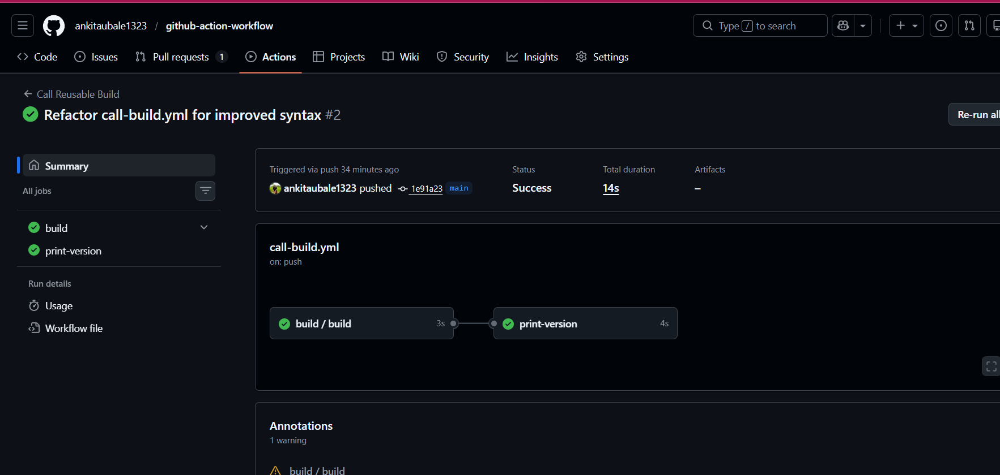

# 🚀 Day 46 – Reusable Workflows & Composite Actions

## 📌 Overview

In real-world DevOps, writing the same CI/CD logic again and again is inefficient. Instead, teams create **reusable workflows** and **composite actions** to keep pipelines clean, modular, and scalable.

This project demonstrates:

* Reusable workflows using `workflow_call`
* Caller workflows
* Passing inputs, secrets, and outputs
* Creating and using a custom composite action

---

# ✅ Task 1: Theory

## 1. What is a Reusable Workflow?

A **reusable workflow** is a GitHub Actions workflow that can be called by other workflows.

### 🔹 Benefits:

* Avoids duplication
* Centralized CI/CD logic
* Easy to maintain across multiple repositories

---

## 2. What is `workflow_call`?

`workflow_call` is a trigger that allows one workflow to be invoked by another.

```yaml
on:
  workflow_call:
```

---

## 3. Reusable Workflow vs Action

| Feature      | Reusable Workflow | Action               |
| ------------ | ----------------- | -------------------- |
| Level        | Job level         | Step level           |
| Called using | `uses:` in jobs   | `uses:` in steps     |
| Scope        | Full pipeline     | Small reusable logic |

---

## 4. Where must it live?

```
.github/workflows/
```

---

# ✅ Task 2: Reusable Workflow

📄 `.github/workflows/reusable-build.yml`

```yaml
name: Reusable Build

on:
  workflow_call:
    inputs:
      app_name:
        required: true
        type: string
      environment:
        required: true
        type: string
        default: staging

    secrets:
      docker_token:
        required: true

    outputs:
      build_version:
        description: "Generated build version"
        value: ${{ jobs.build.outputs.build_version }}

jobs:
  build:
    runs-on: ubuntu-latest

    outputs:
      build_version: ${{ steps.set_version.outputs.version }}

    steps:
      - name: Checkout Code
        uses: actions/checkout@v4

      - name: Print Build Info
        run: |
          echo "Building ${{ inputs.app_name }} for ${{ inputs.environment }}"
          echo "Docker token is set: true"

      - name: Generate Version
        id: set_version
        run: |
          VERSION="v1.0-${GITHUB_SHA::7}"
          echo "version=$VERSION" >> $GITHUB_OUTPUT
```

---

# ✅ Task 3: Caller Workflow

📄 `.github/workflows/call-build.yml`

```yaml
name: Call Reusable Build

on:
  push:
    branches:
      - main

jobs:
  build:
    uses: ./.github/workflows/reusable-build.yml
    with:
      app_name: "my-web-app"
      environment: "production"
    secrets:
      docker_token: ${{ secrets.DOCKER_TOKEN }}

  print-version:
    runs-on: ubuntu-latest
    needs: build

    steps:
      - name: Print Build Version
        run: |
          echo "Version: ${{ needs.build.outputs.build_version }}"
```

---

# ✅ Task 4: Output Flow

```
Reusable Workflow
   ↓
Job Output
   ↓
Workflow Output
   ↓
Caller Workflow (needs)
```

---

# ✅ Task 5: Composite Action

📄 `.github/actions/setup-and-greet/action.yml`

```yaml
name: Setup and Greet
description: Custom greeting action

inputs:
  name:
    required: true
  language:
    required: false
    default: "en"

outputs:
  greeted:
    description: "Greeting status"
    value: ${{ steps.greet.outputs.done }}

runs:
  using: "composite"

  steps:
    - name: Greet User
      id: greet
      shell: bash
      run: |
        if [ "${{ inputs.language }}" = "en" ]; then
          echo "Hello ${{ inputs.name }}"
        elif [ "${{ inputs.language }}" = "hi" ]; then
          echo "Namaste ${{ inputs.name }}"
        else
          echo "Hi ${{ inputs.name }}"
        fi

        echo "done=true" >> "$GITHUB_OUTPUT"

    - name: Print System Info
      shell: bash
      run: |
        date
        echo "Runner OS: $RUNNER_OS"
```

---

# ✅ Task 5 (Usage): Use Composite Action

📄 `.github/workflows/use-composite.yml`

```yaml
name: Use Composite Action

on:
  push:

jobs:
  greet:
    runs-on: ubuntu-latest

    steps:
      - name: Checkout
        uses: actions/checkout@v4

      - name: Run Custom Action
        uses: ./.github/actions/setup-and-greet
        with:
          name: Ankita
          language: en
```

---

# ✅ Task 6: Comparison Table

| Feature                      | Reusable Workflow    | Composite Action     |
| ---------------------------- | -------------------- | -------------------- |
| Triggered by                 | `workflow_call`      | `uses:` in step      |
| Can contain jobs?            | ✅ Yes                | ❌ No                 |
| Can contain multiple steps?  | ✅ Yes                | ✅ Yes                |
| Lives where?                 | `.github/workflows/` | `.github/actions/`   |
| Can accept secrets directly? | ✅ Yes                | ❌ No                 |
| Best for                     | Full CI/CD pipelines | Small reusable logic |

---

# ✅ Expected Output

### ✔ Reusable Workflow Logs

```
Building my-web-app for production
Docker token is set: true
```

### ✔ Caller Output

```
Version: v1.0-abc1234
```

### ✔ Composite Action Output

```
Hello Ankita
Runner OS: Linux
```

---


---

# 🚀 Key Learnings

* Reusable workflows help avoid duplication in CI/CD
* `workflow_call` enables modular pipeline design
* Outputs can be passed between workflows
* Composite actions simplify repeated step logic
* Industry pipelines heavily depend on these concepts

---

# 🔥 Pro Tips (Interview Ready)

* Reusable workflow = **Mini pipeline**
* Composite action = **Reusable step**
* Use reusable workflows for:

  * Build pipelines
  * Deployment pipelines
* Use composite actions for:

  * Repeated scripts
  * Environment setup

