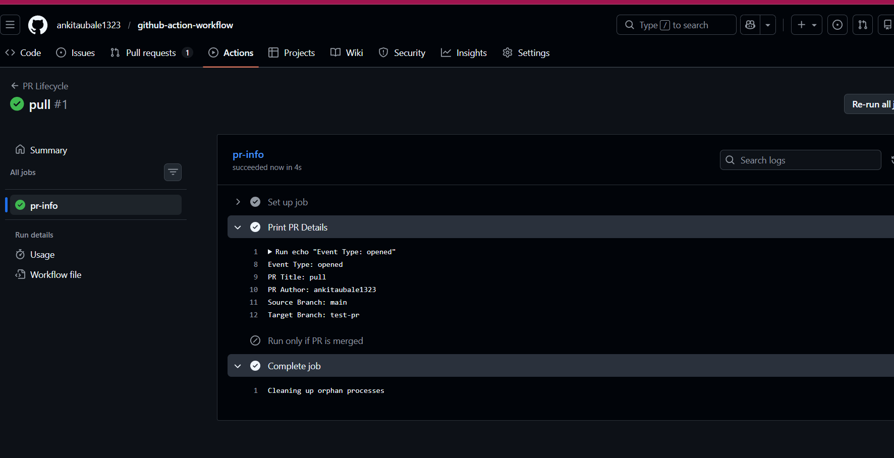
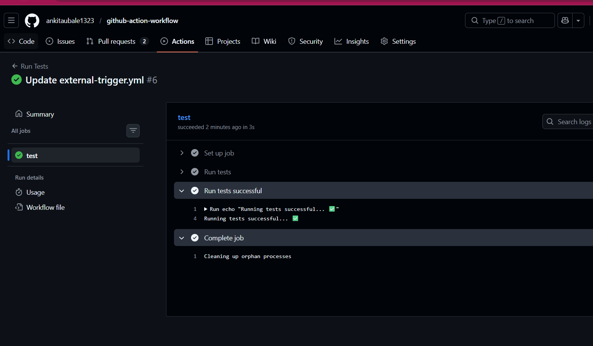
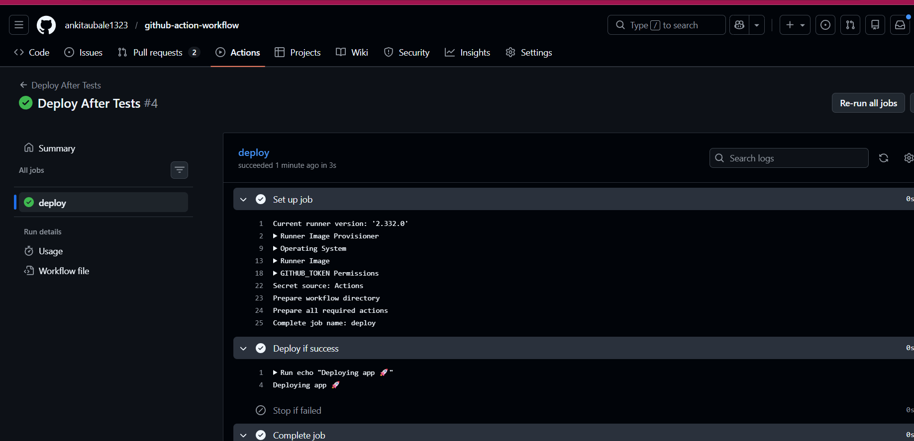

# Day 47 – Advanced Triggers: PR Events, Cron Schedules & Event-Driven Pipelines

## 📌 Overview

Today I explored advanced GitHub Actions triggers beyond basic `push` and `pull_request`. This includes:

* Pull Request lifecycle events
* PR validation workflows (real-world gating)
* Scheduled workflows using cron
* Smart triggers using paths & branches
* Workflow chaining using `workflow_run`
* External triggers using `repository_dispatch`

---

# 🔹 Task 1: Pull Request Lifecycle Events

## Workflow: `pr-lifecycle.yml`

```yaml
name: PR Lifecycle

on:
  pull_request:
    types: [opened, synchronize, reopened, closed]

jobs:
  pr-info:
    runs-on: ubuntu-latest

    steps:
      - name: Print PR Details
        run: |
          echo "Event Type: ${{ github.event.action }}"
          echo "PR Title: ${{ github.event.pull_request.title }}"
          echo "PR Author: ${{ github.event.pull_request.user.login }}"
          echo "Source Branch: ${{ github.head_ref }}"
          echo "Target Branch: ${{ github.base_ref }}"

      - name: Run only if PR is merged
        if: github.event.pull_request.merged == true
        run: echo "PR was merged successfully 🎉"
```

## ✅ What I Learned

* PR events trigger multiple times during lifecycle
* `github.event.action` tells exact event type
* Merge detection requires:

  ```yaml
  github.event.pull_request.merged == true
  ```

---

# 🔹 Task 2: PR Validation Workflow (Real DevOps Gate)

## Workflow: `pr-checks.yml`

```yaml
name: PR Checks

on:
  pull_request:
    branches: [main]

jobs:
  file-size-check:
    runs-on: ubuntu-latest

    steps:
      - uses: actions/checkout@v4

      - name: Check file sizes
        run: |
          echo "Checking file sizes..."
          find . -type f -size +1M && echo "Large file found!" && exit 1 || echo "All files OK"

  branch-name-check:
    runs-on: ubuntu-latest

    steps:
      - name: Validate branch name
        run: |
          BRANCH="${{ github.head_ref }}"
          echo "Branch: $BRANCH"

          if [[ "$BRANCH" =~ ^(feature|fix|docs)/.* ]]; then
            echo "Branch name valid ✅"
          else
            echo "Invalid branch name ❌"
            exit 1
          fi

  pr-body-check:
    runs-on: ubuntu-latest

    steps:
      - name: Check PR body
        run: |
          BODY="${{ github.event.pull_request.body }}"
          
          if [ -z "$BODY" ]; then
            echo "Warning: PR description is empty ⚠️"
          else
            echo "PR description exists ✅"
          fi
```

## ✅ What I Learned

* PR validation acts as **quality gate before merge**
* Can enforce:

  * File size limits
  * Naming conventions
  * Documentation rules
* `exit 1` → fails pipeline

---

# 🔹 Task 3: Scheduled Workflows (Cron Deep Dive)

## Workflow: `scheduled-tasks.yml`

```yaml
name: Scheduled Tasks

on:
  schedule:
    - cron: '30 2 * * 1'
    - cron: '0 */6 * * *'
  workflow_dispatch:

jobs:
  scheduled-job:
    runs-on: ubuntu-latest

    steps:
      - name: Print schedule
        run: echo "Triggered by cron: ${{ github.event.schedule }}"

      - name: Health Check
        run: |
          STATUS=$(curl -o /dev/null -s -w "%{http_code}" https://example.com)
          echo "HTTP Status: $STATUS"

          if [ "$STATUS" -ne 200 ]; then
            echo "Health check failed ❌"
            exit 1
          else
            echo "Service is healthy ✅"
          fi
```

---

## 🧠 Cron Expressions

### ✔ Every weekday at 9 AM IST

```
30 3 * * 1-5
```

(IST = UTC +5:30)

### ✔ First day of every month at midnight

```
0 0 1 * *
```

---

## ⚠ Why Scheduled Jobs May Be Delayed

* GitHub prioritizes active workflows
* Inactive repositories may skip runs
* High system load can delay execution
* Runs only on **default branch**

---

# 🔹 Task 4: Path & Branch Filters

## Workflow: `smart-triggers.yml`

```yaml
name: Smart Triggers

on:
  push:
    branches:
      - main
      - 'release/*'
    paths:
      - 'src/**'
      - 'app/**'

jobs:
  run-if-code-changes:
    runs-on: ubuntu-latest

    steps:
      - run: echo "Code changes detected 🚀"
```

---

## Workflow: `ignore-docs.yml`

```yaml
name: Ignore Docs Changes

on:
  push:
    paths-ignore:
      - '*.md'
      - 'docs/**'

jobs:
  skip-docs:
    runs-on: ubuntu-latest

    steps:
      - run: echo "Running because non-doc files changed"
```

---

## 🧠 paths vs paths-ignore

| Feature      | Use Case                             |
| ------------ | ------------------------------------ |
| paths        | Run workflow ONLY for specific files |
| paths-ignore | Skip workflow for specific files     |

---

# 🔹 Task 5: Workflow Chaining (`workflow_run`)

## Workflow 1: `tests.yml`

```yaml
name: Run Tests

on:
  push:

jobs:
  test:
    runs-on: ubuntu-latest

    steps:
      - name: Run tests
        run: echo "Running tests... ✅"
```

---

## Workflow 2: `deploy-after-tests.yml`

```yaml
name: Deploy After Tests

on:
  workflow_run:
    workflows: ["Run Tests"]
    types: [completed]

jobs:
  deploy:
    runs-on: ubuntu-latest

    steps:
      - name: Deploy if success
        if: github.event.workflow_run.conclusion == 'success'
        run: echo "Deploying app 🚀"

      - name: Stop if failed
        if: github.event.workflow_run.conclusion != 'success'
        run: |
          echo "Tests failed ❌ Deployment stopped"
          exit 1
```

---

## 🧠 workflow_run vs workflow_call

### workflow_run

* Triggers AFTER another workflow finishes
* Used for CI → CD pipeline chaining

### workflow_call

* Reusable workflows
* Called like a function inside another workflow

---

# 🔹 Task 6: External Triggers (`repository_dispatch`)

## Workflow: `external-trigger.yml`

```yaml
name: External Trigger

on:
  repository_dispatch:
    types: [deploy-request]

jobs:
  external:
    runs-on: ubuntu-latest

    steps:
      - name: Print payload
        run: echo "Environment: ${{ github.event.client_payload.environment }}"
```

---

## 🔧 Trigger Command

```bash
gh api repos/<owner>/<repo>/dispatches \
  -f event_type=deploy-request \
  -f client_payload='{"environment":"production"}'
```

---

## 🧠 Use Cases

External systems can trigger workflows:

* Slack bot → Deploy command
* Monitoring tools → Auto-healing
* CI tools → Trigger deployments
* Incident systems → Rollback pipelines

---


---

# 🚀 Final Summary

Today I learned:

* Advanced PR lifecycle events
* Real-world PR validation gates
* Cron scheduling in GitHub Actions
* Smart triggers using file paths
* Workflow chaining with `workflow_run`
* External triggers via API

---

# 🏁 Conclusion

This is real DevOps-level automation. These concepts are used in:

* Production CI/CD pipelines
* Enterprise-grade deployments
* Automated quality enforcement
* Event-driven architectures

