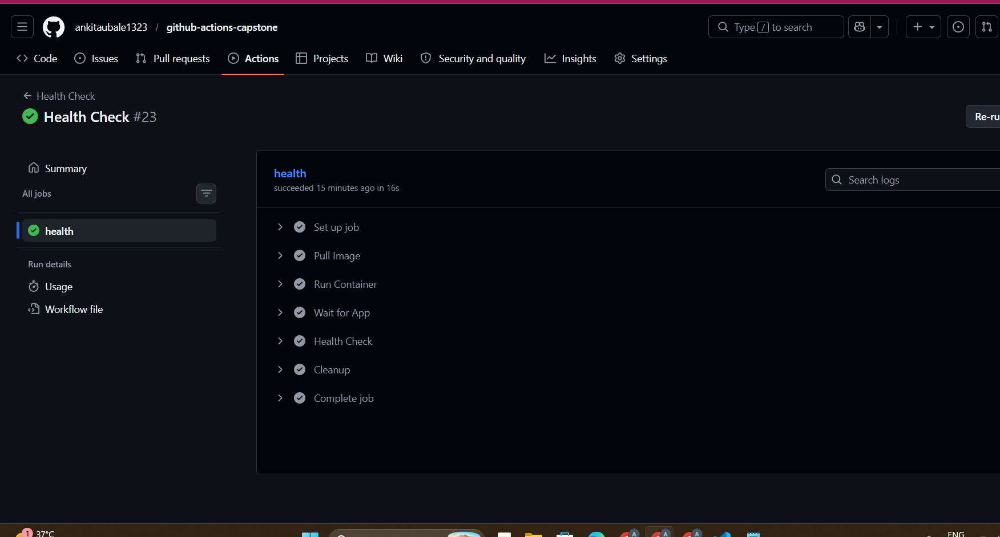
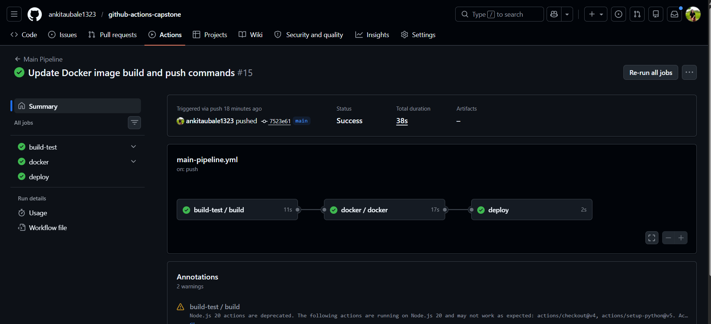
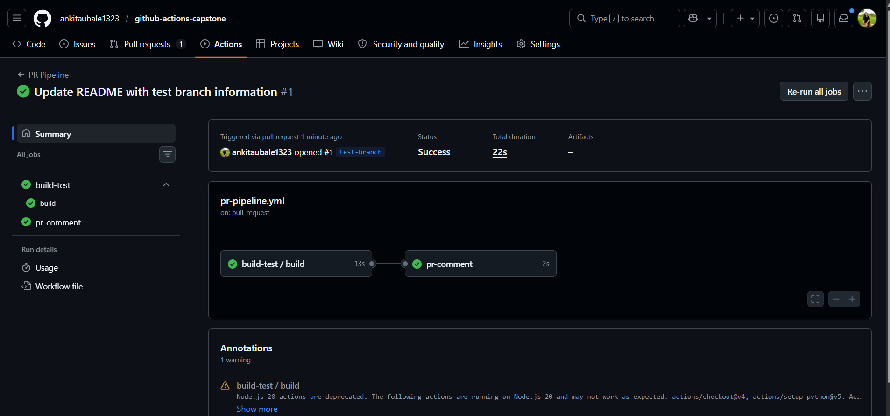

# 🚀 Day 48 – GitHub Actions Capstone Project

## 📌 Project Overview

This project demonstrates a **production-style CI/CD pipeline** using GitHub Actions.
It includes build, test, Docker image creation, deployment simulation, and scheduled health checks.

---

## 🏗️ Project Structure

```
github-actions-capstone/
│── app/
│   └── app.py
│── test/
│   └── test.sh
│── requirements.txt
│── Dockerfile
└── .github/
    └── workflows/
        ├── reusable-build-test.yml
        ├── reusable-docker.yml
        ├── pr-pipeline.yml
        ├── main-pipeline.yml
        └── health-check.yml
```

---

## ⚙️ Application Details

* **Framework:** Flask (Python)
* **Endpoint:** `/health`
* **Purpose:** Lightweight app to validate CI/CD pipeline

---

## 🔄 CI/CD Pipeline Architecture

```
Pull Request →
   Build & Test ✅

Merge to Main →
   Build & Test →
   Docker Build & Push →
   Deploy (Production Environment)

Scheduled (Every 12 hrs) →
   Health Check
```

---

## 📂 Workflow Files

### 🔹 1. Reusable Build & Test Workflow

```yaml
name: Reusable Build & Test

on:
  workflow_call:
    inputs:
      python_version:
        required: true
        type: string
      run_tests:
        required: false
        type: boolean
        default: true
    outputs:
      test_result:
        value: ${{ jobs.build.outputs.test_result }}

jobs:
  build:
    runs-on: ubuntu-latest
    outputs:
      test_result: ${{ steps.set_result.outputs.result }}

    steps:
      - uses: actions/checkout@v4

      - uses: actions/setup-python@v5
        with:
          python-version: ${{ inputs.python_version }}

      - run: pip install -r requirements.txt

      - name: Run Tests
        if: ${{ inputs.run_tests }}
        run: bash test/test.sh

      - name: Set Result
        id: set_result
        run: |
          if [ "${{ job.status }}" == "success" ]; then
            echo "result=passed" >> $GITHUB_OUTPUT
          else
            echo "result=failed" >> $GITHUB_OUTPUT
          fi
```

---

### 🔹 2. Reusable Docker Workflow

```yaml
name: Reusable Docker Build

on:
  workflow_call:
    inputs:
      image_name:
        required: true
        type: string
      tag:
        required: true
        type: string
    secrets:
      docker_username:
        required: true
      docker_token:
        required: true
    outputs:
      image_url:
        value: ${{ jobs.docker.outputs.image }}

jobs:
  docker:
    runs-on: ubuntu-latest
    outputs:
      image: ${{ steps.set.outputs.image }}

    steps:
      - uses: actions/checkout@v4

      - name: Login to DockerHub
        run: echo "${{ secrets.docker_token }}" | docker login -u "${{ secrets.docker_username }}" --password-stdin

      - name: Build Image
        run: |
          docker build -t ${{ secrets.docker_username }}/${{ inputs.image_name }}:${{ inputs.tag }} .

      - name: Push Image
        run: |
          docker push ${{ secrets.docker_username }}/${{ inputs.image_name }}:${{ inputs.tag }}

      - name: Set Output
        id: set
        run: |
          echo "image=${{ secrets.docker_username }}/${{ inputs.image_name }}:${{ inputs.tag }}" >> $GITHUB_OUTPUT
```

---

### 🔹 3. PR Pipeline

```yaml
name: PR Pipeline

on:
  pull_request:
    branches: [main]

jobs:
  build-test:
    uses: ./.github/workflows/reusable-build-test.yml
    with:
      python_version: "3.11"
      run_tests: true

  pr-comment:
    needs: build-test
    runs-on: ubuntu-latest
    steps:
      - run: echo "PR checks passed for branch: ${{ github.head_ref }}"
```

---

### 🔹 4. Main Pipeline

```yaml
name: Main Pipeline

on:
  push:
    branches: [main]

jobs:
  build-test:
    uses: ./.github/workflows/reusable-build-test.yml
    with:
      python_version: "3.11"

  docker:
    needs: build-test
    uses: ./.github/workflows/reusable-docker.yml
    with:
      image_name: github-actions-app
      tag: latest
    secrets:
      docker_username: ${{ secrets.DOCKER_USERNAME }}
      docker_token: ${{ secrets.DOCKER_TOKEN }}

  deploy:
    needs: docker
    runs-on: ubuntu-latest
    environment: production
    steps:
      - run: echo "Deploying image ${{ needs.docker.outputs.image_url }} to production"
```

---

### 🔹 5. Health Check Workflow

```yaml
name: Health Check

on:
  schedule:
    - cron: '0 */12 * * *'
  workflow_dispatch:

jobs:
  health:
    runs-on: ubuntu-latest

    steps:
      - run: docker pull ${{ secrets.DOCKER_USERNAME }}/github-actions-app:latest

      - run: docker run -d -p 3000:3000 --name test-app ${{ secrets.DOCKER_USERNAME }}/github-actions-app:latest

      - run: sleep 5

      - run: curl -f http://localhost:3000/health

      - run: docker rm -f test-app

      - run: |
          echo "## Health Check Report" >> $GITHUB_STEP_SUMMARY
          echo "- Status: PASSED" >> $GITHUB_STEP_SUMMARY
          echo "- Time: $(date)" >> $GITHUB_STEP_SUMMARY
```




---


## 🔐 Secrets Used

* `DOCKER_USERNAME`
* `DOCKER_TOKEN`

---

## 🧪 Screenshots (Add Here)

* PR Pipeline execution
* Main Pipeline execution
* Health Check run

---

## 🐳 Docker Image

Example:

```
https://hub.docker.com/r/ankitaubale/github-actions-app
```

---

## 🔐 Security Enhancement (Optional)

* Integrated Trivy scan for vulnerability detection
* Pipeline fails on CRITICAL vulnerabilities

---

## 🚀 Future Improvements

* Add Slack notifications
* Multi-environment deployment (dev/staging/prod)
* Kubernetes deployment (EKS)
* Auto rollback strategy
* Monitoring integration (Prometheus & Grafana)

---

## 💡 Key Learnings

* Reusable workflows in GitHub Actions
* Secure handling of secrets
* Docker build and push automation
* CI/CD pipeline design
* Scheduled automation with cron jobs

---

## 🔥 Conclusion

This project demonstrates a complete CI/CD pipeline using GitHub Actions, covering build, test, containerization, deployment, and monitoring — aligned with real-world DevOps practices.

---
