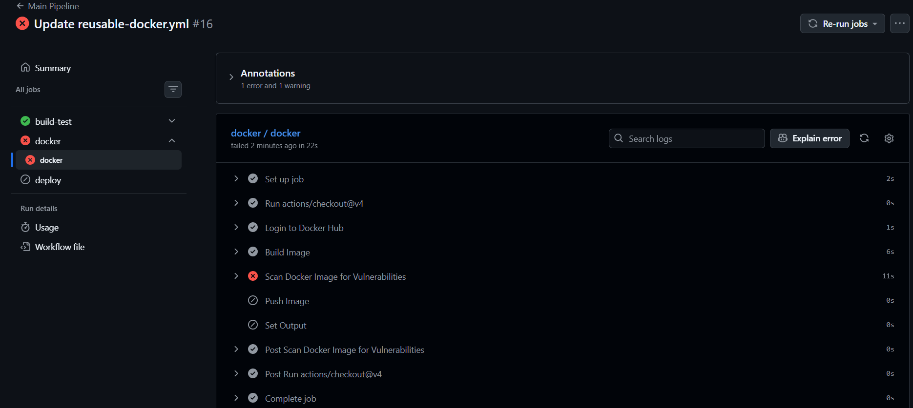
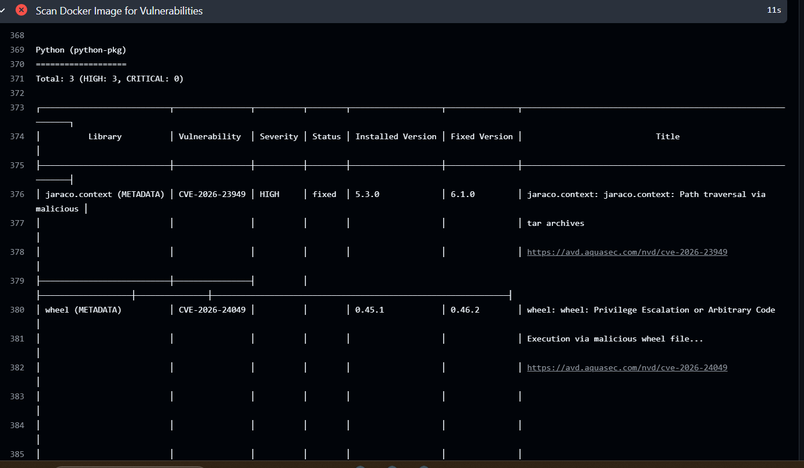

# 🔐 Day 49 – DevSecOps: Securing CI/CD Pipeline

## 📌 What is DevSecOps?

DevSecOps means integrating security directly into the CI/CD pipeline instead of treating it as a separate step.
It ensures vulnerabilities are detected early during development (PR stage or build stage), reducing risk and fixing issues before deployment.

---

## 🏗️ Updated Secure Pipeline Architecture

```
Pull Request →
   Build & Test
   Dependency Vulnerability Check 🔐
   PR Pass / Fail

Merge to Main →
   Build & Test
   Docker Build
   Trivy Image Scan 🔐
   Docker Push (only if scan passes)
   Deploy (Production)

Always Active →
   GitHub Secret Scanning 🔐
   Push Protection 🔐
```

---

## 🔍 Security Implementations

### 🔹 1. Docker Image Vulnerability Scan (Trivy)

We added Trivy to scan Docker images for vulnerabilities before pushing to Docker Hub.

```yaml
- name: Scan Docker Image for Vulnerabilities
  uses: aquasecurity/trivy-action@master
  with:
    image-ref: ${{ secrets.docker_username }}/${{ inputs.image_name }}:${{ inputs.tag }}
    format: table
    exit-code: '1'
    severity: CRITICAL,HIGH
```

### ✅ What it does:

* Scans Docker image for known CVEs
* Fails pipeline if **CRITICAL or HIGH vulnerabilities** are found
* Prevents insecure images from being deployed

---

### 🔹 2. Dependency Vulnerability Scan (PR Pipeline)

We added dependency scanning to check for insecure packages during PR.

```yaml
- name: Check Dependencies for Vulnerabilities
  uses: actions/dependency-review-action@v4
  with:
    fail-on-severity: critical
```

### ✅ What it does:

* Scans newly added dependencies
* Fails PR if critical vulnerabilities exist
* Ensures only safe dependencies are merged

---

### 🔹 3. GitHub Secret Scanning & Push Protection

Enabled from repository settings.

### 🔐 Secret Scanning:

* Detects leaked credentials (API keys, tokens)

### 🚫 Push Protection:

* Blocks commits containing secrets before they are pushed

---

## 🔐 Workflow Permissions

Added minimal permissions to workflows:

```yaml
permissions:
  contents: read
```

### ✅ Why this is important:

* Limits access of workflows
* Prevents misuse if an action is compromised
* Follows principle of least privilege

---

## 🧪 Trivy Scan Output (Screenshot)




---

## 🧠 Key Learnings

* Security should be integrated early in the CI/CD pipeline
* Automated scans reduce manual effort and human error
* Vulnerabilities in Docker images and dependencies can be detected before deployment
* GitHub provides built-in tools for secret detection and protection
* Limiting workflow permissions improves overall pipeline security

---

## ❓ Answers to Key Questions

### 🔹 Difference between Secret Scanning and Push Protection?

* **Secret Scanning:** Detects secrets after they are committed
* **Push Protection:** Prevents secrets from being pushed at all

---

### 🔹 What happens if GitHub detects a leaked AWS key?

* GitHub flags the secret immediately
* May notify AWS to revoke the key
* Repository shows a security alert
* You must remove and rotate the key

---

## 🚀 Future Improvements

* Integrate Kubernetes security scanning
* Use OIDC instead of long-lived secrets
* Add SAST (Static Code Analysis)
* Upload Trivy reports to GitHub Security tab (SARIF)
* Add Slack alerts for security failures

---

## 🔥 Conclusion

This project enhances the CI/CD pipeline by integrating automated security checks.
Now, the pipeline not only builds and deploys applications but also ensures they are secure before reaching production.


