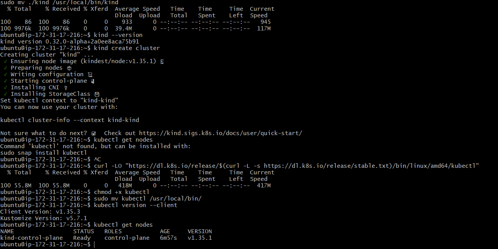
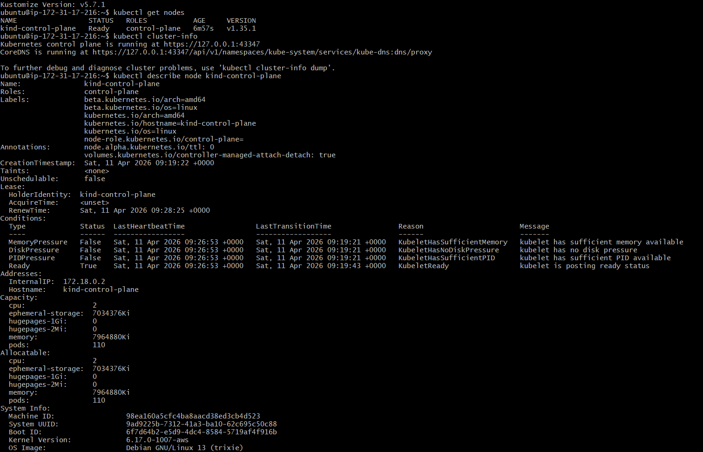
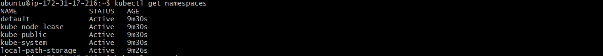
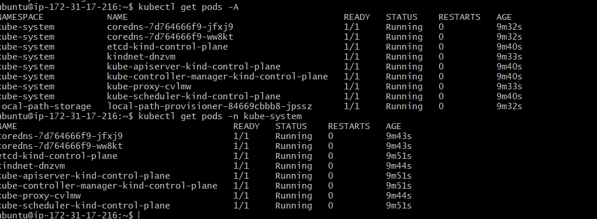
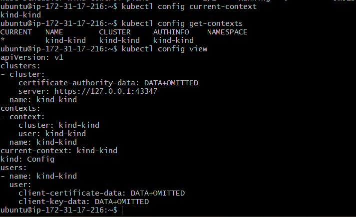

# Day 50 – Kubernetes Architecture and Cluster Setup

## ✅ Kubernetes History (In My Own Words)

Kubernetes was created to solve the problem of managing containers at scale. While Docker helps in creating and running containers, it does not handle orchestration like scaling, load balancing, or self-healing across multiple servers. Kubernetes automates deployment, scaling, and operations of containerized applications.

Kubernetes was originally developed by Google and inspired by their internal system called Borg. The name "Kubernetes" comes from Greek, meaning "helmsman" or "pilot", which reflects its role in managing containerized workloads.

---

## 🏗️ Kubernetes Architecture

### Control Plane (Master Node)
- API Server → Entry point for all commands
- etcd → Stores cluster state
- Scheduler → Assigns pods to nodes
- Controller Manager → Maintains desired state

### Worker Node
- kubelet → Manages pods and communicates with API server
- kube-proxy → Handles networking
- Container Runtime → Runs containers (containerd/Docker)

---

## 🔄 What Happens When You Run `kubectl apply -f pod.yaml`

1. kubectl sends request to API Server  
2. API Server validates and stores data in etcd  
3. Scheduler assigns pod to a worker node  
4. kubelet creates the pod on that node  
5. Container runtime runs the container  

---

## ⚠️ Failure Scenarios

### If API Server goes down
- No new requests can be processed  
- Existing applications continue running  

### If Worker Node goes down
- Pods on that node stop  
- Kubernetes reschedules pods on other nodes  

---

## 🛠️ Tool Used: KIND

I used Kind (Kubernetes in Docker) because:
- Lightweight and fast  
- Supports multi-node clusters  
- Used in CI/CD pipelines  
- Closer to real-world DevOps scenarios  

---

## 📸 Screenshots

---



## 🔍 kube-system Components

- etcd → Cluster database  
- kube-apiserver → API entry point  
- kube-scheduler → Pod placement  
- kube-controller-manager → Maintains desired state  
- coredns → DNS resolution  
- kube-proxy → Network routing  

---

## 🔁 Cluster Lifecycle Commands

```bash
kind delete cluster --name devops-cluster
kind create cluster --name devops-cluster
kubectl get nodes


⚙️ kubeconfig


Configuration file for kubectl
Stores cluster, user, and context info
Default location: ~/.kube/config

🧪 Commands Practiced
kubectl cluster-info
kubectl get nodes
kubectl describe node <node-name>
kubectl get namespaces
kubectl get pods -A
kubectl get pods -n kube-system
kubectl config current-context
kubectl config get-contexts
kubectl config view
🚀 Conclusion

Today I set up my first Kubernetes cluster using Kind, explored its architecture, and understood how control plane components work internally. This marks the beginning of my Kubernetes journey.