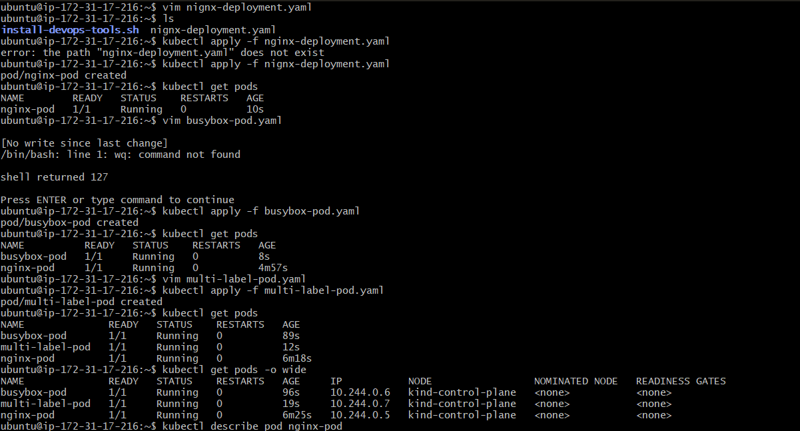
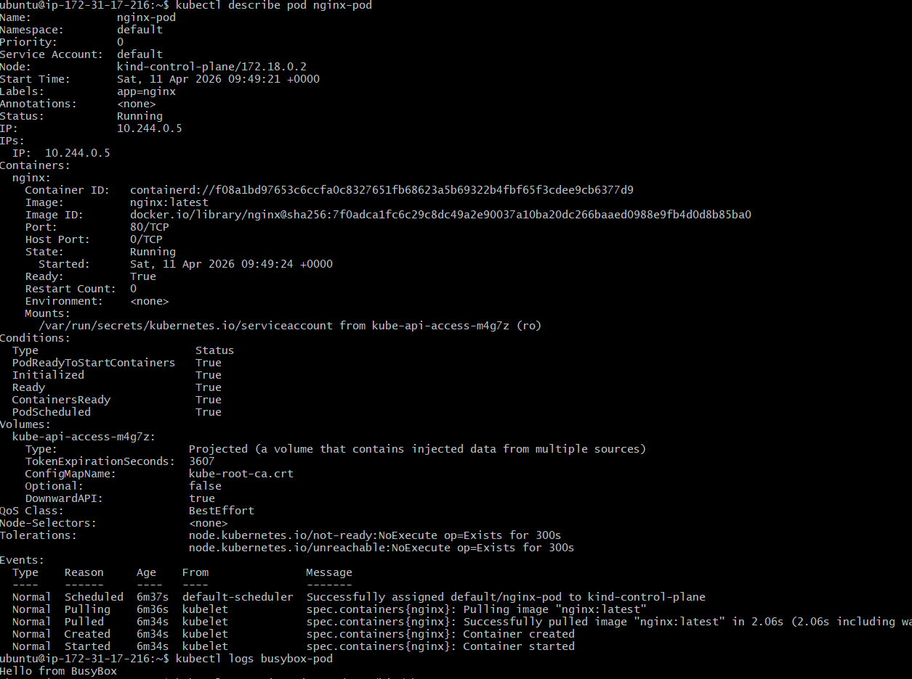
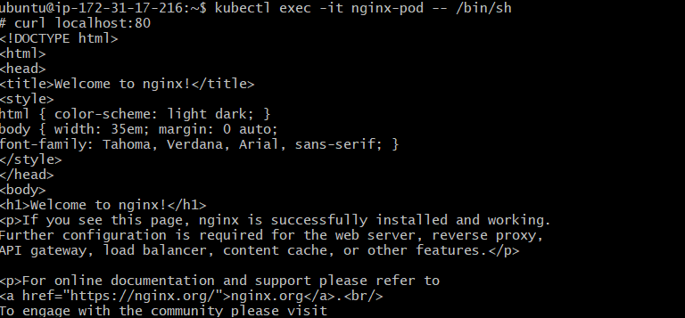
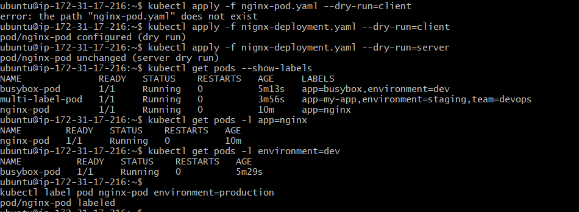
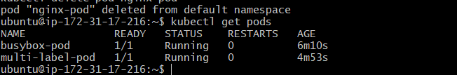

# Day 51 – Kubernetes Manifests and Your First Pods

## Task Summary
Learned Kubernetes manifests and created Pods from scratch using YAML.

---

## Kubernetes Manifest Structure

Every Kubernetes manifest has 4 required fields:

- apiVersion → defines API version (v1 for Pod)
- kind → type of resource (Pod)
- metadata → name and labels
- spec → actual configuration (containers, image, ports)

---

## Pod 1: Nginx

apiVersion: v1
kind: Pod
metadata:
  name: nginx-pod
  labels:
    app: nginx
spec:
  containers:
  - name: nginx
    image: nginx:latest
    ports:
    - containerPort: 80

---

## Pod 2: BusyBox

apiVersion: v1
kind: Pod
metadata:
  name: busybox-pod
  labels:
    app: busybox
    environment: dev
spec:
  containers:
  - name: busybox
    image: busybox:latest
    command: ["sh", "-c", "echo Hello from BusyBox && sleep 3600"]

---

## Pod 3: Multi-Label Pod

apiVersion: v1
kind: Pod
metadata:
  name: multi-label-pod
  labels:
    app: my-app
    environment: staging
    team: devops
spec:
  containers:
  - name: nginx
    image: nginx:latest
    ports:
    - containerPort: 80

---

## Commands Used

kubectl apply -f nginx-pod.yaml  
kubectl apply -f busybox-pod.yaml  
kubectl apply -f multi-label-pod.yaml  

kubectl get pods  
kubectl get pods -o wide  

kubectl describe pod nginx-pod  
kubectl logs busybox-pod  

kubectl exec -it nginx-pod -- /bin/sh  
curl localhost:80  

---

## Imperative vs Declarative

Imperative:
kubectl run redis-pod --image=redis:latest  

Declarative:
kubectl apply -f nginx-pod.yaml  

Imperative → quick but not reusable  
Declarative → reusable and preferred  

---

## Dry Run

kubectl run test-pod --image=nginx --dry-run=client -o yaml > test.yaml  

---

## Validation

kubectl apply -f nginx-pod.yaml --dry-run=client  
kubectl apply -f nginx-pod.yaml --dry-run=server  

---

## Labels

kubectl get pods --show-labels  

kubectl get pods -l app=nginx  
kubectl get pods -l environment=dev  

kubectl label pod nginx-pod environment=production  
kubectl label pod nginx-pod environment-  

---

## Error (Missing Image)

error: ValidationError(Pod.spec.containers[0]): missing required field "image"  

---

## Deleting Pod

kubectl delete pod nginx-pod  

- Pod is permanently deleted  
- Not recreated automatically  
- No controller is managing it  

---

## Screenshot

---

## Key Learnings

- Learned manifest structure  
- Created Pods from scratch  
- Used kubectl for logs, exec, describe  
- Understood labels and filtering  
- Learned imperative vs declarative  
- Learned Pods are not self-healing  

---
