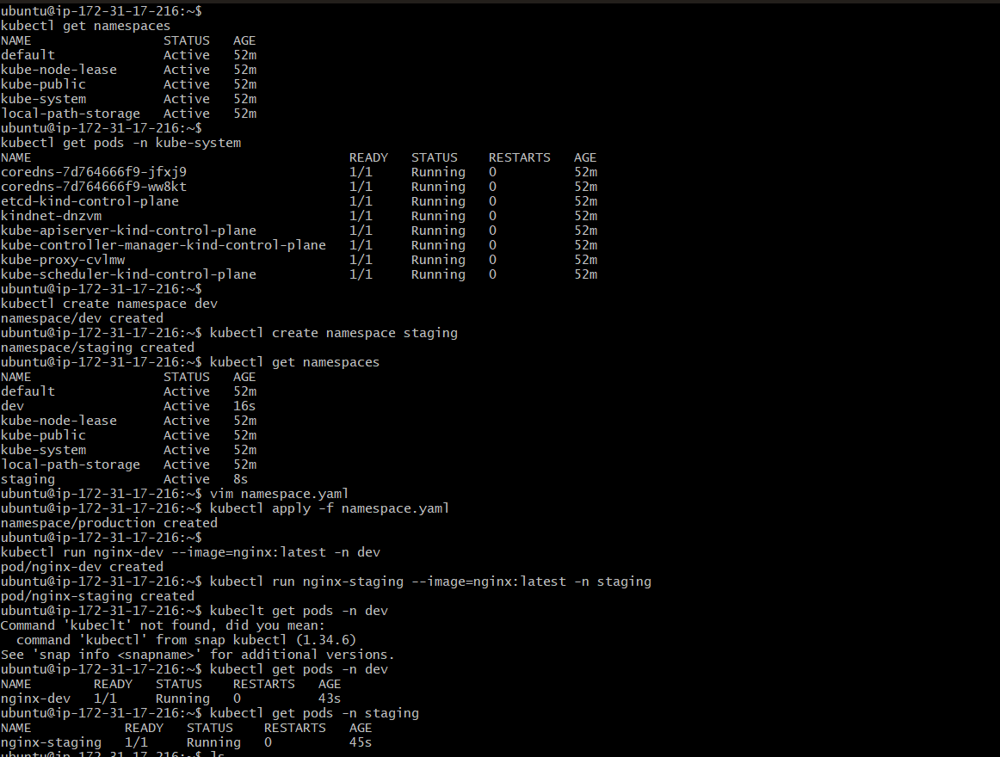
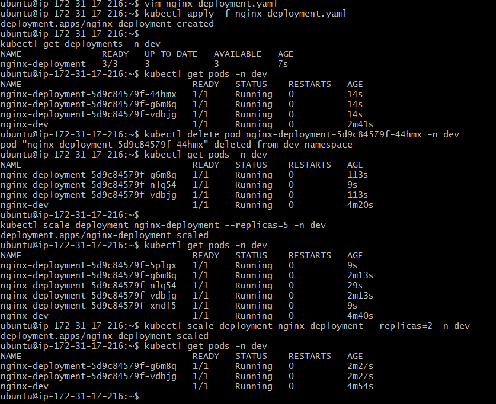
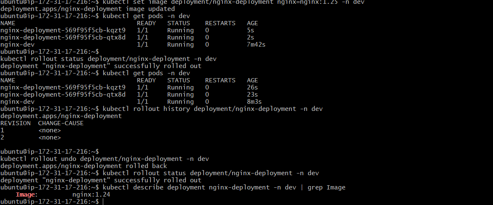
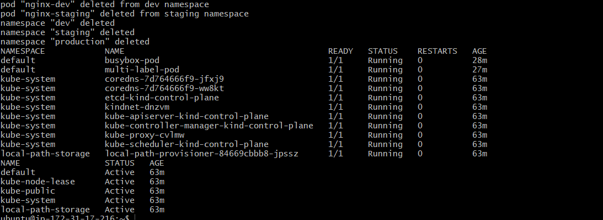

# Day 52 – Kubernetes Namespaces and Deployments

## Task Summary
Worked with Kubernetes Namespaces and Deployments to manage and run applications with self-healing, scaling, and rolling updates.

---

# 🔹 Namespaces

Namespaces are used to logically separate resources inside a Kubernetes cluster.

## Default Namespaces

kubectl get namespaces  

- default → used when no namespace is specified  
- kube-system → system components (API server, scheduler, etc.)  
- kube-public → publicly accessible resources  
- kube-node-lease → node heartbeat tracking  

Check system pods:

kubectl get pods -n kube-system  

---

# 🔹 Create Custom Namespaces

kubectl create namespace dev  
kubectl create namespace staging  

Verify:

kubectl get namespaces  

Create using YAML:

apiVersion: v1
kind: Namespace
metadata:
  name: production  

kubectl apply -f namespace.yaml  

---

# 🔹 Run Pods in Specific Namespace

kubectl run nginx-dev --image=nginx:latest -n dev  
kubectl run nginx-staging --image=nginx:latest -n staging  

Check pods:

kubectl get pods -A  

kubectl get pods -n dev  
kubectl get pods -n staging  

---

# 🔹 Deployment Manifest

apiVersion: apps/v1
kind: Deployment
metadata:
  name: nginx-deployment
  namespace: dev
  labels:
    app: nginx
spec:
  replicas: 3
  selector:
    matchLabels:
      app: nginx
  template:
    metadata:
      labels:
        app: nginx
    spec:
      containers:
      - name: nginx
        image: nginx:1.24
        ports:
        - containerPort: 80  

---

# 🔹 Apply Deployment

kubectl apply -f nginx-deployment.yaml  

kubectl get deployments -n dev  
kubectl get pods -n dev  

Purpose:
- creates 3 identical pods
- ensures desired state is always maintained  

---

# 🔹 Deployment Output Meaning

kubectl get deployments -n dev  

- READY → running pods / desired pods  
- UP-TO-DATE → updated pods  
- AVAILABLE → healthy pods available  

---

# 🔹 Self-Healing

kubectl delete pod <pod-name> -n dev  

kubectl get pods -n dev  

Purpose:
- Deployment automatically creates a new pod  
- ensures replica count is maintained  
- replacement pod has different name  

---

# 🔹 Scaling Deployment

Scale up:

kubectl scale deployment nginx-deployment --replicas=5 -n dev  

Scale down:

kubectl scale deployment nginx-deployment --replicas=2 -n dev  

Purpose:
- adjusts number of running pods  
- Kubernetes creates or deletes pods automatically  

Declarative scaling:

Change replicas in YAML → kubectl apply -f file.yaml  

---

# 🔹 Rolling Update

kubectl set image deployment/nginx-deployment nginx=nginx:1.25 -n dev  

kubectl rollout status deployment/nginx-deployment -n dev  

Purpose:
- updates application without downtime  
- replaces pods one by one  

---

# 🔹 Rollback

kubectl rollout history deployment/nginx-deployment -n dev  

kubectl rollout undo deployment/nginx-deployment -n dev  

kubectl rollout status deployment/nginx-deployment -n dev  

Verify:

kubectl describe deployment nginx-deployment -n dev | grep Image  

Purpose:
- revert to previous working version  
- ensures safe deployments  

---

# 🔹 Cleanup

kubectl delete deployment nginx-deployment -n dev  

kubectl delete pod nginx-dev -n dev  
kubectl delete pod nginx-staging -n staging  

kubectl delete namespace dev staging production  

kubectl get pods -A  
kubectl get namespaces  

---

# 🔹 Key Observations

- Namespaces isolate environments (dev, staging, production)  
- Deployments manage Pods using ReplicaSets  
- Pods created by Deployment are self-healing  
- Scaling adjusts number of replicas dynamically  
- Rolling updates ensure zero downtime  
- Rollback restores previous version safely  

---

# 🔹 Screenshot

---
