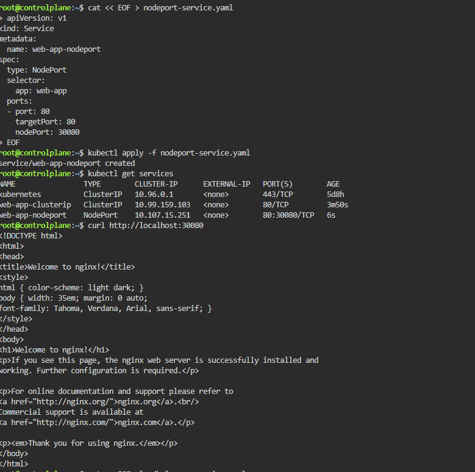
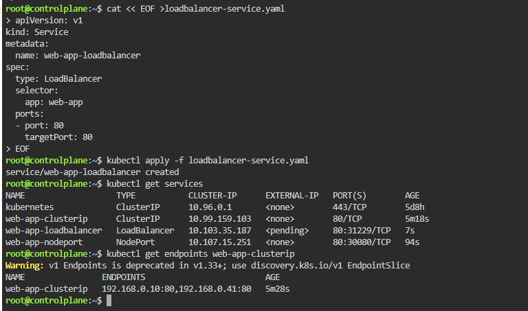

# Day 53 – Kubernetes Services

## Task Summary
Exposed a Deployment using different Kubernetes Service types to enable stable networking and access to Pods.

---

# 🔹 Problem Services Solve

- Pods have dynamic IPs → change on restart  
- Deployment has multiple Pods → no single access point  

Solution:
Service provides:
- Stable IP and DNS  
- Load balancing across Pods  

---

# 🔹 Deployment

apiVersion: apps/v1
kind: Deployment
metadata:
  name: web-app
  labels:
    app: web-app
spec:
  replicas: 2
  selector:
    matchLabels:
      app: web-app
  template:
    metadata:
      labels:
        app: web-app
    spec:
      containers:
      - name: nginx
        image: nginx:1.25
        ports:
        - containerPort: 80  

Apply:

kubectl apply -f app-deployment.yaml  
kubectl get pods -o wide  

Purpose:
- creates 2 Pods  
- each pod has its own IP  

---

# 🔹 ClusterIP Service (Internal)

apiVersion: v1
kind: Service
metadata:
  name: web-app-clusterip
spec:
  type: ClusterIP
  selector:
    app: web-app
  ports:
  - port: 80
    targetPort: 80  

Apply:

kubectl apply -f clusterip-service.yaml  
kubectl get services  

Purpose:
- exposes app inside cluster  
- provides stable IP  
- load balances traffic  

---

# 🔹 Test ClusterIP (Internal Communication)

kubectl run test-client --image=busybox:latest --rm -it --restart=Never -- sh  

Inside pod:

wget -qO- http://web-app-clusterip  

Purpose:
- verifies service connectivity  
- confirms load balancing  

---

# 🔹 DNS Resolution

wget -qO- http://web-app-clusterip  
wget -qO- http://web-app-clusterip.default.svc.cluster.local  

nslookup web-app-clusterip  

Purpose:
- Kubernetes DNS resolves service name → ClusterIP  
- enables service-to-service communication  

---

# 🔹 NodePort Service (External via Node)

apiVersion: v1
kind: Service
metadata:
  name: web-app-nodeport
spec:
  type: NodePort
  selector:
    app: web-app
  ports:
  - port: 80
    targetPort: 80
    nodePort: 30080  

Apply:

kubectl apply -f nodeport-service.yaml  
kubectl get services  

Access:

curl http://localhost:30080  

Purpose: 
- exposes app outside cluster  
- accessible via NodeIP:NodePort  

---

# 🔹 LoadBalancer Service (Cloud)

apiVersion: v1
kind: Service
metadata:
  name: web-app-loadbalancer
spec:
  type: LoadBalancer
  selector:
    app: web-app
  ports:
  - port: 80
    targetPort: 80  

Apply:

kubectl apply -f loadbalancer-service.yaml  
kubectl get services  

Purpose:
- provisions external load balancer (cloud)  
- distributes traffic across nodes  

Note:
- Local cluster → EXTERNAL-IP = <pending>  
- Minikube → use: minikube tunnel  

---

# 🔹 Check Endpoints

kubectl get endpoints web-app-clusterip  

Purpose:
- shows Pod IPs behind service  
- verifies selector is working  

---

# 🔹 Compare Services

kubectl get services -o wide  

ClusterIP:
- internal access only  

NodePort:
- external via NodeIP:Port  

LoadBalancer:
- external via cloud LB  

---

# 🔹 Traffic Flow

Client → Service → Pods  

- Service selects Pods using labels  
- distributes traffic automatically  

---

# 🔹 Cleanup

kubectl delete -f app-deployment.yaml  
kubectl delete -f clusterip-service.yaml  
kubectl delete -f nodeport-service.yaml  
kubectl delete -f loadbalancer-service.yaml  

kubectl get pods  
kubectl get services  

---

# 🔹 Key Observations

- Service provides stable access to dynamic Pods  
- Selector connects Service to Pods  
- ClusterIP used for internal communication  
- NodePort exposes service externally  
- LoadBalancer used in cloud environments  
- Endpoints show actual Pod IP mapping  

---

# 🔹 Screenshot

(<Screenshot 2026-05-22 100258.png>)

